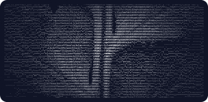
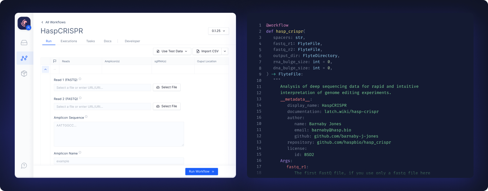

<div align="center">



# Latch SDK

The Latch SDK is a framework to build and deploy bioinformatics workflows, and
dynamically generate associated interfaces, with a handful of python functions.

It is built directly on [Flyte](https://docs.flyte.org) for all the benefits that the Kubernetes-native
workflow orchestration framework provides - task-level type-safety and
containerization, independent task scheduling, and heterogeneous & highly
scalable computing infrastructure.

[Slack Community](https://join.slack.com/t/latchbiosdk/shared_invite/zt-193ibmedi-WB6mBu2GJ2WejUHhxMOuwg) • [Docs](https://docs.latch.bio) • [Installation](#installation) •
[Quickstart](#configuration) • [Latch](https://latch.bio) • [Latch Verified](https://github.com/latch-verified)




</div>

Workflows developed with the SDK feature:

  * Instant no-code interfaces for accessibility and publication
  * First class static typing
  * Containerization + versioning of every registered change
  * Reliable + scalable managed cloud infrastructure
  * Single line definition of arbitrary resource requirements (eg. CPU, GPU) for serverless execution

The Latch SDK is a framework to build workflows. A collection of existing and
maintained workflows for common biological assays can be found at [Latch
Verified](https://github.com/latch-verified).

### Quickstart

Getting your hands dirty with SDK is the best way to understand how it works.
Run the following three commands in your terminal to register your first
workflow to LatchBio.

**Prerequisite**: ensure that `docker` is present and running on your machine. 
(Install docker [here](https://docs.docker.com/get-docker/) if you don't already
have it installed.)

First, install latch through `pip`.

```
$ python3 -m pip install latch
```

Then, create some boilerplate code for your new workflow.

```
$ latch init testworkflow
```

Finally register the boilerplate code to [LatchBio](latch.bio).

```
$ latch register testworkflow
```

This might take 3-10 minutes depending on your network connection. (Subsequent
registers will complete in seconds by reusing the image layers from this initial
register.) The registration process will:

  * Build a docker image containing your workflow code
  * Serialize your code and register it with your LatchBio account
  * Push your docker image to a managed container registry

When registration has completed, you should be able to navigate
[here](https://console.latch.bio/workflows) and see your new workflow in your
account.

If you are having issues with registration or have general questions, please
file an issue on [github](https://github.com/latchbio/latch).

---

### Installation

The SDK is distributed on pip. Install in a fresh virtual environment for best
behavior. 

[Virtualenvwrapper](https://virtualenvwrapper.readthedocs.io/en/latest/) is recommended.

```
python3 -m pip install latch
```

_Note that a local installation of docker is required to register workflows_.

---

### Examples

[Latch Verified](https://github.com/latch-verified) features list of well-curated workflows developed by the Latch team. 
* [Bulk RNA-seq](https://github.com/latch-verified/bulk-rnaseq)
* [Differential Expression](https://github.com/latch-verified/diff-exp)
* [Pathway Analysis](https://github.com/latch-verified/pathway)

We'll maintain a growing list of well documented examples developed by our community members here. Please open a pull request to feature your own:

**Gene Editing**
  * [Guide Counter](https://github.com/latchbio/wf-guide_counter)
  * [Batch-GE: Gene editing analysis](https://github.com/latchbio/wf-batch_ge)

**Phylogenetics**
  * [Seq-to-tree: Evolutionary history inference](https://github.com/JLSteenwyk/latch_wf_seq_to_tree)
  * [Codon optimization estimation](https://github.com/JLSteenwyk/latch_wf_codon_optimization)
  * [Metamage: Taxonomy classification](https://github.com/jvfe/metamage_latch)

**Single-cell Analysis**
  * [ArchR: Single-cell chromatin accessibility analysis](https://github.com/aa20g217/Archr-Latch-Wf)
  * [emptydropsR: Ambient RNA detection](https://github.com/mrland99/emptydropsR-latch-wf)
  * [scVelo: Single-cell RNA velocity analysis](https://github.com/aa20g217/RNA-velocity-Latch-WF)

**Protein Engineering**
  * [UniRep: mLSTM "babbler" deep representation learner for protein engineering](https://github.com/matteobolner/unirep_latch)
  * [FAMSA: Multiple sequence protein alignment](https://github.com/shivaramakrishna99/famsa-latch)
 
  