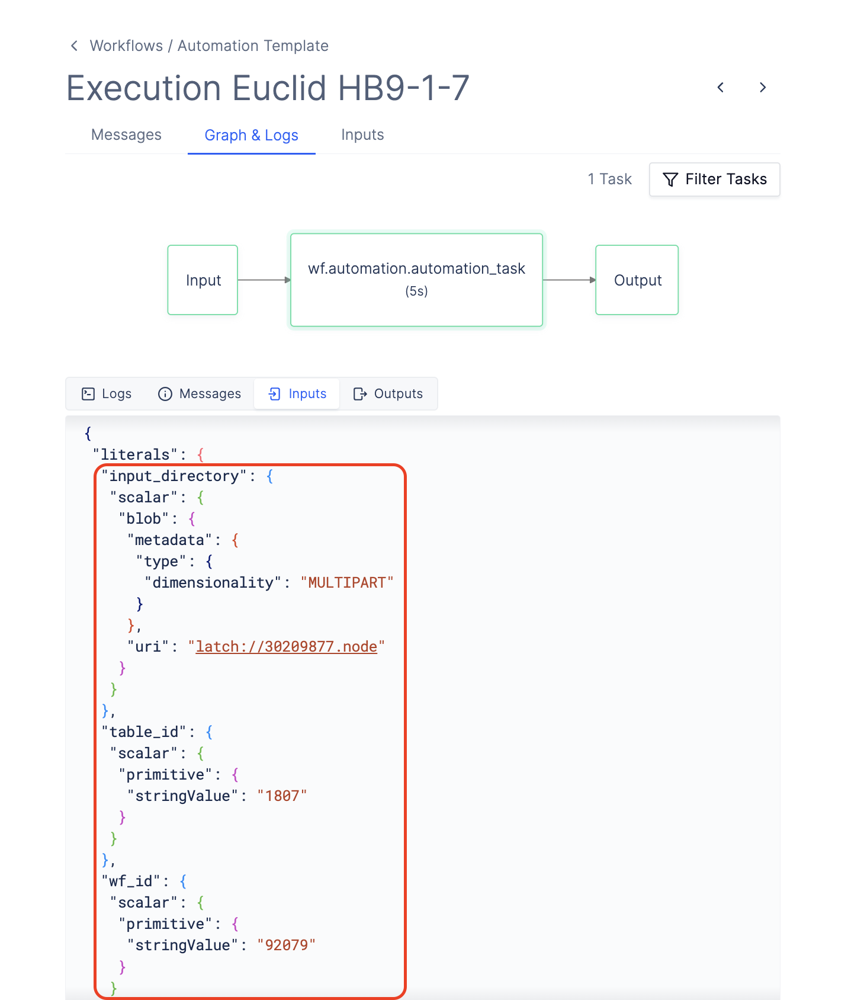
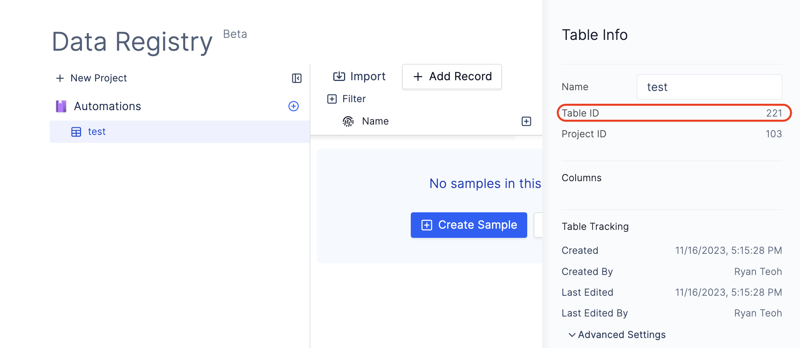

# Automation Example

Note: This document is a work in progress and is subject to change.

We will walk through the process of creating an [automation](overview.md) on Latch which will run a _target workflow_ on all children of the target directory. We assume that you understand how to write and register [Workflows](../basics/what_is_a_workflow.md) on Latch.

**Prerequisite:**
* An existing Table in [Latch Registry](https://latch.wiki/what-is-registry)
* An target folder in [Latch Data](https://console.latch.bio/data)

## 1: Create the Target Workflow

This example requires another _target workflow_ which will get executes on every child folder when _automation workflow_ gets triggered. Below is a simple workflow example which reads every file in a child directory and prints out its Latch Path.

1. Initialize a new workflow using `latch init test-workflow`.
2. Replace `__init__.py` and `task.py` with the following sample code.
    ```python
    # __init__.py

    from wf.task import task

    from latch.resources.workflow import workflow
    from latch.types.directory import LatchDir, LatchOutputDir
    from latch.types.file import LatchFile
    from latch.types.metadata import LatchAuthor, LatchMetadata, LatchParameter

    metadata = LatchMetadata(
        display_name="Target Workflow",
        author=LatchAuthor(
            name="Your Name",
        ),
        parameters={
            "input_directory": LatchParameter(
                display_name="Input Directory",
                batch_table_column=True,  # Show this parameter in batched mode.
            ),
            "output_directory": LatchParameter(
                display_name="Output Directory",
                batch_table_column=True,  # Show this parameter in batched mode.
            ),
        },
    )


    @workflow(metadata)
    def template_workflow(
        input_directory: LatchDir, output_directory: LatchOutputDir
    ) -> LatchOutputDir:
        return task(input_directory=input_directory, output_directory=output_directory)
    ```
    ```python
    # task.py

    import os
    from logging import Logger
    from urllib.parse import urljoin

    from latch import message
    from latch.resources.tasks import small_task
    from latch.types.directory import LatchDir, LatchFile, LatchOutputDir
    from latch.account import Account


    log = Logger("wf.task")


    @small_task
    def task(input_directory: LatchDir, output_directory: LatchOutputDir) -> LatchOutputDir:

        # iterate through all directories of the child input directories using iterdir()
        for file in input_directory.iterdir():
            log.error(f"{file} {file.remote_path}") # note: `error` is used here since its the highest logging level

        return output_directory

    ```
3. Register the sample target workflow with Latch using `latch register --remote --yes test-workflow`.
4. Record the ID of your workflow on the sidebar which we will use later in the example.
    
5. Test the workflow by running it on Latch
6. You will need to pass the parameters into your target workflow from your automation. To obtain the JSON representation of the workflow inputs, navigate to a previous execution of your workflow. Select **Graph and Logs**, click on square box around the first task, and select **Inputs**. Copy the workflow parameters inside the `literal` object, and pass it to `params`.
\
\
    i.e.
    ```json
    {
        "literals": {
            # copy everything inside the brackets
        }
    }
    ```
    


## 2: Create a New Registry Table

In this example, we record all processed child directories in the Registry Table to not reprocess directories when automation workflow is runs again. This example requires you to create a new table with no existing columns. The automation workflow will add a column `Processed Directory` with the directory name of processed children.

To create a new table to be used with the automation:

1. Go to [Latch Registry](https://console.latch.bio/registry).
2. Select an existing project, and click `New Table`.
3. Record the Table ID on the sidebar which we will use later in the example.



## 3: Create the Automation Workflow

This is the workflow which will be run when automation gets triggered. To create the automation workflow, clone the [Automation Workflow Template](https://github.com/latchbio/automation-wf) and navigate to the `automation-wf/wf` directory.

```shell-session
$ git clone git@github.com:latchbio/automation-wf.git
Cloning into 'automation-wf'...
remote: Enumerating objects: 33, done.
remote: Counting objects: 100% (33/33), done.
remote: Compressing objects: 100% (24/24), done.
remote: Total 33 (delta 9), reused 28 (delta 6), pack-reused 0
Receiving objects: 100% (33/33), 8.52 KiB | 1.42 MiB/s, done.
Resolving deltas: 100% (9/9), done.

$ cd automation-wf/wf
```

File Tree:
```shell-session
├── Dockerfile
├── README.md
├── version
└── wf
    ├── __init__.py
    ├── automation.py
    └── util.py
```

* `__init__.py` calls the automation task defined in `automation.py`.
* `automation.py` contains the Python logic to determine how a workflow should be launched.
* `util.py` contains the utility function which launches target workflow.

## 4. Configure the Target Workflow

To specify the target workflow and the registry table which you have just created, configure the following parameters in `wf/__init__.py` and specify your name in workflow metadata:

* `output_directory`: The Latch Path to the output folder which this automation workflow will populate. i.e. `latch://...`
* `target_wf_id`: The ID of the target workflow that you have just created.
* `params`: The parameters for your workflow. Refer to [Create The Target Workflow](#1-create-the-target-workflow) to get the parameters.
* `table_id`: The ID of the table which you created that stores metadata for this automation. Refer to [Create A New Registry Table](#2-create-a-new-registry-table) to create a table and get the ID.

```python
# __init__.py​

from latch.resources.workflow import workflow
from latch.types.directory import LatchDir, LatchOutputDir
from latch.types.metadata import LatchAuthor, LatchMetadata, LatchParameter

from wf.automation import automation_task

metadata = LatchMetadata(
    # MODIFY NAMING METADATA BELOW
    display_name="Automation Template",
    author=LatchAuthor(
        name="Your Name Here",
    ),
    # MODIFY NAMING METADATA ABOVE
    parameters={
        "input_directory": LatchParameter(
            display_name="Input Directory",
        ),
        "automation_id": LatchParameter(
            display_name="Automation ID",
        ),
    },
)


@workflow(metadata)
def automation_workflow(input_directory: LatchDir, automation_id: str) -> None:
    output_directory = LatchOutputDir(
        path="fixme"  # fixme: change to remote path of desired output directory
    )

    automation_task(
        input_directory=input_directory,
        output_directory=output_directory,
        target_wf_id="fixme",  # fixme: change wf_id to the desired workflow id
        table_id="fixme",  # fixme: change table_id to the desired registry table
    )
```

Change the parameters object in `automation.py` from [step 1.6](#1-create-the-target-workflow):
```python
# automation.py

...

params = {
    "input_directory": {
        "scalar": {
            "blob": {
                "metadata": {"type": {"dimensionality": "MULTIPART"}},
                "uri": input_directory.remote_path,
            }
        }
    },
    "output_directory": {
        "scalar": {
            "blob": {
                "metadata": {"type": {"dimensionality": "MULTIPART"}},
                "uri": output_directory.remote_path,
            }
        }
    },
}
...
```

**Usage Notes**:
* The `input_directory` refers to the child directory (i.e. the trigger directory) to be passed to the target workflow.
* The `output_directory` refers to directory where the output of the target workflow will be stored.


## 5. (Optional) Modify Automation Logic

The file `wf/automation.py` contains the logic that determines how an execution for the target workflow should be launched.

The `automation_task` defines the logic that is used to launch the workflow. The code below checks a registry table to see whether an output directory exists, and launches an execution for the target workflow if that is not the case.

Modify the function below to change the logic for launching target workflows.

```python
# automation.py

import uuid
from typing import Set

from latch.registry.table import Table
from latch.resources.tasks import small_task
from latch.types.directory import LatchDir, LatchOutputDir
from latch.types.file import LatchFile

from .utils import launch_workflow


@small_task
def automation_task(
    input_directory: LatchDir,
    output_directory: LatchOutputDir,
    target_wf_id: str,
    table_id: str,
    params: Dict[T,T],
) -> None:
    """
    Logic on how to process the input directory and launch the target workflows.
    """

    # fetch the table using Latch SDK
    automation_table = Table(table_id)
    processed_directory_column = "Processed Directory"

    # [PARAMS OMITTED]

    # check if the provided table contains column `Processed Directory` and creates one if it isn't present
    # we use Latch SDK to get the columns of the table and try to get the column by name
    if automation_table.get_columns().get(processed_directory_column, None) is None:
        with automation_table.update() as automation_table_updater:  # create an update context for the table
            automation_table_updater.upsert_column(processed_directory_column, LatchDir)

    # fetch all the directories that have been processed and recorded in the Registry table previously
    resolved_directories: Set[str] = set()
    # list_records() returns a generator of records(rows) of the Registry Table
    for page in automation_table.list_records():
        for _, record in page.items():
            value = record.get_values()[processed_directory_column]
            assert isinstance(
                value, LatchDir
            )  # we only allow processing of child directories
            resolved_directories.add(str(value))

    assert isinstance(input_directory.remote_path, str)
    assert isinstance(output_directory.remote_path, str)

    # Launch the target workflow for each child directory which hasn't been processed yet.
    # Record the processed directory in the Registry table.

    # iterdir() returns an iterator of the child files and directories of the input directory
    for child in input_directory.iterdir():
        # skip files, output directory and directories that have been processed
        if (
            isinstance(child, LatchFile)
            or str(child) == str(output_directory)
            or str(child) in resolved_directories
        ):
            continue

        with automation_table.update() as automation_table_updater:
            # use a util function to launch the target workflow with the right parameters
            launch_workflow(
                target_wf_id=target_wf_id,
                params=params,
            )
            # update registry table with the processed directory
            automation_table_updater.upsert_record(
                str(uuid.uuid4()),
                **{
                    processed_directory_column: child,
                },
            )
```


## 5. Register Automation Workflow

Register the automation workflow to your Latch workspace.

```shell-session
$ latch register --remote --yes automation-wf
```

## 6. Create Automation

Navigate to [Automations](https://console.latch.bio/automations) tab via **Worfklows** > **Automations** and click on the **Create Automation** button.

Input an **Automation Name** and **Description**.

Next, select a folder where files/folders will be uploaded using the `Select Target` button. Any items uploaded to this folder will trigger the specified workflow.

Set `Follow-up Update Period` to something short like 30 seconds to make your automation easy to test.

Finally, select the automation workflow that you have just registered using the selector.


## 7. Test Your Automation

To test your automation, go to the target directory that you have specified when creating automation, and create a couple of folders. Upload any files to the folders, and wait for the trigger timer to expire.

Go to **Worfklows** > **All Executions**. There should be 1 automation workflow execution, and a target workflow execution for each child in your target directory. Each target workflow should print out
