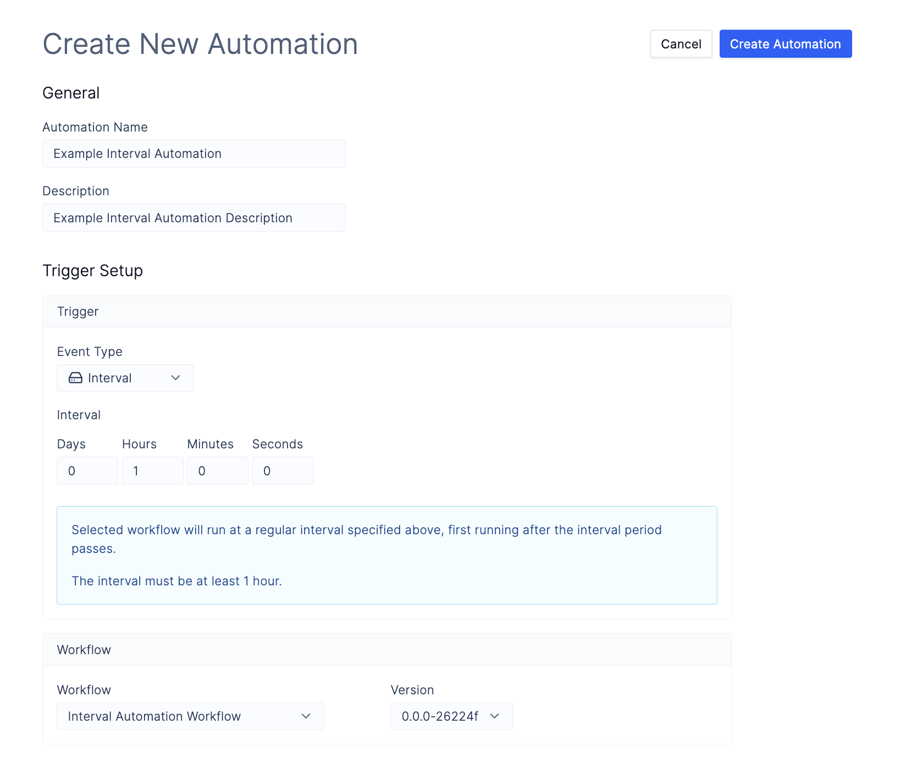

# Automation Example - Interval Trigger

Note: This document is a work in progress and is subject to change.

We will walk through the process of creating an [automation](overview.md) using an `Interval` trigger type on Latch that will run an automation workflow hourly. We assume that you understand how to write and register [Workflows](../basics/what_is_a_workflow.md) on Latch.

**Terms:**
- _Automation Workflow_: workflow which will be called by automation. This is the workflow we create in [step 1](#1-create-the-automation-workflow) of this tutorial.

## 1: Create the Automation Workflow
Below is a simple workflow example which creates folder `output` with a file locally and pushes it to Latch Data.

Note: to upload `LatchDir` or ``

1. Initialize a new workflow using `latch init automation-wf`.
2. Replace `__init__.py` and `task.py` with the following sample code.
    ```python
    # __init__.py

    from wf.task import task

    from latch.resources.workflow import workflow
    from latch.types.directory import LatchDir, LatchOutputDir
    from latch.types.file import LatchFile
    from latch.types.metadata import LatchAuthor, LatchMetadata, LatchParameter

    metadata = LatchMetadata(
        display_name="Interval Automation Workflow",
        author=LatchAuthor(
            name="Your Name",
        ),
        # Note: parameters have to be empty for this workflow to be successfully run by the automation
        parameters={},
    )


    @workflow(metadata)
    def workflow() -> None:
        task()
    ```

    ```python
    # task.py

    import os
    from urllib.parse import urljoin

    from latch import message
    from latch.resources.tasks import small_task
    from latch.types.directory import LatchDir, LatchFile, LatchOutputDir

    @small_task
    def task() -> LatchDir:
        os.mkdir("output")
        with open("output/hello_world.txt", 'w') as file:
            file.write("Hello World!")

        return LatchDir("output", "LDATA PATH FOR THE DIRECTORY")
    ```

3. Register the sample target workflow with Latch using
```shell-session
$ latch register --yes automation-wf
```
5. Test the workflow by running it on Latch

## 2. Create Automation

Navigate to [Automations](https://console.latch.bio/automations) tab via **Worfklows** > **Automations** and click on the **Create Automation** button.

1. Input an **Automation Name** and **Description**.

2. Select the `Event Type` as `Interval`.

3. Specify `Interval` to 1 hour.

4. Select the automation workflow that you have just registered with Latch.


