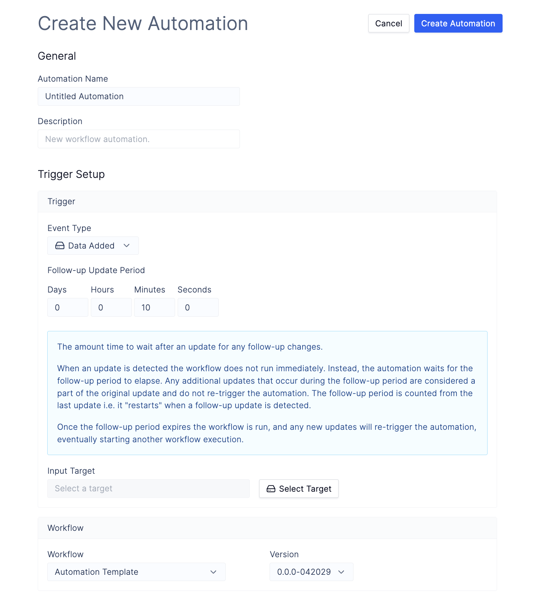

# Workflow Automations

Note: This document is a work in progress and is subject to change.

### Description

Automations allow you to automaically run workflows on top of folders in Latch Data when triggered by specific events such as when files are added to folders. Automations consist of a [*trigger*](#trigger) and an [*automation workflow*](#automation-workflow).

Additionally, you can pause and resume automations by toggling status radio on the sidebar.

### Trigger

Automation trigger specifies the conditions to run the automation(i.e. child got added to the target directory). It allows you to specify a target directory to watch, the [_event_](#trigger-event-types) which kicks off a workflow, and a [_timer_](#trigger-timer).

#### Trigger Event Types

> Note: currently, only child addition event is supported in automations.

*Available events:*

- _Data Update_ event type specifies when to run the automation if a data tree in Latch Data has been modified.
\
Supported events:
    -  _Child Added_ event triggers if a new child has been added to the target directory at any depth. Automation will not run if the child has been modified or deleted.

#### Trigger Timer

Automation trigger timer specifies the wait period after the last trigger event after which the workflow will run.

For example, if the timer is 10 minutes and the trigger event is `Child Added`, the automation will wait 10 minutes after a child has been added to the target directory and then run automation workflow.

### Automation Workflow

This is the [workflow](../basics/what_is_a_workflow.md) that will run whenever the automation has been [triggered](#trigger).

#### Usage Note:
Currently, automations are only passing `input_directory` as the parameter to the automation workflow. If your workflow has different parameters automation will fail to start it. Make sure that the workflows which you use with automation have the following parameter dictionary:

```python
# __init__.py

from latch.resources.workflow import workflow
from latch.types.directory import LatchDir, LatchOutputDir
from latch.types.metadata import LatchAuthor, LatchMetadata, LatchParameter
from wf.automation import automation_task

metadata = LatchMetadata(
    # MODIFY NAMING METADATA BELOW
    display_name="Workflow Name",
    author=LatchAuthor(
        name="Your Name Here",
    ),
    # MODIFY NAMING METADATA ABOVE
    # IMPORTANT: these exact parameters are required for the workflow to work with automations
    parameters={
        "input_directory": LatchParameter(
            display_name="Input Directory",
        )
    },
)


@workflow(metadata)
def automation_workflow(input_directory: LatchDir) -> None:
    pass
```

See an [example](automation-usecase.md) of how we create an automation workflow which reads all children of the target directory and kicks off another workflow which runs processing on child directories.

## Creating an Automation

1. Register automation workflow with Latch. See [Usage Note](#usage-note) to make sure that your workflow can be run by automations.

2. Navigate to [Automations](https://console.latch.bio/automations) tab via **Worfklows** > **Automations** and click on the **Create Automation** button.

    Input an **Automation Name** and **Description**.

    Next, select a folder where files/folders will be uploaded using the `Select Target` button. Any items uploaded to this folder will trigger the specified workflow.

    Finally, select the [automation workflow](#automation-workflow) that you have registered with Latch.

    Checkout an [example](automation-usecase.md) on how to create and register automation workflows.

    
