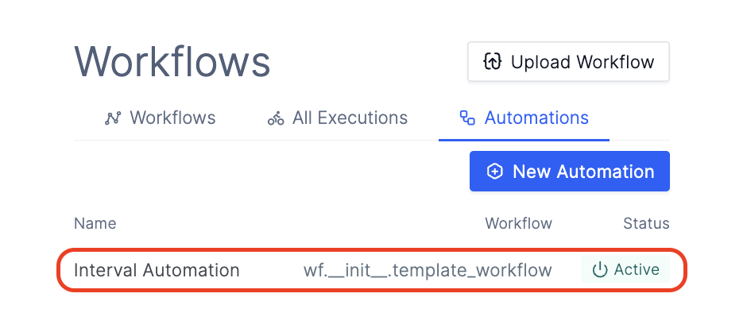
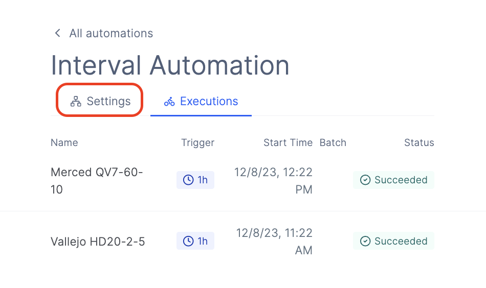
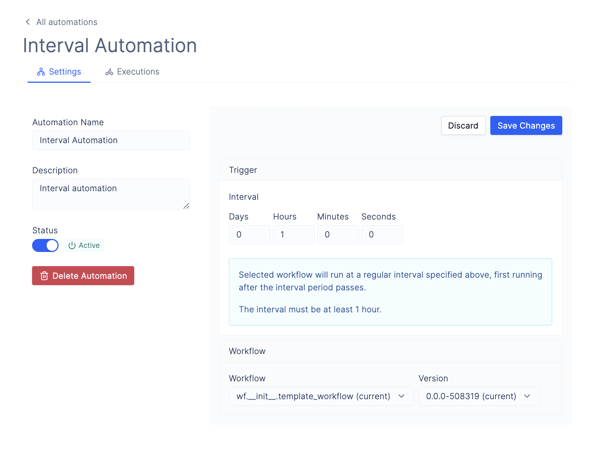

# Workflow Automations

Note: This document is a work in progress and is subject to change.

## Description

Automations allow you to automatically run workflows on top of folders in Latch Data when triggered by specific events such as when files are added to folders or after a regular interval of time has passed. Automations consist of a [*trigger*](#trigger) and an [*automation workflow*](#automation-workflow).

Additionally, you can inactivate and reactivate automations by toggling the status radio on the sidebar.

## Triggers

Automation triggers specify the conditions needed to run the automation, such as "child got added to the target directory" or "time interval expired".

Triggers are created and configured in the [Latch console](https://console.latch.bio/automations/new).

### Available Trigger Types

#### Data Added

This trigger type runs an [automation workflow](#automation-workflow) if a new child has been added to the target directory at any depth (level of nested directory). The automation will not run if a child has been modified or deleted.

_Trigger Parameters_:

- `Input Target`: the target directory to watch for new children.
- `Follow-up Update Period`: this is the wait period after the last trigger event after which the workflow will run.\
For example, if this value is 10 minutes, the automation will run 10 minutes after a child has been added to the target directory.

_Example_: an automation with the `Data Added` trigger type configured with `Input Target` of directory `/test` and `Follow-up Update Period` of 10 minutes will run the [automation workflow](#automation-workflow) 10 minutes after the last child is added at any depth to `/test` directory in Latch Data.

#### Interval

This trigger type runs [automation workflow](#automation-workflow) on a regular time interval specified by the user.

_Trigger Parameters_:

- `Interval`: the time interval that will activate a trigger

_Example_: an automation with the `Interval` trigger type configured with `Interval` of `1 hour` will run the [automation workflow](#automation-workflow) hourly.

## Automation Workflow

This is the [workflow](../basics/what_is_a_workflow.md) that will run whenever the automation has been [triggered](#trigger).

#### Usage Note:

- When using [`Data Added`](#data-added) trigger, the automation workflow function must have `input_directory: LatchDir` as the _only_ parameter, else the automation will fail to start.

    _Required Workflow Definition_:
    ```python
    # __init__.py

    from latch.resources.workflow import workflow
    from latch.types.directory import LatchDir, LatchOutputDir
    from latch.types.metadata import LatchAuthor, LatchMetadata, LatchParameter
    from wf.automation import automation_task

    metadata = LatchMetadata(
        # MODIFY NAMING METADATA BELOW
        display_name="Workflow Name",
        author=LatchAuthor(
            name="Your Name Here",
        ),
        # MODIFY NAMING METADATA ABOVE
        # IMPORTANT: these exact parameters are required for the workflow to work with automations
        parameters={
            "input_directory": LatchParameter(
                display_name="Input Directory",
            )
        },
    )


    @workflow(metadata)
    def automation_workflow(input_directory: LatchDir) -> None:
        pass
    ```

- When using [`Interval`](#interval) trigger, the automation workflow function must have no parameters, else the automation will fail to start.

    _Required Workflow Definition_
    ```python
    # __init__.py

    from latch.resources.workflow import workflow
    from latch.types.directory import LatchDir, LatchOutputDir
    from latch.types.metadata import LatchAuthor, LatchMetadata, LatchParameter
    from wf.automation import automation_task

    metadata = LatchMetadata(
        # MODIFY NAMING METADATA BELOW
        display_name="Workflow Name",
        author=LatchAuthor(
            name="Your Name Here",
        ),
        # IMPORTANT: these exact parameters are required for the workflow to work with automations
        parameters={
        },
    )


    @workflow(metadata)
    def automation_workflow() -> None:
        pass
    ```

    In case you need more parameters to pass your workflow, we suggest to hard-code them into your workflow while we are working on adding parameter support for automations.

### Examples

For step-by-step instructions on how to create automations, checkout our examples on how to create [Data Added](example-data-addition.md) and [Interval](example-interval.md) automations.

## Creating an Automation

1. Author an automation workflow in Python with the Latch SDK and register it with Latch. See [Usage Note](#usage-note) to make sure that your workflow can be run by automations.

2. Navigate to [Automations](https://console.latch.bio/automations) tab via **Worfklows** > **Automations** and click on the **Create Automation** button.

    1. Input an **Automation Name** and **Description**.

    2. Select the `Event Type`. Refer to the [Available Trigger Types](#available-trigger-types) for explanation of trigger behaviors.

    3. Specify `Follow-up Update Period` or `Interval` depending on the type of the trigger you have selected.

    4. (For [`Data Added`](#data-added) trigger) select a folder where files/folders will be uploaded using the `Select Target` button. Any items uploaded to this folder will trigger the specified workflow.

    5. Select the [automation workflow](#automation-workflow) that you have just registered with Latch.

See our [examples](#examples) for step-by-step instructions on how to create automations.


## Configuring Automations

If you want to configure the name, description or wait intervals or delete your automation, you can do so in automation settings.

1. Navigate to [Automations](https://console.latch.bio/automations) tab via **Worfklows** > **Automations** and click on any of your automations.


2. Click on the settings tab on the selected automation overview page.


3. Update any information that you want on the settings page.


4. Click `Save Changes` to persist your updated settings.
