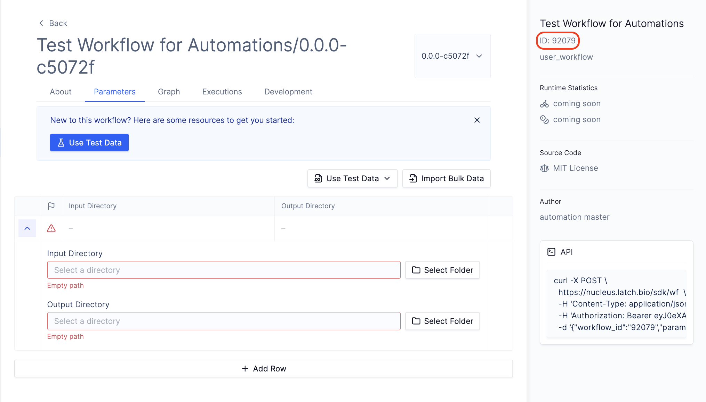

# Workflow Automations

Note: This document is a work in progress and is subject to change.

**Description**

Automations allow you to automatically run a workflow on top of folders in Latch Data based on specific triggers such as when files are added to folders. Automations consist of a trigger, automation workflow and your target workflow.

* _Trigger_ allows you to specify a target directory to watch, the event which kicks off a workflow(right now we support monitoring for file addition events), and a timer for how long to wait to start the workflow after the last file has been added to the target directory.
* _Automation workflow_ runs when the automation triggers. We have supplied a template workflow which reads children of the target folder, runs your _target workflow_ on children and updates which children have been processed in a table your specify inside [Latch Registry](../registry/overview.md).
* _Target workflow_ contains the logic of how to process the files in the child directories.

Below, we will walk through the process of creating an automation on Latch. We assume that you understand how to write and register [Workflows](../basics/what_is_a_workflow.md) on Latch.


**Prerequisite:**
* An existing Table in [Latch Registry](https://latch.wiki/what-is-registry)
* An target folder in [Latch Data](https://console.latch.bio/data)

---

## 1: Create the Automation Workflow

To create the automation workflow, clone the [Automation Workflow Template](https://github.com/latchbio/automation-wf) and navigate to the `automation-wf/wf` directory.

```shell-session
$ git clone git@github.com:latchbio/automation-wf.git
Cloning into 'automation-wf'...
remote: Enumerating objects: 33, done.
remote: Counting objects: 100% (33/33), done.
remote: Compressing objects: 100% (24/24), done.
remote: Total 33 (delta 9), reused 28 (delta 6), pack-reused 0
Receiving objects: 100% (33/33), 8.52 KiB | 1.42 MiB/s, done.
Resolving deltas: 100% (9/9), done.

$ cd automation-wf/wf
```

File Tree:
```shell-session
├── Dockerfile
├── README.md
├── version
└── wf
    ├── __init__.py
    └── automation.py
```

* `automation.py` contains the Python logic to determine how a workflow should be launched.
* `__init__.py` calls the automation task defined in `automation.py`.

## 2. Select the Target Workflow

To specify the child workflow and the registry table with processed children, configure the following parameters in `wf/__init__.py`:

* `output_directory`: The Latch Path to the output folder which this automation workflow will populate. i.e. `latch://...`
* `target_wf_id`: The ID of the workflow you want to automate. To find the workflow ID, navigate to the `Workflows` page on Latch Console, select the workflow of interest, and obtain the ID from the right sidebar.
* `table_id`: The ID of the table that stores metadata for this automation. Automations currently rely on a table to record processed children directories. To obtain the `table_id`, navigate to `Registry` on Latch Console. Then, create a new table in one of your existing projects, and get the ID of the table from the sidebar.


```python
# __init__.py
​
...
@workflow(metadata)
def automation_workflow(input_directory: LatchDir, automation_id: str) -> None:
    automation_task(
        input_directory=input_directory,
        output_directory=LatchOutputDir(
            path="latch://<FIXME>"  # fixme: change to remote path of desired output directory
        ),
        target_wf_id="FIXME",  # fixme: target_wf_id to desired workflow
        table_id="FIXME",  # fixme: change table_id to the desired registry table
    )
```

### Get Workflow ID


### Get Table ID


## 3. Configure Automation Logic

The file `wf/automation.py` contains the logic that determines how an execution for the target workflow should be launched.

### Define the function to launch the target workflow

The `launch_workflow` function is designed to initiate the execution of a specified workflow. It accomplishes this by sending a POST request to the Latch executions endpoint.​

The `data` variable contains the JSON body required for the `POST` request. It includes parameters like `account_id`, `launcher_id`, and `workflow_id`.

The key segment to modify in the data structure is `params`. This refers to the JSON representation of the inputs to the target workflow.

```python
def launch_workflow(
    target_wf_id: str,
    input_directory: LatchDir,
    output_directory: LatchOutputDir,
) -> None:
​
    ### DO NOT CHANGE BELOW
    token = os.environ["FLYTE_INTERNAL_EXECUTION_ID"]
    nucleus_endpoint = os.environ["LATCH_AUTHENTICATION_ENDPOINT"]
    workspace_id = Account.current().id
​
    headers = {
        "Authorization": f"Latch-Execution-Token {token}",
    }
    ### DO NOT CHANGE ABOVE
​
    data = {
        "account_id": workspace_id,
        "launcher_id": workspace_id,
        "workflow_id": target_wf_id,
​
        ### MODIFY WORKFLOW PARAMETERS BELOW
        "params": {
            "input_directory": {
                "scalar": {
                    "blob": {
                        "metadata": {"type": {"dimensionality": "MULTIPART"}},
                        "uri": input_directory.remote_path,
                    }
                }
            },
            "output_directory": {
                "scalar": {
                    "blob": {
                        "metadata": {"type": {"dimensionality": "MULTIPART"}},
                        "uri": output_directory.remote_path,
                    }
                }
            },
        },
    }
​
    response = requests.post(
        urljoin(nucleus_endpoint, "/api/create-execution"),
        headers=headers,
        json=data,
    )
    print(f"Launched workflow {target_wf_id}: {response.json()}")
```

To obtain the JSON representation of the workflow inputs, navigate to a previous execution of your workflow. Select **Graph and Logs**, click on square box around the first task, and select **Inputs**. Copy the workflow parameters inside the `literal` object, and pass it to `params`.

i.e.
```json
{
 "literals": {
    # copy everything inside the brackets
 }
}
```
​
**Usage Notes**:
* To simplify the automation workflow, it is recommended that may want to assign default values to all inputs that is not the input directory you want to watch.
* The `input_directory` refers to the child directory (i.e. the trigger directory) to be passed to the target workflow.
* The `output_directory` refers to directory where the output of the target workflow will be stored.


### Define the logic to launch the workflow
​
The `automation_task` defines the logic that is used to launch the workflow. The code below checks a registry table to see whether an output directory exists, and launches an execution for the target workflow if that is not the case. Optionally, modify the function to change the logic for launching target workflows.

```python
# automation.py
​
...
@small_task
def automation_task(
    input_directory: LatchDir,
    output_directory: LatchOutputDir,
    target_wf_id: str,
    table_id: str,
) -> None:
    automation_table = Table(table_id)

    if automation_table.get_columns().get("Resolved directories", None) is None:
        with automation_table.update() as automation_table_updater:
            automation_table_updater.upsert_column("Resolved directories", LatchDir)

    resolved_directories: Set[str] = set()
    for page in automation_table.list_records():
        for _, record in page.items():
            value = record.get_values()["Resolved directories"]
            assert isinstance(value, LatchDir)
            resolved_directories.add(str(value))
...
```

## 3. Register Automation Workflow

Register the automation workflow to your Latch workspace.

```
$ latch register --remote --yes automation-wf
```

## 4. Create Automation

Navigate to [Automations](https://console.latch.bio/automations) tab via **Worfklows** > **Automations** and click on the **Create Automation** button.

Input an **Automation Name** and **Description**.

Next, select a folder where files/folders will be uploaded using the `Select Target` button. Any items uploaded to this folder will trigger the specified workflow.

Finally, input the automation ID you obtained in the previous step.


