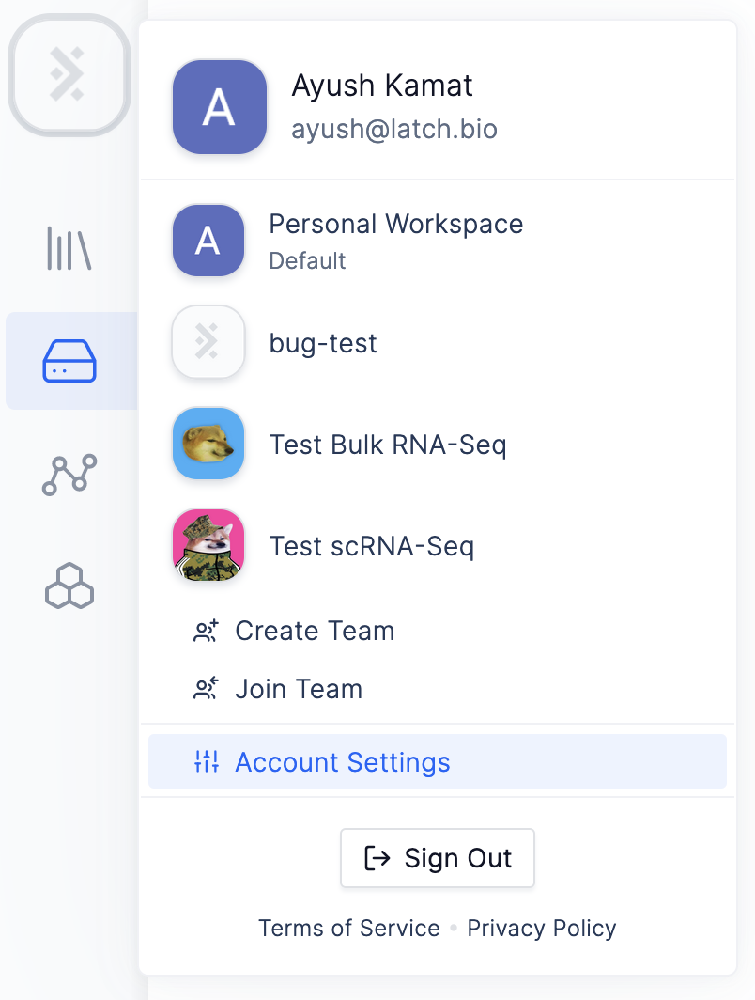
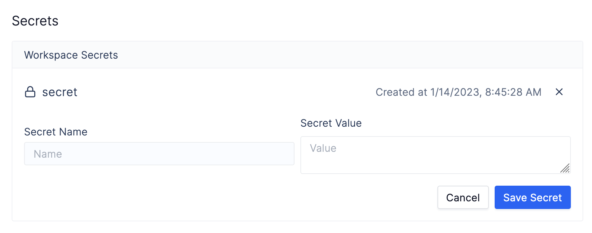

# Storing and using Secrets

Often a workflow can depend on _secret data_, such as an API key, to function
correctly. To make storing and using secret data easy, the Latch SDK comes with
special utilities that handle this securely.

## Adding Secrets

To add a secret, simply navigate to the [Latch Console](https://console.latch.bio)
and head to Account Settings.



From there, navigate to Developer Settings


From there, scroll down to the 'Secrets' section and add your secrets.



Secrets consist of key-value pairs where keys are unique across a workspace.
Secrets are also immutable, so the only way to change the value of a given
secret is to delete it and add a new one with the same key.

## Using Secrets

To use a secret in a workflow, simply use the `get_secret` function built into
the Latch SDK. This function takes in a key and returns the value of the secret
with that key as a string. When run locally, secrets are looked up in the user's
personal workspace only (for security reasons). When running a workflow in the
console, secrets are looked up in the workspace in which the workflow was
registered. Moreover, such workflows will only succeed if ran in the registered
workspace, meaning that no one outside of your team will be able to access your
secrets.

As an example, the following task will get the value of the secret `API_KEY` and
use it to send a request to a server.

```python
from latch import small_task
from latch.functions.secrets import get_secret
import requests


@small_task
def send_fake_data_task(fake_data: str) -> bool:
    token = get_secret("API_KEY")

    response = requests.post(
        "https://fake.example.com/fake/endpoint",
        headers={"Authorization": f"Bearer {token}"}
        json={
            "fake_data": fake_data
        }
    )

    return response.status_code == 200

```
