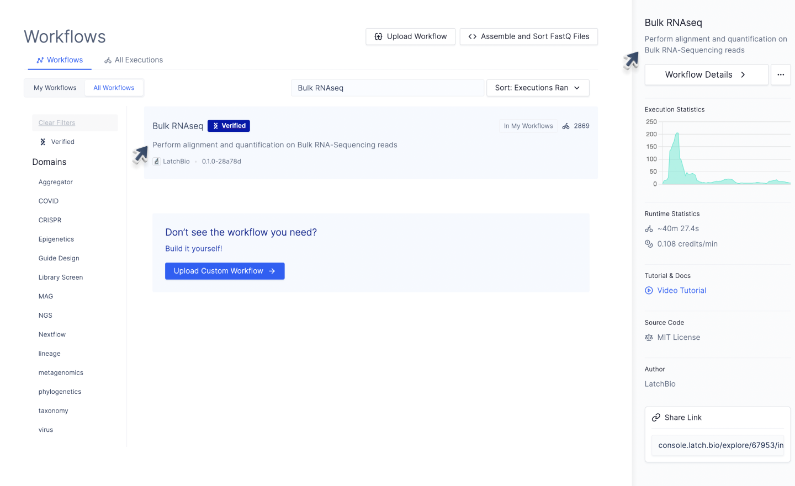
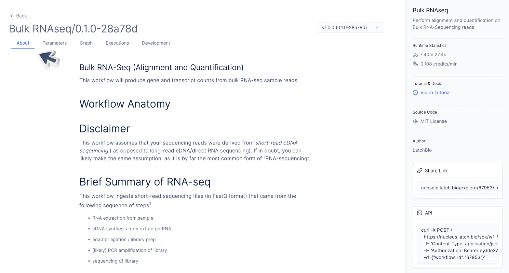

# Adding Documentation to your Workflow

While most of the metadata of a workflow will be encapsulated in a LatchMetadata object, we still require a docstring in the body of the workflow function which specifies both a short and long-form description.

## Short Description

The workflow sidebar and workflow explore tab render the first line of the workflow docstring as a brief description of its functionality. This description should summarize the significance of the workflow in a single line.


```python
from latch import workflow

@workflow
def rnaseq(
    ...
):
    """Perform alignment and quantification on Bulk RNA-Sequencing reads.

    ...
    """
    ...
```



## Long Description

The body of the workflow function docstring supports [GitHub-flavored markdown](https://github.github.com/gfm/) and [KaTeX, a subset of LaTeX for mathematical typesetting](https://katex.org/docs/supported.html).

The workflow "About" tab renders all lines of the workflow docstring after the first. This should include any long-form documentation for the workflow.

```python
from latch import workflow

@workflow
def rnaseq(
    ...
):
    """Perform alignment and quantification on Bulk RNA-Sequencing reads

    Bulk RNA-Seq (Alignment and Quantification)
    ----
    This workflow will produce gene and transcript counts from bulk RNA-seq
    sample reads.

    # Disclaimer

    This workflow assumes that your sequencing reads were derived from *short-read
    cDNA seqeuncing* ...

    # Brief Summary of RNA-seq

    This workflow ingests short-read sequencing files (in FastQ format) that came
    from the following sequence of steps[^1]:
      - RNA extraction from sample
      - cDNA synthesis from extracted RNA
      - adaptor ligation / library prep
      - (likely) PCR amplification of library
      - sequencing of library
    You will likely end up with one or more FastQ files from this process that hold
    the sequencing reads in raw text form. This will be the starting point of our
    workflow.
    ...
    """
```


