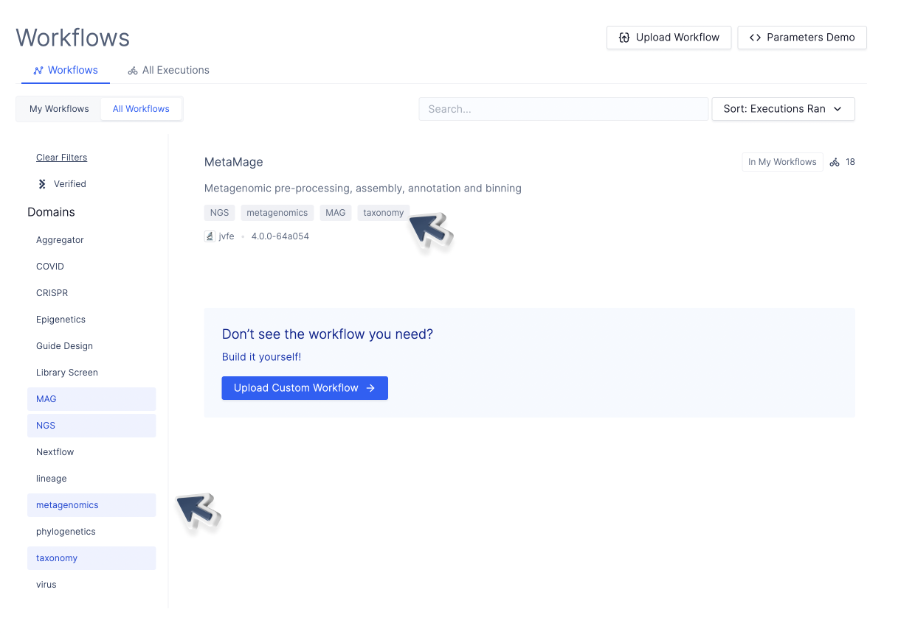

# Customizing Your Interface

The Latch SDK will dynamically construct parameter interfaces from your python code. With these you can specify

- markdown formatted long form documentation
- sidebar presentation of contact email, repository, social media links, etc.
- the ordering and grouping of parameters
- parameter tooltip descriptions
- parameter display names

You use the `LatchMetadata`, `LatchParameter`, etc. constructs to create your parameter interface, with a docstring specifying a short and long description.

---

## Previewing your Workflow

To quickly reiterate on the user interface of your workflow, it is recommended that you use `latch preview` to preview your workflow locally without registering them on Latch.

First, verify that you are inside the workflow directory:

```shell-session
$ ls

Dockerfile      reference       wf      version
```

Then, use `latch preview` with the name of your workflow function:

```shell-session
$ latch preview <workflow_function_name>
```

After using `latch preview`, a new button with your workflow name will also be generated on the top right corner of the workflow page.


You can click on the button to preview the interface.

---

## The `LatchMetadata` Object

The main object that organizes the metadata for a workflow is the `LatchMetadata` object. With the `LatchMetadata` object, you can:

- Customize the sidebar to include information about the source code, software license, documentation, and author of the workflow.
- Customize parameter presentation
- Assign your workflow to a biological domain to make it easily discoverable on Latch

### Customizing the Sidebar

To use `LatchMetadata`, create a singleton instance of a `LatchMetadata` object as follows:

```python
from latch.types import LatchMetadata, LatchAuthor

metadata = LatchMetadata(
    display_name="My Workflow",
    documentation="https://github.com/author/my_workflow/README.md",
    author=LatchAuthor(
        name="Workflow Author",
        email="licensing@company.com",
        github="https://github.com/author",
    ),
    repository="https://github.com/author/my_workflow",
    license="MIT",
)
```

The information given here will be rendered in the sidebar of the workflow in the Latch Console. Here's a brief description of each of the fields of the LatchMetadata object:

- `display_name`: The name of the workflow, e.g. CRISPResso2,
- `documentation`: A URL that leads to documentation for the workflow itself,
- `author`: This must be a `LatchAuthor` objects, whose fields are:
  - `name`: The name of the author;
  - `email`: The author's email;
  - `github`: A link to the author's Github profile,
- `repository`: A link to the Github repository where the code for the workflow lives,
- `license`: The license that the workflow code falls under - must be a [SPDX](https://spdx.dev/) identifier.


---

## Adding Documentation to your Workflow

While most of the metadata of a workflow will be encapsulated in a LatchMetadata object, we still require a docstring in the body of the workflow function which specifies both a short and long-form description.

### One Line Description

The first line of the workflow function docstring will get rendered in the sidebar of the workflow and the workflow explore tab as a brief description of your workflow's functionality. Think of this as summarizing the entirety of your workflow's significance into a single line.

We recommend limiting your workflow description to one sentence, as longer descriptions are only partially rendered on the Workflows page.

```python
@workflow
def rnaseq(
    ...
):
    """Perform alignment and quantification on Bulk RNA-Sequencing reads.

    ...
    """
    ...
```


### Long Form Description

The body of the workflow function docstring is where you write long-form markdown documentation. This markdown will get rendered in the dedicated workflow "About" tab on your interface. Feel free to include links, lists, code blocks, and more.

```python
@workflow
def rnaseq(
    ...
):
    """Perform alignment and quantification on Bulk RNA-Sequencing reads

    Bulk RNA-Seq (Alignment and Quantification)
    ----
    This workflow will produce gene and transcript counts from bulk RNA-seq
    sample reads.

    # Workflow Anatomy

    # Disclaimer

    This workflow assumes that your sequencing reads were derived from *short-read
    cDNA seqeuncing* ...

    # Brief Summary of RNA-seq

    This workflow ingests short-read sequencing files (in FastQ format) that came
    from the following sequence of steps[^1]:
      - RNA extraction from sample
      - cDNA synthesis from extracted RNA
      - adaptor ligation / library prep
      - (likely) PCR amplification of library
      - sequencing of library
    You will likely end up with one or more FastQ files from this process that hold
    the sequencing reads in raw text form. This will be the starting point of our
    workflow.
    ...
    """
```


---

### Customizing Parameter Presentation

Any input of the main `@workflow` function can be added & customized on the front end display for ingesting user values in the browser. To add a workflow parameter to the front end simply add a `LatchParameter` object to your `LatchMetadata` object's parameter dictionary:

```python
from latch.types import LatchParameter, LatchAppearanceType, LatchRule

...

# Assuming you have created a LatchMetadata object named `metadata`
metadata.parameters['param_0'] = LatchParameter(
    display_name="Parameter 0",
    description="This is parameter 0",
    hidden=False,
)

...

@workflow(metadata)
def wf(
    param_0: int, # any of the supported types would also work here
    ...
)
```

When a workflow is registered, each workflow parameter will receive a frontend component to ingest values in the browser.

Each key in `metadata.parameters` must be the name of one of the parameters of the workflow, and so the corresponding `LatchParameter` object describes that specific parameter. A `LatchParameter` can take a myriad of keyword arguments at construction time, each of which are briefly described below.

- `display_name` (str): A human-readable, descriptive name of the parameter,
- `description` (str): A short description of the role of the parameter within the workflow, to be displayed when hovered over in a tooltip,
- `hidden` (boolean): A boolean for whether or not the parameter should be hidden by default,
- `section_title` (str): If provided, the specified parameter will start a new section of the given name,
- `placeholder` (str): What placeholder to put inside the input form for the parameter if no value is present,
- `comment` (str): A comment about the parameter,
- `output` (boolean): Whether this parameter is an output directory (to disable path existence checks),
- `batch_table_column` (boolean): Whether this parameter should have a column to itself in the batch table at the top of the parameters page,
- `appearance_type`: Either `LatchAppearanceType.line` or `LatchAppearanceType.paragraph`, which style to render text inputs as.
- `rules`: A list of `LatchRule`s which consist of a regular expression and a message. If provided, an input must match all given regexes in order to appear valid in the front end - if it fails to match one of the regexes, the corresponding message is displayed.

See below for a parameter display that uses all options mentioned:

```python
from latch.types import LatchMetadata, LatchAuthor, LatchRule, LatchAppearanceType

metadata = LatchMetadata(
    parameters={
        "read1": LatchParameter(
            display_name="Read 1",
            description="Paired-end read 1 file to be assembled.",
            hidden=True,
            section_title="Sample Reads",
            placeholder="Select a file",
            comment="This is a comment",
            output=False,
            appearance_type=LatchAppearanceType.paragraph,
            rules=[
                LatchRule(
                    regex="(.fasta|.fa|.faa|.fas)$",
                    message="Only .fasta, .fa, .fas, or .faa extensions are valid"
                )
            ],
            batch_table_column=True,  # Show this parameter in batched mode.
        ),
)

@workflow(metadata)
def wf(read1: LatchFile):
    ...
```

### How Python types of paramters translate to the UI

Latch parses the Python type of your workflow parameters to generate the appropriate interface.

Below is a list of examples of Python types and how they translate to the UI:

### LatchFile

```python
from latch.types import LatchFile
from typing import Optional

...
@workflow
def bactopia_wf(
    ...
    fastq_one: Optional[LatchFile] = None,
    ...
)
```


`LatchFile` receives a button that allows users of the workflow to select data from their Latch account. The `Optional` type renders the toggle for `fastq_one`. When the toggle is turned on, Latch automatically detects the empty path and throws a warning. Additionally, you can set the default value to the path to `None`.

### LatchDir

```python
from latch.types import LatchDir

...
@workflow
def bactopia_wf(
    ...
    output_dir: LatchDir,
    ...
)
```


### Boolean

```python
hybrid: bool = False,
```


### Enum

```python
from enum import Enum

# You must define your Enum as a python class before using it as an annotation.
class SpeciesGenomeSize(Enum):
    mash = "mash estimate"
    min = "min"
    median = "median"
    mean = "mean"
    max = "max"

...
@workflow
def bactopia_wf(
    ...
    species_genome_size: SpeciesGenomeSize,
    ...
)
```


### Int

```python
@workflow
def bactopia_wf(
    ...
    coverage: int,
    ...
)
```


### Str

```python
@workflow
def bactopia_wf(
    ...
    sample_name: str = "sample1"
    ...
)
```


### List

```python
from latch.types import LatchFile
from typing import List

@workflow
def rnaseq(
    sample_identifiers: List[str],
    sample_reads: List[LatchFile]
):
...
```


When `List` is used, Latch generates a plus sign, where users can add additional values of the same type. For `LatchFile`s specifically, an additional button **Bulk Add Files** is generated, allowing users to select multiple files at once.

### Dataclass

If you want to handle file references and their associated metadata as an input to your workflow, you may want to use a `dataclass`.

```python
from dataclasses import dataclass
from dataclasses_json import dataclass_json

@dataclass_json
@dataclass
class Sample:
    name: str
    fastq: LatchFile

@workflow
def rnaseq(
    samples: List[Sample]
):

```


Here, we are passing a list of `Sample`s as the input. On the Latch interface, when a user clicks the `+ Sample` button, a new block will be added with two parameters of the Python class `name` and `fastq`.

---

## Custom Parameter Layout (Flow)

By default parameters are displayed in a flat list, in the order in which they are declared in the metadata. For more complex workflows it is often better to specify a custom layout, known as a "flow".

The custom layout is specified using the `flow` parameter of the {class}`~latch.types.metadata.Metadata` specification, which is a list of flow elements. Additionally, some flow elements can have child flows themselves. All such flow elements can be arbitrarily nested

## Flow Elements

- {class}`~latch.types.metadata.Params` is the most basic flow element which displays the specified parameter widgets one after another. A parameter can be part of any number of {class}`~latch.types.metadata.Params` elements. The default workflow layout is equivalent to `flow=[Params("first_param", "second_param", ...)]`

- {class}`~latch.types.metadata.Title` and {class}`~latch.types.metadata.Text` are decorative flow elements that display a string of title and body text respectively. These elements have full markdown support. They are most often used to explain a parameter or group parameters without cluttering the UI as much as a {class}`~latch.types.metadata.Section`

- {class}`~latch.types.metadata.Section` displays a child flow in a card with a given title. This is the basic building block of most UIs

- {class}`~latch.types.metadata.Spoiler` displays a child flow in a collapsible card with a given title. The spoiler is collapsed by default. This is often used for hiding away parts of the UI that will not be useful to the majority of users

- {class}`~latch.types.metadata.Fork` shows a set of mutually-exclusive alternatives. The alternatives are specified as a list of {class}`~latch.types.metadata.ForkBranch`, each of which displays a child flow when active and nothing otherwise. Each branch is identified by a unique key. This key is passed to the workflow is a `str`-typed parameter so the user selection can be used to change runtime behavior

---

## Adding your workflow to a biological domain on Latch

For public workflows, you may want to classify your workflow to a biological domains to make it easier for future users to discover.

To do so, you can use the `tags` property of `LatchMetadata`.

```python
metadata = LatchMetadata(
    ...
    tags=["NGS", "MAG"],
    ...
)
```

Below is a list of commonly used domains on Latch. For best practices, you should tag your workflow with an existing domain instead of creating a new one.

- Aggregator
- COVID
- CRISPR
- Epigenetics
- Guide Design
- Library Screen
- MAG
- NGS
- Nextflow


