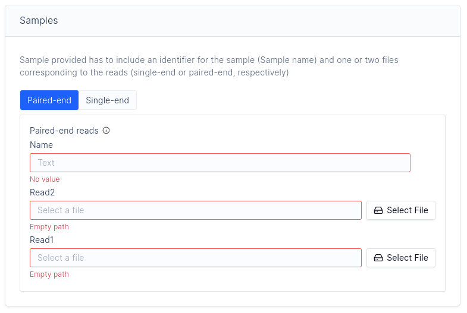
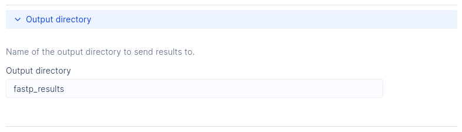

# Customizing Your Interface

The Latch SDK will dynamically construct parameter interfaces from your python code using the `LatchMetadata` object.

With these you can specify

- sidebar presentation of contact email, repository, social media links, etc.
- the ordering and grouping of parameters
- parameter tooltip descriptions
- parameter display names

## Parameter Display

For any workflow parameters you want to display on the GUI, you can add them to the `LatchMetadata` object like so:

```python
from latch.types import LatchParameter, LatchAppearanceType, LatchRule

...

# Assuming you have created a LatchMetadata object named `metadata`
metadata.parameters['param_0'] = LatchParameter(
    display_name="Parameter 0",
    description="This is parameter 0",
    hidden=False,
)

...

@workflow(metadata)
def wf(
    param_0: int, # any of the supported types would also work here
    ...
)
```

Each key in `metadata.parameters` must be the name of one of the parameters of the workflow, otherwise the parameter will not be displayed.

A `LatchParameter` can take a myriad of keyword arguments at construction time, each of which is described below.

- `display_name` (str): A human-readable, descriptive name of the parameter,
- `description` (str): A short description of the role of the parameter within the workflow, to be displayed when hovered over in a tooltip,
- `hidden` (boolean): A boolean for whether or not the parameter should be hidden by default,
- `section_title` (str): If provided, the specified parameter will start a new section of the given name,
- `placeholder` (str): What placeholder to put inside the input form for the parameter if no value is present,
- `comment` (str): A comment about the parameter,
- `output` (boolean): Whether this parameter is an output directory (to disable path existence checks),
- `batch_table_column` (boolean): Whether this parameter should have a column to itself in the batch table at the top of the parameters page,
- `appearance_type`: Either `LatchAppearanceType.line` or `LatchAppearanceType.paragraph`, which style to render text inputs as.
- `rules`: A list of `LatchRule`s which consist of a regular expression and a message. If provided, an input must match all given regexes in order to appear valid in the front end - if it fails to match one of the regexes, the corresponding message is displayed.
- `documentation`: A URL that leads to documentation for the workflow itself,
- `author`: This must be a `LatchAuthor` objects, whose fields are:
  - `name`: The name of the author;
  - `email`: The author's email;
  - `github`: A link to the author's Github profile,
- `repository`: A link to the Github repository where the code for the workflow lives,
- `license`: The license that the workflow code falls under - must be a [SPDX](https://spdx.dev/) identifier.

<details>
<summary>Example</summary>

```python
from latch.types import LatchMetadata, LatchAuthor, LatchRule, LatchAppearanceType

metadata = LatchMetadata(
    parameters={
        "read1": LatchParameter(
            display_name="Read 1",
            description="Paired-end read 1 file to be assembled.",
            hidden=True,
            section_title="Sample Reads",
            placeholder="Select a file",
            comment="This is a comment",
            output=False,
            appearance_type=LatchAppearanceType.paragraph,
            rules=[
                LatchRule(
                    regex="(.fasta|.fa|.faa|.fas)$",
                    message="Only .fasta, .fa, .fas, or .faa extensions are valid"
                )
            ],
            batch_table_column=True,  # Show this parameter in batched mode.
            # The below parameters will be displayed on the side bar of the workflow
            documentation="https://github.com/author/my_workflow/README.md",
            author=LatchAuthor(
                name="Workflow Author",
                email="licensing@company.com",
                github="https://github.com/author",
            ),
            repository="https://github.com/author/my_workflow",
            license="MIT",
            # If the workflow is public, display it under the defined categories on Latch to be more easily discovered by users
            tags=["NGS", "MAG"],
        ),
)

@workflow(metadata)
def wf(read1: LatchFile):
    ...
```
</details>

---

## Parameter Layout (Flow)

By default parameters are displayed in a flat list, in the order in which they are declared in the metadata. For more complex workflows it is often better to specify a custom layout, known as a "flow".

The custom layout is specified using the `flow` parameter of the {class}`~latch.types.metadata.Metadata` specification, which is a list of flow elements. Additionally, some flow elements can have child flows themselves. All such flow elements can be arbitrarily nested.

## Flow Elements

- {class}`~latch.types.metadata.Params` is the most basic flow element which displays the specified parameter widgets one after another. A parameter can be part of any number of {class}`~latch.types.metadata.Params` elements. The default workflow layout is equivalent to `flow=[Params("first_param", "second_param", ...)]`

- {class}`~latch.types.metadata.Title` and {class}`~latch.types.metadata.Text` are decorative flow elements that display a string of title and body text respectively. These elements have full markdown support. They are most often used to explain a parameter or group parameters without cluttering the UI as much as a {class}`~latch.types.metadata.Section`

- {class}`~latch.types.metadata.Section` displays a child flow in a card with a given title. This is the basic building block of most UIs

- {class}`~latch.types.metadata.Spoiler` displays a child flow in a collapsible card with a given title. The spoiler is collapsed by default. This is often used for hiding away parts of the UI that will not be useful to the majority of users

- {class}`~latch.types.metadata.Fork` shows a set of mutually-exclusive alternatives. The alternatives are specified as a list of {class}`~latch.types.metadata.ForkBranch`, each of which displays a child flow when active and nothing otherwise. Each branch is identified by a unique key. This key is passed to the workflow is a `str`-typed parameter so the user selection can be used to change runtime behavior

<details>
<summary>Flow Example</summary>





The `LatchMetadata` can be defined as follows:

```python
from latch.types import LatchMetadata, LatchParameter
from latch import workflow

metadata = LatchMetadata(
    display_name="fastp - Flow Tutorial",
    author=LatchAuthor(
        name="LatchBio",
    ),
    parameters={
        "sample_fork": LatchParameter(),
        "paired_end": LatchParameter(
            display_name="Paired-end reads",
            description="FASTQ files",
            batch_table_column=True,
        ),
        "single_end": LatchParameter(
            display_name="Single-end reads",
            description="FASTQ files",
            batch_table_column=True,
        ),
        "output_directory": LatchParameter(
            display_name="Output directory",
        ),
    },
    flow=FLOW,
)

@workflow(metadata)
def fastp(
    sample_fork: str,
    paired_end: PairedEnd,
    single_end: Optional[SingleEnd] = None,
    output_directory: str = "fastp_results",
) -> LatchDir:
    ...
```

where `FLOW` is a list of flow elements:

```python
FLOW = [
    Section(
        "Samples",
        Text(
            "Sample provided has to include an identifier for the sample (Sample name)"
            " and one or two files corresponding to the reads (single-end or paired-end, respectively)"
        ),
        Fork(
            "sample_fork",
            "Choose read type",
            paired_end=ForkBranch("Paired-end", Params("paired_end")),
            single_end=ForkBranch("Single-end", Params("single_end")),
        ),
    ),
    Section(
        "Quality threshold",
        Text(
            "Select the quality value in which a base is qualified."
            "Quality value refers to a Phred quality score"
        ),
        Params("quality_threshold"),
    ),
    Spoiler(
        "Output directory",
        Text("Name of the output directory to send results to."),
        Params("output_directory"),
    ),
]
```

</details>
