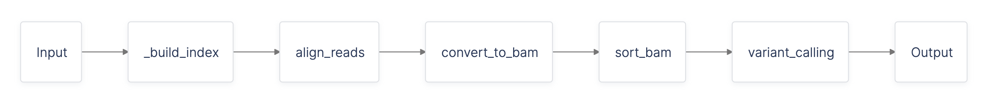
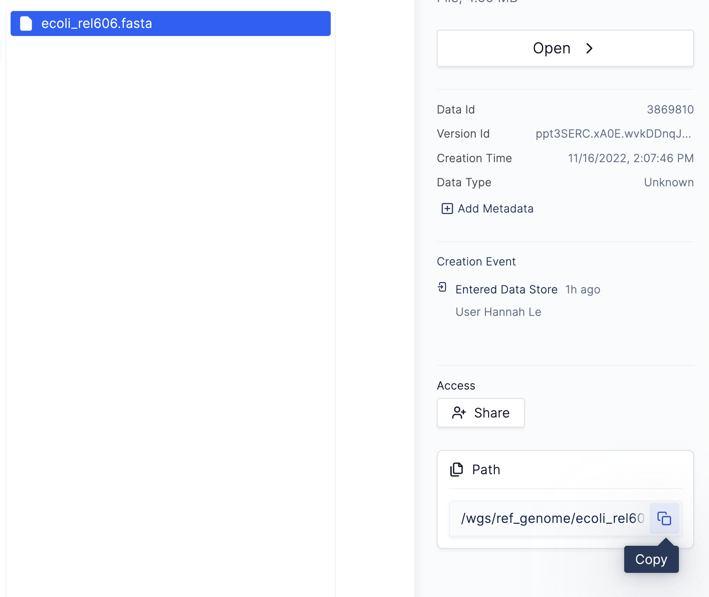
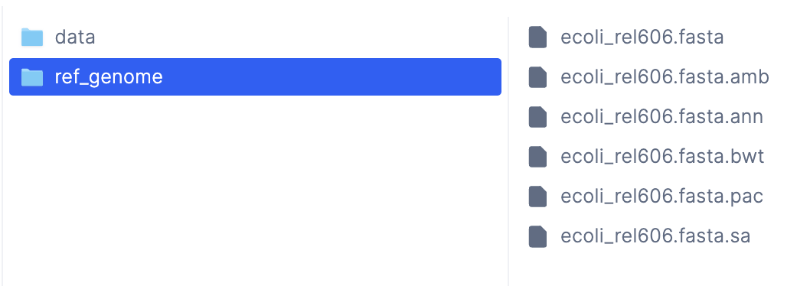
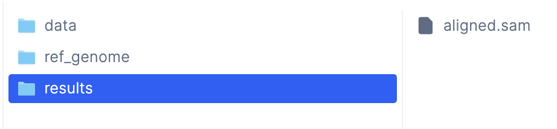

# Learning through An Example
We will walk through a quick end-to-end flow for testing and debugging a variant calling workflow to demonstrate how to use latch develop.

## Prerequisites

* Install [Latch](../getting_started/quick_start.md)
* Have a conceptual understanding of how Latch workflows work through reading the [quick start](../getting_started/quick_start.md) and [authoring a workflow](../getting_started/authoring_your_workflow.md)
* Understand how [latch develop](../basics/local_development.md) works

## Building a Simple Variant Calling Workflow

In this tutorial, we will be building a variant calling workflow. To follow along, clone the example code here:

```console
git clone https://github.com/hannahle/simple-variant-calling.git
cd simple-variant-calling
```

The repository consists of three folders:

* `buggy-wf`: The workflow with bugs
* `good-wf`: The final, functional workflow
* `wgs`: Test data for the workflow

We will use `latch develop` to test and debug the buggy-wf to arrive at good-wf effectively.

Let's get started!

## Preparing test data

First, we must upload our test data folder, `wgs`, to the Latch Platform.

Run the following command to upload the `wgs` data from the terminal

```console
$ latch cp wgs latch:///wgs
```

Once the data has finished uploading, verify whether it exists on Latch by using `latch ls` like so:

```console
$ latch ls

Size Date Modified Name
   - -             welcome/
   - -             wgs/
```

## Overview of the variant calling workflow

The data we are working with is part of a long-term evolution experiment by
[Richard Lenski](https://lenski.mmg.msu.edu/), designed to assess the adaptation of _E. coli_ in various
environments.

Variant calling is a typical workflow used to observe the change in a population over successive
generations. We can use this to analyze how this experiment's _E. coli__ population changed over time relative to the original population, _E. coli_ strain REL606. To do so, we will align each of our samples to the original _E.coli_ strain's (REL606) reference genome to determine the differences between our reads after 40,000 generations
versus the original genome.



Our variant calling pipeline will consist of five steps:

1. Index the reference genome
2. Align our reads to the reference genome
3. Convert our aligned reads from SAM to BAM format
4. Sort our BAM file by coordinates
5. Perform variant calling

Hence, our workflow will contain five tasks: `build_index`, `align_reads`, `convert_to_bam`, `sort_bam`, and
`variant_calling`.

We have provided some (buggy) code for the five tasks above for you in the `buggy-wf`, which you will now test and debug!

## Testing and Debugging the Workflow

First, enter the `buggy-wf` folder and register it to Latch:

```console
$ ls
buggy-wf        good-wf         wgs

$ cd buggy-wf

$ latch register --remote .
```

We must register the workflow before we can debug it with `latch develop`. The registration process builds the code's environment, which is the key to successfully debugging your workflow. Now we can interact with the environment.

## Entering the environment

Run `latch develop .` in the workflow directory to enter the workflow environment.

We recommend reading [this](../basics/local_development.md#notes-on-the-test-environment) overview of the latch develop environment before proceeding.

## Defining a test script

Before testing the workflow end-to-end, it is helpful to run and test each task individually. To get started, we have provided a testing directory called `scripts` with a `main.py` inside containing commented-out task test code.

```console
$ tree .
.
├── Dockerfile
├── README.md
├── scripts
│   └── main.py
├── version
└── wf
    └── __init__.py

3 directories, 6 files
```

Uncomment some of the code in `main.py` to get this:

```python
# Import task functions from our workflow
from wf import build_index, align_reads, convert_to_bam, sort_bam, variant_calling
from latch.types import LatchFile, LatchDir

# Call task function
build_index(ref_genome = LatchFile("latch:///wgs/ref_genome/ecoli_rel606.fasta"))
```

* The first line imports all tasks defined in `wf/__init__.py` so we can reference them in this script.
* The second line imports the necessary Latch types.
* The third line calls the task function to index the reference genome, `build_index`.



To use a file on Latch as test data for the task, navigate to the Latch Console, click on the specific file and copy the
path shown on the sidebar. After copying the path, prefix it with `latch://` to specify that it is a file on Latch, and
pass the whole string as a parameter to `LatchFile`.

## Calling the test script

Now that we have modified our local code, we can run it in the development environment. Note that local changes are automatically reflected in the development environment.

```console
>>> python3 scripts/main.py

...
FileNotFoundError: [Errno 2] No such file or directory: 'bwa'
```

The logs tell us that there is no file or directory called `bwa`. One potential reason is that we might not have
installed the binary `bwa` correctly.

```console
>>> bwa

bash: bwa: command not found
```

Indeed, our `bwa` binary is not installed! Checking the Dockerfile, notice that the installation instruction for `bwa`
is commented out. Let's uncomment it:

```Dockerfile
...
RUN apt-get install bwa
...
```

Because we modified our Dockerfile, we must rebuild the environment and enter a new development session to load in the newest changes. First, exit the current development session:

```console
>>> exit
Exiting local development session
```

Re-register the workflow with the new Docker image

```console
$ latch register --remote .
...
```

Now enter a new development session and re-run the test script:

```console
>>> python3 scripts/main.py
```

The script should now run successfully!

## Where are my outputs?
To ensure that our tasks are working correctly, let's look at their output files to ensure they're correct.
To locate the output files, we can inspect the return statement of the `build_index` task inside `wf/__init__.py`:

```python
@small_task
def build_index(ref_genome: LatchFile = LatchFile("latch:///wgs/ref_genome/ecoli_rel606.fasta")) -> LatchDir:
    _bwa_cmd = [
        "bwa",
        "index",
        ref_genome.local_path,
    ]
    subprocess.run(_bwa_cmd)
    output = Path(ref_genome.local_path).resolve().parent

    return LatchDir(output, "latch:///wgs/ref_genome")
```

We see that the task is returning a `LatchDir` with the remote path `latch:///wgs/ref_genome`, which indicates that the
output files are inside the `/wgs/ref_genome` folder in the Latch Console.



## Debugging Subsequent Tasks

Similarly to how we tested our first task, we can also call the second task from `scripts/main.py` like so:

```python
from wf import build_index, align_reads, convert_to_bam, sort_bam, variant_calling
from latch.types import LatchFile, LatchDir

build_index(ref_genome=LatchFile("latch:///wgs/ref_genome/ecoli_rel606.fasta"))

align_reads(
    ref_genome_dir=LatchDir("latch:///wgs/ref_genome/"),
    read1=LatchFile("latch:///wgs/data/SRR2584863_1.trim.sub.fastq"),
    read2=LatchFile("latch:///wgs/data/SRR2584863_2.trim.sub.fastq"),
)
```

Here, we are passing the output of the first task, `latch:///wgs/ref_genome`, as the input to the second task.

Run the test script:

```console
>>> python3 scripts/main.py
...
Original exception: failed to get presigned url for `latch:///wgs/trimmed_fastqs/SRR2584863_1.trim.sub.fastq`
```

This error tells us that there is no file called `/wgs/trimmed_fastqs/SRR2584863_1.trim.sub.fastq` in the Latch
Console. Referencing the actual file paths of the trimmed FastQs, we can see that their paths are indeed wrong, with
the correct paths being `/wgs/data/SRR2584863_1.trim.sub.fastq`, etc (listed under `/wgs/data` instead of `/wgs/
trimmed_fastqs`).

We can make this modification to our test script and re-run the task as below:

```console
>>> python3 scripts/main.py
```

The task now outputs the results to the folder `/results` on Latch!



## Exercise

As an optional exercise, continue debugging the workflow's final three tasks. The debugged workflow code is provided in the `good-wf` folder for reference.

---

## Key Takeaways

* How to open a development session with `latch develop`
* How local changes are synced to the development environment
* How to reflect changes from your `Dockerfile` in the latch develop environment
