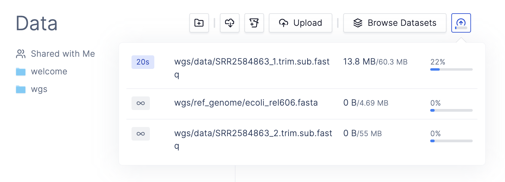

# Learning through An Example

To demonstrate how to use `latch develop`, we will walk through an end-to-end flow of testing and debugging an existing variant calling workflow.

## Prerequisites

* Install [Latch](../getting_started/quick_start.md)
* Have a conceptual understanding of how Latch workflows work through reading the [Quickstart](../getting_started
  quick_start.md) and [Authoring your own workflow](../getting_started/authoring_your_workflow.md)

## Building a Simple Variant Calling Workflow

In this tutorial, we will be building a simple variant calling workflow. To follow along, you can clone the example
code here:

```console
git clone https://github.com/hannahle/simple-variant-calling.git
cd simple-variant-calling
```

The repository consists of three folders:

* `buggy-wf`: The workflow with bugs
* `good-wf`: The final, functional workflow
* `wgs`: Test data for the workflow

After this example, you will learn how to use `latch develop` to effectively test and debug the `buggy-wf` to arrive at
the `good-wf`.

Let's get started!

## Preparing test data

First, we have to upload our test data folder, `wgs`, to the Latch Platform.

To do so, you can navigate to [console.latch.bio](https://console.latch.bio), and drag and drop the test data folder on
Latch. You should see a spinning wheel which indicates the status of your data upload.



Once your data has finished uploading, you can verify whether it exists on Latch by using `latch ls` like so:

```console
$ latch ls

Size Date Modified Name
   - -             welcome/
   - -             wgs/
```

## Overview of the variant calling workflow

The data we are working with is part of a long-term evolution experiment by
[Richard Lenski](https://lenski.mmg.msu.edu/), which was designed to assess the adaptation of _E. coli_ in various
environments.

A population of these bacteria was propagated for over 40,000 generations in a glucose-limited minimal medium which was
supplemented with citrate. Sequencing of the populations at different time points revealed that a spontaneous
citrate-using variant (Cit+) appeared between 31,000 and 31,500 generations, causing an increase in population size and
diversity.

Variant calling is a common workflow that can be used to observe the change in a population over successive
generations. We can use this to analyze how the population of _E. coli_ in this experiment changed over time relative
to the original population, _E. coli_ strain REL606. To do so, we will align each of our samples to the original _E.
coli_ strain's (REL606) reference genome to determine what differences exist between our reads after 40,000 generations
versus the original genome.


Our variant calling pipeline will consist of five steps:

1. Index the reference genome
2. Align our reads to the reference genome
3. Convert our aligned reads from SAM to BAM format
4. Sort our BAM file by coordinates
5. Perform variant calling

Hence, our workflow will contain five tasks: `build_index`, `align_reads`, `convert_to_bam`, `sort_bam`, and
`variant_calling`.

We've provided some (buggy) code for the five tasks above for you in the `buggy-wf`, which you will now test and debug!

## Testing and Debugging the Workflow

First, enter the `buggy-wf` folder and register it to Latch:

```console
$ ls
buggy-wf        good-wf         wgs

$ cd buggy-wf

$ latch register --remote .
```

## Defining a test script

Before testing the workflow end-to-end, it is helpful to run and test each task individually. To do so, create a folder
called `scripts`, which will contain Python files that can call your task functions.

```console
$ tree .
.
├── Dockerfile
├── README.md
├── scripts
│   └── main.py
├── version
└── wf
    └── __init__.py

3 directories, 6 files
```

For example, our `main.py` script can look like:

```python
# Import task functions from our workflow
from wf import build_index, align_reads, convert_to_bam, sort_bam, variant_calling
from latch.types import LatchFile, LatchDir

# Call task function
build_index(ref_genome = LatchFile("latch:///wgs/ref_genome/ecoli_rel606.fasta"))
```

* The first line imports all tasks defined in `wf/__init__.py` so that we can reference them in this script.
* The second line imports the necessary Latch types.
* The third line calls the task function to index the reference genome, `build_index`.


To use a file on Latch as test data to the task, navigate to the Latch Console, click on the specific file and copy the
path shown on the sidebar. After copying the path, prefix it with `latch://` to specify that it is a file on Latch, and
pass the whole string as a parameter to `LatchFile`.

## Calling the test script

Inside `buggy-wf`, start a development session by running

```console
$ latch develop .

Copying your local changes...
Could not find /Users/hannahle/Documents/GitHub/simple-variant-calling/buggy-wf/data - skipping
Done.
Successfully connected to remote instance.
Pulling 6064_buggy-wf, this will only take a moment...
Image successfully pulled.
>>>
```

Now, run the test script as below:

```console
>>> run-script scripts/main.py

Syncing your local changes...
Could not find /Users/hannahle/Documents/GitHub/simple-variant-calling/buggy-wf/data - skipping
Finished syncing. Beginning execution and streaming logs:
Finished downloading ecoli_rel606.fasta

====================
2022-11-17 00:09:13,104 flytekit ERROR Exception occured when executing task: [Errno 2] No such file or directory: 'bwa'
====================
```

The logs tell us that there is no file or directory called `bwa`. One potential reason why is that we might not have
installed the binary `bwa` correctly.

To check this, let's open up a shell and check if the `bwa` command exists:

```console
>>> shell

account-4034-development@ip-10-0-11-243:~$
```

This opens up an interactive bash session into the environment in which our task is running, which we can use just like
a normal terminal. Trying to run `bwa` in it yields the following output:

```console
account-4034-development@ip-10-0-11-243:~$ bwa
bash: bwa: command not found
```

Indeed, our `bwa` binary was not installed! Checking the Dockerfile, notice that the installation instruction for `bwa`
is commented out. Let's uncomment it:

```Dockerfile
...
RUN apt-get install bwa
...
```

Because we made a modification to our Dockerfile, we have to rebuild the environment and enter a new development
session to load in the newest changes. First, exit your current development session:

```console
account-4034-development@ip-10-0-11-243:~$ exit
>>> exit
Exiting local development session
```

Re-register your workflow with the new Docker image

```console
$ latch register --remote .
...
```

Next, once your workflow finishes registering, enter a new development session:

```console
$ latch develop .
...
```

Now, re-run the test script:

```console
>>> run-script scripts/main.py
```

Your script should now run successfully!

## Where are my outputs?

To make sure that our tasks are working properly, lets look at their output files to make sure that they're correct.
Where do we find them though? Let's inspect the return statement of the `build_index` task inside `wf/__init__.py`:

```python
@small_task
def build_index(ref_genome: LatchFile = LatchFile("latch:///wgs/ref_genome/ecoli_rel606.fasta")) -> LatchDir:
    _bwa_cmd = [
        "bwa",
        "index",
        ref_genome.local_path,
    ]
    subprocess.run(_bwa_cmd)
    output = Path(ref_genome.local_path).resolve().parent

    return LatchDir(output, "latch:///wgs/ref_genome")
```

We can see the task is returning a `LatchDir` with the remote path `latch:///wgs/ref_genome`, which indicates that the
output files are located inside the `/wgs/ref_genome` folder in the Latch Console.


## Debugging Subsequent Tasks

Similarly to how we tested our first task, we can also call the second task from `scripts/main.py` like so:

```python
from wf import build_index, align_reads, convert_to_bam, sort_bam, variant_calling
from latch.types import LatchFile, LatchDir

build_index(ref_genome=LatchFile("latch:///wgs/ref_genome/ecoli_rel606.fasta"))

align_reads(
    ref_genome_dir=LatchDir("latch:///wgs/ref_genome/"),
    read1=LatchFile("latch:///wgs/data/SRR2584863_1.trim.sub.fastq"),
    read2=LatchFile("latch:///wgs/data/SRR2584863_2.trim.sub.fastq"),
)
```

Here, we are passing the output of the first task, `latch:///wgs/ref_genome`, as the input to the second task.

Run the test script:

```console
>>> run-script scripts/main.py

Syncing your local changes...
Could not find /Users/hannahle/Documents/GitHub/simple-variant-calling/buggy-wf/data - skipping
Finished syncing. Beginning execution and streaming logs:
Finished downloading ecoli_rel606.fasta.amb
Finished downloading ecoli_rel606.fasta.ann
Finished downloading ecoli_rel606.fasta.pac
Finished downloading ecoli_rel606.fasta.sa
Finished downloading ecoli_rel606.fasta
Finished downloading ecoli_rel606.fasta.bwt
['/tmp/flyte-4jp7wtbm/sandbox/local_flytekit/638a02102804a22fa669f18a715b580a/ecoli_rel606.fasta']
====================
2022-11-17 00:42:29,046 flytekit ERROR Exception occured when executing task: Failed to get data from latch:///wgs/
trimmed_fastqs/SRR2584863_1.trim.sub.fastq to /tmp/flyte-4jp7wtbm/sandbox/local_flytekit/
3b8d7234fe9c7d3e37ec78af9c592208/SRR2584863_1.trim.sub.fastq (recursive=False).

Original exception: failed to get presigned url for `latch:///wgs/trimmed_fastqs/SRR2584863_1.trim.sub.fastq`
====================
```

This error tells us that there is no file called `/wgs/trimmed_fastqs/SRR2584863_1.trim.sub.fastq` in the Latch
Console. Referencing the actual file paths of the trimmed FastQs, we can see that their paths are indeed wrong, with
the correct paths being `/wgs/data/SRR2584863_1.trim.sub.fastq`, etc (listed under `/wgs/data` instead of `/wgs/
trimmed_fastqs`).

We can make this modification to our test script and re-run the task as below:

```console
>>> run-script scripts/main.py
```

The task now outputs the results to the folder `/results` on Latch!


## Exercise

As an exercise, you are welcome to continue and debug the final three tasks of the whole workflow. The solution of a
working workflow is provided in the `good-wf` folder for reference.

---

## Key Takeaways

* How to open a development session with `latch develop`
* How to open an interactive bash for quick debugging of commands with `shell`
* How to call a task and run a test script with `run-script`
