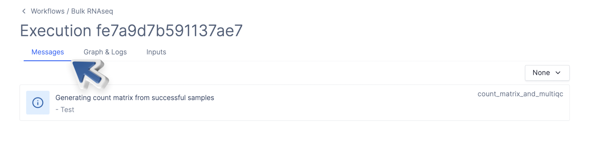

# Messages

Task executions produce logs, displayed on the Latch console to provide users visibility into their workflows. However, these logs tend to be terribly verbose. It's tedious to sift through piles of logs looking for useful signals; instead, important information, warnings, and errors should be prominently displayed. This is accomplished through the Latch SDK's messaging feature.

```python
@small_task
def task():

    ...

    try:
        ...
    catch ValueError:
        title = 'Invalid sample ID column selected'
        body = 'Your file indicates that sample columns a, b are valid'
        message(typ='error', data={'title': title, 'body': body})

    ...
```

The `type` parameter affects how your message is styled. It currently accepts three options:

- `info`
- `warning`
- `error`

The `data` parameter contains the message to be displayed. It's represented as a Python `dict` and requires two inputs,

- `title`: The title of your message
- `body`: The contents of your message

On the Latch interface, the messages will be displayed under the **Messages** tab of a specific execution. 



For more information, see `latch.functions.messages` under the API docs.