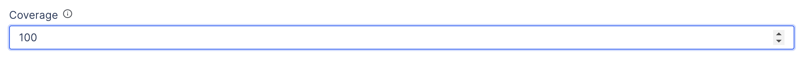
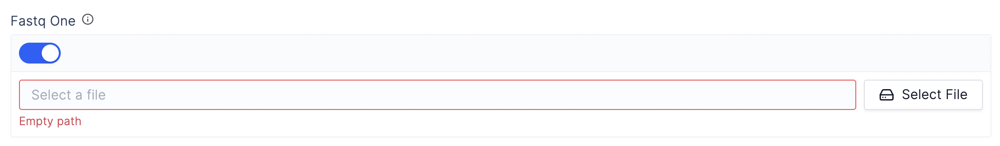
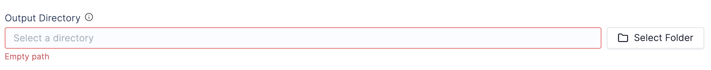
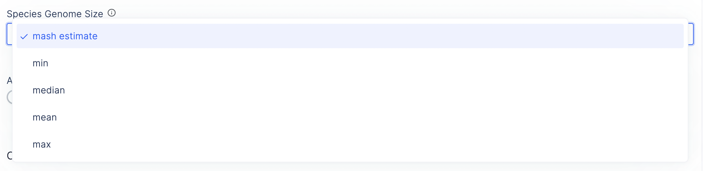
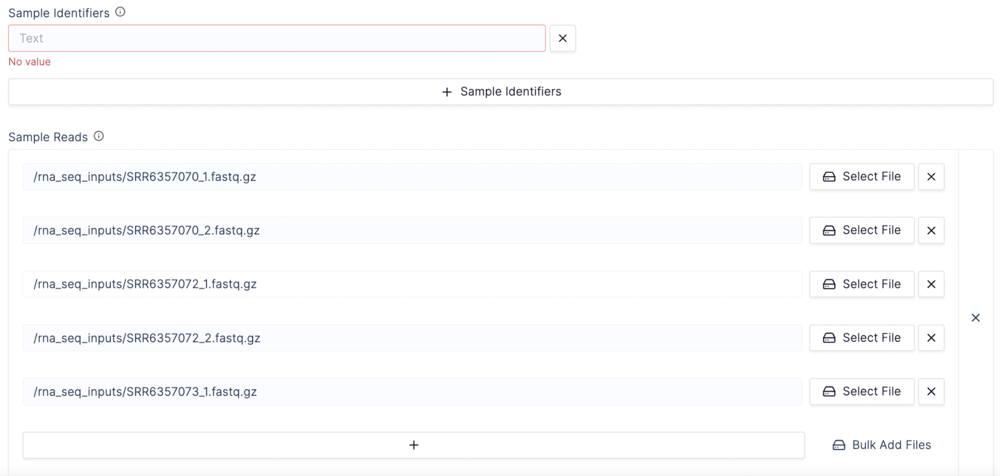
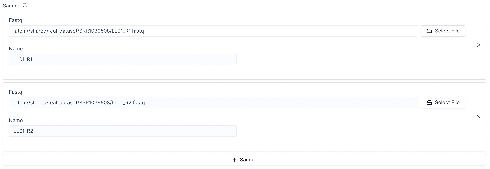

# Parameter Types

The Latch SDK supports first-class static typing. All input parameters and
output values must be annotated with types in the function signature.

These type annotations validate task values and guide the construction of parameter-specific frontend components when your interface is generated at
registration.

---

## Supported Types

Below is an exhaustive list of workflow and task parameter types currently supported by the SDK, and how they translate to the workflow UI once the workflow is registered:

### Integers

```python
@workflow
def bactopia_wf(
    ...
    coverage: int,
    ...
)
```



### Boolean

```python
@workflow
def bactopia_wf(
    ...
    hybrid: bool,
    ...
)
```


### Floats

```python
@task
def foo(
  a: float = 10.0
):
  ...
```

### Strings

```python
@workflow
def bactopia_wf(
    ...
    sample_name: str = "sample1"
    ...
)
```


### Files

```python
from latch.types import LatchFile
from typing import Optional

...
@workflow
def bactopia_wf(
    ...
    fastq_one: LatchFile | None = None,
    ...
)
```



### Directories

```python
from latch.types import LatchDir

...
@workflow
def bactopia_wf(
    ...
    output_dir: LatchDir,
    ...
)
```



### Enums

_Note_: As expressed in the [Flyte Docs](https://docs.flyte.org/projects/cookbook/en/stable/auto/core/type_system/enums.html), Enum values can only be strings.

```python
from enum import Enum

# You must define your Enum as a python class before using it as an annotation.
class SpeciesGenomeSize(Enum):
    mash = "mash estimate"
    min = "min"
    median = "median"
    mean = "mean"
    max = "max"

...
@workflow
def bactopia_wf(
    ...
    species_genome_size: SpeciesGenomeSize,
    ...
)
```



### Unions

Along with the previous basic types, `Union` and `Optional` types from Python's
`typing` module give extra flexibility.

Recall that `Optional[T] = Union[None, T]`.

```python
from typing import Union, Optional
from latch.types import LatchFile

@workflow
def foo(
  a: Union[int, LatchFile] = LatchFile("/root/data.txt"),
  b: Optional[float] = None
):
  ...
```

### Lists

Finally, we currently support a single collection type which is `List[T]`, also
provided by the `typing` module.

```python
from latch.types import LatchFile
from typing import List

@workflow
def rnaseq(
    sample_identifiers: list[str],
    sample_reads: List[LatchFile]
):
...
```



### :class:`~dataclasses.dataclass`

Complex object types should be represented using :class:`dataclasses <dataclasses.dataclass>` They render a group of input elements for each of the fields of the dataclass. These can be used in lists and maps, and are useful to model interdependent data, for example, pairs of reads or named samples.

```python
from dataclasses import dataclass
from typing import List

@dataclass
class Sample:
    name: str
    fastq: LatchFile

@workflow
def rnaseq(
    samples: List[Sample]
):

```



### Custom Types

If existing types are not sufficient to properly model the input or output data, it is possible to define your own custom types for use in tasks and workflows. [Flyte documentation on custom type transformers](https://docs.flyte.org/projects/cookbook/en/latest/auto/core/extend_flyte/custom_types.html) describes this process. The workflow interface will show inputs for the underlying representation (the IDL) of the custom type.

## Setting Default Values

If a parameter has a default value, it is displayed to the user in the frontend interface and passed to the workflow if the user does not change it. Default values are optional but encouraged as, if a reasonable default exists, it can improve the user experience by encouraging best practices and allowing users to focus on the settings that really matter to them.

## Example

Here is the function header for Bactopia, a workflow available on Latch. To see
how these inputs translate into a user interface, check out
[Bactopia](https://console.latch.bio/se/bactopia) on Latch.

```python
@large_task
def bactopia_task(
    fastq_one: Optional[LatchFile],
    fastq_two: Optional[LatchFile],
    input_dir: Optional[LatchDir],
    output_dir: LatchDir,
    sample_name: List[Union[str, int]],
    genome_size: Optional[int],
    species: Optional[Species],
    species_genome_size: Optional[SpeciesGenomeSize],
    ask_merlin: bool = False,
    coverage: int = 100,
    hybrid: bool = False,
    skip_logs: bool = False,
    skip_fastq_check: bool = False,
    skip_qc: bool = False,
    skip_error_correction: bool = False,
    no_miniasm: bool = False,
    skip_pseudogene_correction: bool = False,
    skip_adj_correction: bool = False,
    skip_prodigal_tf: bool = False,
    rawproduct: bool = False,
    centre: str = "Bactopia",
    min_contig_length: int = 500,
    amr_plus: bool = False,
) -> LatchDir:
    # example opening a LatchFile
    with open(Path(fastq_one), "w") as f:
        lines = f.readlines() 
    
        # ... Logic Here ...
    
        local_output_dir = Path("/root/outputs")
  
        # example returning Flyte directory
        return LatchDir(
            str(local_output_dir.resolve()),
            remote_directory=_fmt_dir(output_dir.remote_source),
        )


@workflow
def bactopia_wf(
    output_dir: LatchDir,
    sample_name: List[Union[str, int]] = "sample1",
    fastq_one: Optional[LatchFile] = None,
    fastq_two: Optional[LatchFile] = None,
    input_dir: Optional[LatchDir] = None,
    genome_size: Optional[int] = None,
    species: Species = Species.none,
    species_genome_size: SpeciesGenomeSize = SpeciesGenomeSize.mash,
    ask_merlin: bool = False,
    coverage: int = 100,
    hybrid: bool = False,
    skip_logs: bool = False,
    skip_fastq_check: bool = False,
    skip_qc: bool = False,
    skip_error_correction: bool = False,
    no_miniasm: bool = False,
    skip_pseudogene_correction: bool = False,
    skip_adj_correction: bool = False,
    skip_prodigal_tf: bool = False,
    rawproduct: bool = False,
    amr_plus: bool = False,
    centre: str = "Bactopia",
    min_contig_length: int = 500,
) -> LatchDir:

    return bactopia_task(
        fastq_one=fastq_one,
        fastq_two=fastq_two,
        input_dir=input_dir,
        output_dir=output_dir,
        sample_name=sample_name,
        genome_size=genome_size,
        species=species,
        species_genome_size=species_genome_size,
        ask_merlin=ask_merlin,
        coverage=coverage,
        hybrid=hybrid,
        skip_logs=skip_logs,
        skip_fastq_check=skip_fastq_check,
        skip_qc=skip_qc,
        skip_error_correction=skip_error_correction,
        no_miniasm=no_miniasm,
        skip_pseudogene_correction=skip_pseudogene_correction,
        skip_adj_correction=skip_adj_correction,
        skip_prodigal_tf=skip_prodigal_tf,
        rawproduct=rawproduct,
        centre=centre,
        min_contig_length=min_contig_length,
        amr_plus=amr_plus,
    )

```
