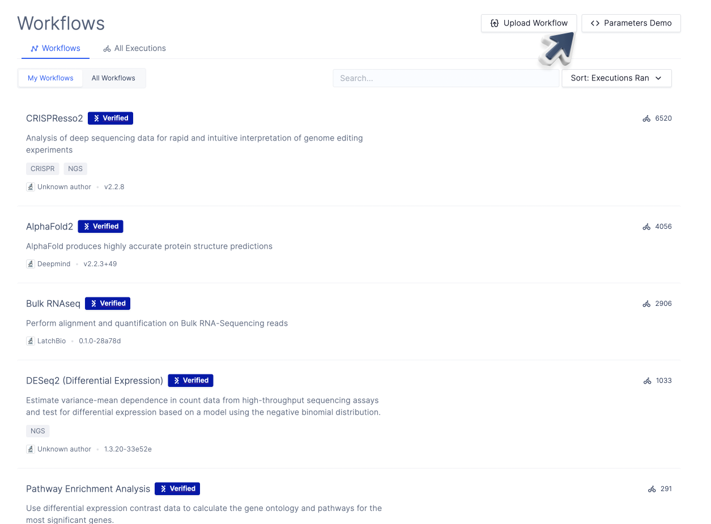

# Previewing the Workflow Interface

When iterating on the design of the workflow, it is helpful to preview the user interface locally using `latch preview`.

First, verify that you are inside the workflow directory:

```shell-session
$ ls

Dockerfile      reference       wf      version
```

Then, use `latch preview` with the name of the workflow function:

```shell-session
$ latch preview <workflow_function_name>
```

After using `latch preview`, a new button with the workflow name will appear on the top right corner of the "Workflows" page:

You can click on the button to preview the interface.


