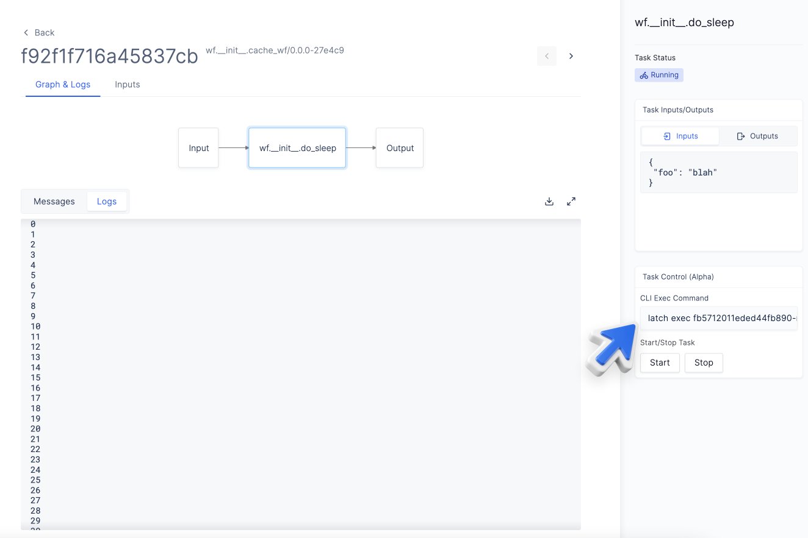

# Remote Execution

It is often desirable to be able to access a shell from within a running
task of a workflow, to debug a misbehaving program or inspect some files for
example.

When inspecting a running task in the [Console](https://console.latch.bio), simply click
on the node representing the desired task and copy and paste the `latch exec
<hash>` subcommand in the right sidebar into your terminal to retrieve a live
shell from within the running task.



The shell session is accessible as long as the task is executing. For short-lived tasks, you can use the **Start**, **Stop** options on the sidebar to pause a task. Alternatively, you can also programmatically sleep a task like so:

```python
import time

@task
def very_short_task(a: int, b: int) -> int:
    time.sleep(300) # Sleep the task for 5 minutes
    return a + b
```

The task would run for longer on Latch, giving you more time to `latch exec` into it and debug.

_This feature is in alpha, please contact hannah@latch.bio to gain access._
