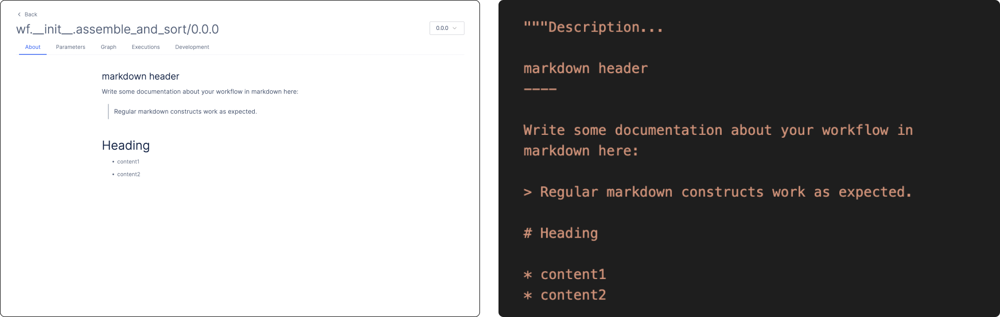

# Authoring your Own Workflow

In this demonstration, we will examine a workflow which sorts and assembles COVID sequencing data.

The document aims to be an extension to the quickstart to help you better understand the structure of a workflow and write your own.

**Prerequisite:**
* Complete the [Quickstart](../getting_started/quick_start.md) guide.

**What you will learn:**
* How to write a task and create a workflow
* How to define compute and storage requirements
* How to manage third-party dependencies
* How to customize a user-friendly interface
* How to test your workflow from the Latch CLI and Latch Console

---

## 1: Initialize Workflow Directory
Bootstrap a new workflow directory by running `latch init` from the command line.
```
latch init covid-wf -t subprocess
```
Output:
```
Created a latch workflow in `covid-wf`
Run
        $ latch register covid-wf
To register the workflow with console.latch.bio.
```
File Tree:
```
covid-wf
├── LICENSE
├── README.md
├── bowtie2
│   ├── bowtie2
│   └── ...
├── reference
│   ├── wuhan.1.bt2
│   └── ...
├── system-requirements.txt
├── version
└── wf
    ├── __init__.py
    ├── assemble.py
    └── sort.py
```

Once your boilerplate workflow has been created successfully, you should see a folder called `covid-wf`.

## 2. Writing your First Task

A task is a Python function that takes in inputs and returns outputs to the latch platform or to another task. In the `assemble.py` file inside the `covid-wf/wf` directory, we have a task which ingests two sequencing reads and outputs an assembled SAM file. Take a look within the file.

### How to work with LatchFiles and LatchDirs

`LatchFile` and `LatchDir` are types built into the Latch SDK which allow users to use files and directories on Latch as inputs and outputs to workflows. They point to remote file locations in our user interfact on [Latch Console](https://console.latch.bio/data) and implement the necessary operations to ensure data is pulled into the task environment and saved back into your data tab.

Anytime you read from a file or directory in a task, for example running the following code in a task

```python
from latch.types import LatchFile
...

@small_task
def assembly_task(
    read1: LatchFile, ...
) -> LatchFile:

    local_file = Path(read1)
    ...
```
The data will be downloaded locally and will be able to be accessed inside the task.

Sometimes, our python task does not access a file but the file data still needs to exist locally. For example, when running a subprocess with a file as an argument. We can get around having to call Path on the file or directory by accessing the `local_path` attribute of the LatchFile or LatchDir. This will download the data into the task and return back a path to the local file or directory.
    
```python
_bowtie2_cmd = [
        "bowtie2/bowtie2",
        "--local",
        "-x",
        "wuhan",
        "-1",
        read1.local_path,
        "-2",
        read2.local_path,
        "--very-sensitive-local",
        "-S",
        str(sam_file),
    ]
```

To output a file or directory to the latch platform:
```python
    local_file = Path("/root/covid_assembly.sam")
    return LatchFile(local_file, "latch:///covid_assembly.sam")
```

Here, LatchFile takes two values: the first being your local filepath and the second being the remote file location on Latch. Every file on Latch must be prefixed with `latch:///`.

## 3. Define compute and storage requirements

Specifying compute and storage requirements is as easy as using a Python decorator.

```python
from latch import small_task

@small_task # 2 cpus, 4 gigs of memory, 0 gpus
def my_task(
    ...
):
    ...

@large_gpu_task #31 cpus, 120 gigs of memory, 1 gpu
def inference(
    ...
):
    ...
```

See an exhaustive reference to larger CPU and GPU tasks [here](../basics/defining_cloud_resources.md).


To arbitrarily specify resource requirements, use:
```python
from latch import custom_task

@custom_task(cpu, memory)
def my_task(
    ...
):
    ...
```

## 4. Manage installation for third-party dependencies

Under the hood, latch uses Dockerfiles for dependencies management, which allow you to define the computing environment that your task will execute in.

There's no need to create your Dockerfile from scratch as one is already provided when you initialized your workflow.

To write a Dockerfile, you simply write the commands that you want executed.

For example, since we want `bowtie` and `samtools` available to our tassk, we can write the Dockerfile like so:

```Dockerfile
FROM 812206152185.dkr.ecr.us-west-2.amazonaws.com/latch-base:9a7d-main

# Its easy to build binaries from source that you can later reference as
# subprocesses within your workflow.
RUN curl -L https://sourceforge.net/projects/bowtie-bio/files/bowtie2/2.4.4/bowtie2-2.4.4-linux-x86_64.zip/download -o bowtie2-2.4.4.zip &&\
    unzip bowtie2-2.4.4.zip &&\
    mv bowtie2-2.4.4-linux-x86_64 bowtie2

# Or use managed library distributions through the container OS's package
# manager.
RUN apt-get update -y &&\
    apt-get install -y autoconf samtools


# You can use local data to construct your workflow image.  Here we copy a
# pre-indexed reference to a path that our workflow can reference.
COPY reference /root/reference
ENV BOWTIE2_INDEXES="reference"

COPY wf /root/wf

# STOP HERE:
# The following lines are needed to ensure your build environement works
# correctly with latch.
ARG tag
ENV FLYTE_INTERNAL_IMAGE $tag
RUN sed -i 's/latch/wf/g' flytekit.config
RUN python3 -m pip install --upgrade latch
WORKDIR /root
```

To write a Dockerfile for R and Python packages, visit Dockerfile recipes [here](../basics/writing_dockerfiles.md).

## 5. Customize user interface
There are two pages that you can customize: the **About** page for your workflow and a **Parameters** page for workflow input parameters.

To modify the About page, simply write your description in Markdown in the docstring of the workflow function.


Latch provides a suite of front-end components out-of-the-box that can be defined by using Python objects `LatchMetadata` and `LatchParameter`:
```python
from latch.types import LatchAuthor, LatchDir, LatchFile, LatchMetadata, LatchParameter

...
"""The metadata included here will be injected into your interface."""
metadata = LatchMetadata(
    display_name="Assemble and Sort FastQ Files",
    documentation="your-docs.dev",
    author=LatchAuthor(
        name="John von Neumann",
        email="hungarianpapi4@gmail.com",
        github="github.com/fluid-dynamix",
    ),
    repository="https://github.com/your-repo",
    license="MIT",
    parameters={
        "read1": LatchParameter(
            display_name="Read 1",
            description="Paired-end read 1 file to be assembled.",
            batch_table_column=True,  # Show this parameter in batched mode.
        ),
        "read2": LatchParameter(
            display_name="Read 2",
            description="Paired-end read 2 file to be assembled.",
            batch_table_column=True,  # Show this parameter in batched mode.
        ),
    },
)


...
```

The `metadata` variable then needs to be passed into the `@workflow` decorator to apply the interface to the workflow.

```python
@workflow(metadata)
def assemble_and_sort(read1: LatchFile, read2: LatchFile) -> LatchFile:
    ...
```

**Preview the workflow's interface**

To preview the user interface for your workflow, first make sure you are inside your workflow directory.

```bash
$ ls

Dockerfile      reference       version         wf
```

Then, type the following command:
```bash
latch preview assemble_and_sort
```
Make sure what comes after `preview` is the exactly same as the name of your workflow function.

`latch preview` will open up a browser displaying your interface.

## 6. Add test data for your workflow

First, you'd need to upload your test data to a remote S3 bucket using `latch test-data` command:

```bash
$ latch test-data upload <path_to_local_file>
```

Confirm that your file has been successfully uploaded:
```bash
$ latch test-data ls

Listing your managed objects by full S3 path.

s3://latch-public/test-data/<your_account_id>/<name_of_local_file>
```

Now, you can use Latch `LaunchPlan` to add test data to your workflow.

```python
from latch.resources.launch_plan import LaunchPlan

# Add launch plans at the end of your wf/__init__.py
LaunchPlan(
    assemble_and_sort,
    "Protocol Template 1",
    {
        "read1": LatchFile("s3://latch-public/init/r1.fastq"),
        "read2": LatchFile("s3://latch-public/init/r2.fastq"),
    },
)

LaunchPlan(
    assemble_and_sort,
    "Protocol Template 2",
    {
        "read1": LatchFile("s3://latch-public/init/r1.fastq"),
        "read2": LatchFile("s3://latch-public/init/r2.fastq"),
    },
)

```

These default values will be available under the 'Test Data' dropdown at Latch Console.


## 7. Register your workflow to Latch
You can release a live version of your workflow by registering it on Latch:
```
latch register --remote <path_to_workflow_dir>
```

The registration process will:
* Build a Docker image containing your workflow code
* Serialize your code and register it with your LatchBio account
* Push your docker image to a managed container registry

When registration has completed, you should be able to navigate [here](https://console.latch.bio/workflows) and see your new workflow in your account.

## 8. Test your workflow

### Using Latch Console

To test your first workflow on Console, select the **Test Data** and click Launch. Statuses of workflows can be monitored under the **Executions** tab.


### Using Latch CLI
Using `latch get-wf`, you can view the names of all workflows available in your workspace:
```shell-session
$ latch get-wf

ID     	Name                                          	Version
65047	wf.deseqf.deseq2_wf                       	0.0.1r
67056	wf.__init__.aggregate_bulk_rna_seq_counts 	0.0.2-eb5e84
67649	wf.__init__.align_with_salmon             	0.0.0-4cd8db
67628	wf.__init__.alphafold_wf                  	v2.2.3+46
67617   wf.__init__.assemble_and_sort               0.0.1
```

To launch the workflow on Latch Console from the CLI, first generate a parameters file by using `latch get-params` and passing in the name of your workflow like so:
```shell-session
$ latch get-params wf.__init__.assemble_and_sort
```
which will return a parameters file called `wf.__init__.assemble_and_sort.params.py`, whose contents are as below:
```python
"""Run `latch launch wf.__init__.assemble_and_sort.params.py` to launch this workflow"""

from latch.types import LatchFile

params = {
    "_name": "wf.__init__.assemble_and_sort", # Don't edit this value.
    "read1": LatchFile("latch:///foobar"), # <class 'latch.types.file.LatchFile'>
    "read2": LatchFile("latch:///foobar"), # <class 'latch.types.file.LatchFile'>
}
```

To launch a workflows with parameters specified in the above file, use:

```shell-session
$ latch launch [--version=VERSION] wf.__init__.assemble_and_sort.params.py
```

You can view execution statuses from the CLI, run:
```shell-session
$ latch get-executions
```


The command will open up a Terminal UI with the same capabilities on the Executions page on the Latch Platform, where you will see a list of executions, tasks, and logs for easy debugging.

---
# Next Steps
* Understand [how to test and debug your workflow](../basics/local_development.md).
* Read the [Concepts](../basics/what_is_a_workflow.md) page
* Visit [Examples](../examples/workflows_examples.md) to see real-world bioinformatics workflows being built using Latch SDK
* Learn through examples with [Tutorials](../tutorials/rnaseq.md)
* Join the SDK open-source community on Slack [here](https://forms.gle/sCjr8tdjzx5HjVW27)!
