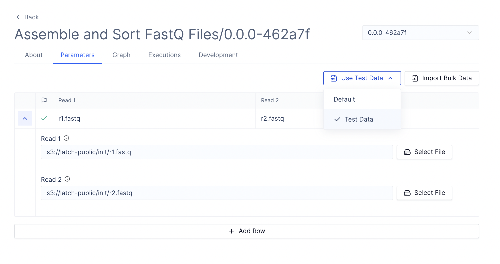
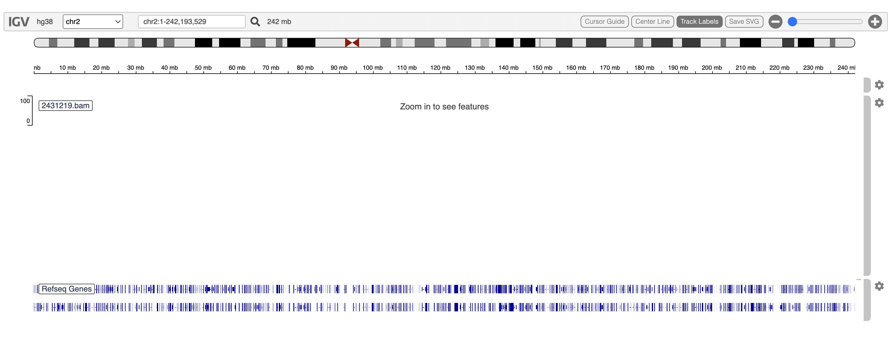

# Quick Start
Get up and running with your first workflow in Python.
---

In this quickstart, you install the Latch SDK and register a workflow to sort and assemble COVID genomes. The workflow makes use of two computational tools, SAM tools and bowtie, which will allow us to reconstruct the COVID genome from its reads.

## Initial setup
Register for an account and log into the
[Latch Console](https://console.latch.bio)

---

## Step 1: Set up your developer environment

### For Linux/ MacOS
We recommend installing Latch SDK in a fresh environment for best behaviour. To do so, you can use `venv`.
```bash
python3 -m venv env
source env/bin/activate
```

### For Windows
The Latch SDK is a Python package, so we recommend installing Latch SDK in a fresh environment for best behavior. To do so, you can use `venv`.

1. First, install the WSL command:
```Powershell
wsl --install
```
This command will enable the features necessary to run WSL and install the Ubuntu distribution of Linux.

2. Activate the Linux shell:
```Powershell
wsl
```

Now, you are in a Linux environment and can create a virtual environment like so:
```bash
python3 -m venv env
source env/bin/activate
```

## Step 2: Install Latch
The Latch SDK is available as a Python package. Install it using pip:
```
python3 -m pip install latch
```

## Step 3: Initialize Workflow Directory
Bootstrap a new workflow directory by running `latch init` from the command line:
```
latch init covid-wf
```

The command creates a folder in your current working directory called `covid-wf`.  Inside that folder, it will generate the initial project structure:
```
covid-wf
├── LICENSE
├── README.md
├── bowtie2
│   ├── bowtie2
│   └── ...
├── reference
│   ├── wuhan.1.bt2
│   └── ...
├── system-requirements.txt
├── version
└── wf
    ├── __init__.py
    ├── assemble.py
    └── sort.py
```

## Step 4: Register your first workflow
To get a live version of your workflow on Latch, simply type:
```
latch register --remote covid-wf
```

Now, visit [Latch Console](https://console.latch.bio/workflows), and you will see a live, no-code interface of your assemble and sort workflow!



## Step 5: Running your workflow on Latch
To launch your first workflow, make sure that you are on your workflow page in Latch Console. Then, select the Test Data and click Launch.

Once the workflow finishes running, you can see both the `covid_assembly.sam` and `covid_sorted.bam` files on [Latch Console](https://console.latch.bio/data). The SAM file contains the sequence alignment data, and the BAM file is the binary version of the SAM file.

To further check that the genome is aligned properly, simply double click on the output file to open an IGV.



The next time your scientists want to reconstruct COVID genome from sequencing reads, they can visit your workflow on Latch Console!

---

## Next Steps
* Understand [how to author your own workflow](../getting_started/authoring_your_workflow.md).
* Understand [how to test and debug your workflow](../basics/local_development.md).
* Read the [Concepts](../basics/what_is_a_workflow.md) page
* Visit [Examples](../examples/workflows_examples.md) to see real-world bioinformatics workflows being built using Latch SDK
* Join the SDK open-source community on Slack [here](https://forms.gle/sCjr8tdjzx5HjVW27)!
