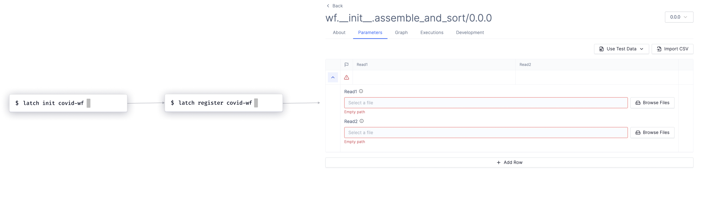
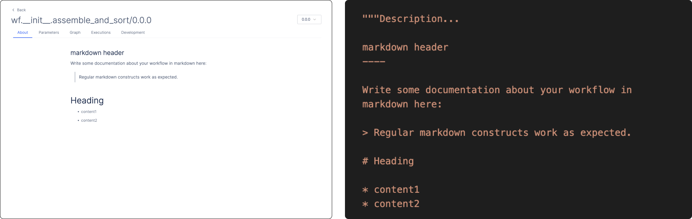
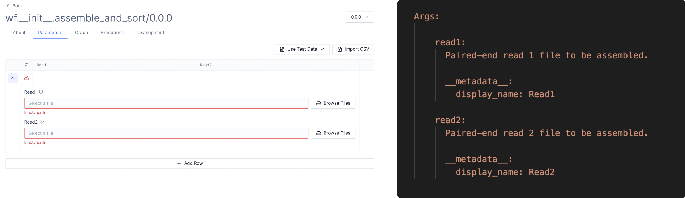

# Quick Start

In this tutorial, we will:
* Write a workflow to sort and assemble COVID sequencing data
* Customize a front-end interface for our workflow
* Define the necessary compute and resource requirements
* Upload the workflow onto Latch
* Test our workflow from a user-friendly interface 

After going through the tutorial, you should have a strong understanding of how to translate a handful of python functions into a Latch workflow.

---

## Overview



At a high level, there are three main steps to the development flow using Latch SDK. 
1. `latch init path_to_new_directory`: intializes a boilerplate repo for your workflow.
2. `latch register path_to_new_directory`: registers your workflow onto Latch. 
3. Once your workflow registers successfully, you will receive a user interface for your workflow on [Latch Console](https://console.latch.bio/workflows).

In this tutorial, we will go through each step in-depth and explain how your workflow repo translates to an interface.

## Prerequisites
* Install [Docker](https://docs.docker.com/get-docker/)
* Ensure Docker Daemon is running

> **Note:**
If you are using Windows, you have to install a virtualized Linux shell to use Latch. Please head to our [troubleshooting](../troubleshooting/troubleshooting.md) page to learn more. 

## Step 1: Install Latch
Install the Latch SDK and CLI using pip: 
```
python3 -m pip install latch
```
It is recommended that you install Latch in a fresh virtual environment for best behavior. There are many ways to create and activate your virtual environment, such as using [Virtualenvwrapper](https://virtualenvwrapper.readthedocs.io/en/latest/) or Python's [venv](https://docs.python.org/3/library/venv.html) module. 

## Step 2: Initialize Workflow Directory
Bootstrap a new workflow directory by running `latch init` from the command line. 
```
latch init covid-wf
```
Output:
```
Created a latch workflow called covid-wf.
```
File Tree:
```
covid-wf
├── Dockerfile
├── data
│   ├── wuhan.1.bt2
│   ├── wuhan.2.bt2
│   ├── wuhan.3.bt2
│   ├── wuhan.4.bt2
│   ├── wuhan.fasta
│   ├── wuhan.rev.1.bt2
│   └── wuhan.rev.2.bt2
├── version
└── wf
    └── __init__.py
```
Once your boilerplate workflow has been created successfully, you should see a folder called `covid-wf`.

Let's inspect the content of the folder:
* wf: contains workflow definitions
* Dockerfile: contains instructions for the workflow's dependencies 
* data: contains data to be used in the workflow
* version: specifies the version of your workflow. 

## Step 3: Understand the Anatomy of a Workflow

A workflow is an analysis that takes in some inputs and outputs a result. It consists of a series of task, each of which can be defined as a Python function. 

In this tutorial, our workflow ingests sequencing files in FastQ format and produces a sorted assembly file. The workflow has two tasks. The first task turns the FastQ files into a single BAM file using an assembly algorithm. The second task sorts the assembly from the first task. The final output is a useful assembly conducive to downstream analysis and visualization in tools like IGV.

Let's walk through how each task is constructed, and how tasks are chained together to create a workflow. 

**First task**: Converts FastQ files into a BAM file

```python
@small_task
def assembly_task(read1: LatchFile, read2: LatchFile) -> LatchFile:

    # A reference to our output.
    sam_file = Path("covid_assembly.sam").resolve()

    _bowtie2_cmd = [
        "bowtie2/bowtie2",
        "--local",
        "-x",
        "wuhan",
        "-1",
        read1.local_path,
        "-2",
        read2.local_path,
        "--very-sensitive-local",
        "-S",
        str(sam_file),
    ]

    subprocess.run(_bowtie2_cmd)

    return LatchFile(str(sam_file), "latch:///covid_assembly.sam")
```

### 1.1 Decorating a task

The decorator `@small_task` is used to specify that a Python function is a task within a workflow. In other words, if you <i>don't</i> use the decorator, Latch will treat it as a normal Python helper function. Using the function in your workflow would throw an error. 

The decorator is also used to determine the resources the task is expected to consume (eg. CPU, RAM, GPU) at runtime. Read more about how you can annotate tasks with different resource requirements [here](../basics/defining_cloud_resources.md).

### 1.2. Definining Typed Inputs 

All inputs to a task must be typed. The types can be any valid Python type (e.g. `str`, `int`, `List`, etc.) or Latch-specific types, such as `LatchFile` or `LatchDir`. 

There are two reasons why typing your inputs is important. One, it maintains the integrity of the workflow, ensuring that the output of a previous task has the same type as the input of the next task. Second, Latch SDK parses the type of your input to generate the right front-end component at registration. For example, if you specify the input has type `str`, Latch would generate an input box that allows user to enter a string. Similarly, if you specify type `LatchFile` for a FastQ file, Latch would generate a button that says **Browse File**, allowing you to browse data on Latch. 

<!-- Code and pictures here -->

You can see an exhaustive list of all parameter types supported on Latch [here](../basics/parameter_types.md).

### 1.3. Resolving Input File Path

One common pattern you'd notice in tasks is calling `local_path` on an input parameter of type `LatchFile`:

```python
def assembly_task(read1: LatchFile, read2: LatchFile) -> LatchFile:
    ...
    _bowtie2_cmd = [
        "bowtie2/bowtie2",
        "--local",
        "-x",
        "wuhan",
        "-1",
        read1.local_path, 
        "-2",
        read2.local_path,
        "--very-sensitive-local",
        "-S",
        str(sam_file),
    ]
    ...
```

A `LatchFile` is a Python class that represents a file object in the context of a task execution. When we call `local_path` on a LatchFile, Latch downloads the files into the environment on which our task is executed, making it available to our assembly command line tool.

### 1.4. Running a command line with `subprocess`

Many bioinformatics tools are packaged as single command lines. To run such command line in a Latch task, we make use of the [`subprocess`](https://docs.python.org/3/library/subprocess.html) module, which allows us to execute and manage subprocesses directly from Python. That involves working with the standard input stdin, standard output stdout, and return codes.

Let's demonstrate this concept by way of our example. If we have to use the `bowtie` command from our terminal, we'd write:
```bash
bowtie2/bowtie2 --local -x wuhan -1 path_to_read_1 -2 path_to_read_2 ----very-sensitive-local -S path_to_output_sam_file
```

To use the command in a Latch task, we would use `subprocess` like so:
```python
    _bowtie2_cmd = [
        "bowtie2/bowtie2",
        "--local",
        "-x",
        "wuhan",
        "-1",
        read1.local_path,
        "-2",
        read2.local_path,
        "--very-sensitive-local",
        "-S",
        str(sam_file),
    ]

    subprocess.run(_bowtie2_cmd)
```

The code creates a new subprocess to execute the bowtie command and outputs a SAM file. 

### 1.5. Resolving Output File Path

Another common pattern you will see with `LatchFile` is for workflow outputs in your function's return statement:  
```python
    ...
    return LatchFile(str(sam_file), "latch:///covid_assembly.sam")
```

Here, we are passing **two** values to `LatchFile`, a local path and a remote path. 
* The first value represents the full path reference to the output file that is inside the container after your workflow finishes executing. 

    We are able to retrieve the filepath thanks to the `Path` class from the `pathlib` module. Writing `str(Path("covid_assembly.sam").resolve())` returns the complete filepath. <i>(Still in doubt? Try it from your terminal!)</i>

* The second value refers to the output file location on [Latch Console](https://console.latch.bio/data). In other words, when our workflow finishes, you should see a file called `covid_assembly.sam` on Latch Console. 

**Second task**: Sort BAM file

The structure of the second task is very similar to the first one, making use of, `@small_task`, `LatchFile` and `subprocess`, as explained above.

```python
@small_task
def sort_bam_task(sam: LatchFile) -> LatchFile:

    bam_file = Path("covid_sorted.bam").resolve()

    _samtools_sort_cmd = [
        "samtools",
        "sort",
        "-o",
        str(bam_file),
        "-O",
        "bam",
        sam.local_path,
    ]

    subprocess.run(_samtools_sort_cmd)

    return LatchFile(str(bam_file), "latch:///covid_sorted.bam")

```

The only thing we have to pay attention to is because we are taking the output of the `assembly_task` as the input of `sort_bam_task`, their types must match. Here, they both have type `LatchFile`.

### 1.6. Defining the main workflow function 

```python
@workflow
def assemble_and_sort(read1: LatchFile, read2: LatchFile) -> LatchFile:
    """Description...

    markdown header
    ----

    Write some documentation about your workflow in
    markdown here:

    > Regular markdown constructs work as expected.

    # Heading

    * content1
    * content2

    __metadata__:
        display_name: Assemble and Sort FastQ Files
        author:
            name:
            email:
            github:
        repository:
        license:
            id: MIT

    Args:

        read1:
          Paired-end read 1 file to be assembled.

          __metadata__:
            display_name: Read1

        read2:
          Paired-end read 2 file to be assembled.

          __metadata__:
            display_name: Read2
    """
    sam = assembly_task(read1=read1, read2=read2)
    return sort_bam_task(sam=sam)
```

Let's breakdown the different components of our workflow function.

First, to specify that a Python function is a workflow, you must use the `@workflow` Python decorator. 

```python
@workflow
def assemble_and_sort(read1: LatchFile, read2: LatchFile) -> LatchFile:
```

Because a workflow is an ordered template of tasks, it should have the same inputs as your first task and the same output as your final task. 

```python
# How previous tasks are chained into a workflow
    sam = assembly_task(read1=read1, read2=read2)
    return sort_bam_task(sam=sam)
```
> **_Note:_**
When calling your tasks, remember to pass in keyword arguments, such as `read1=read1, read2=read2` instead of `read1, read2`.

The final important component of the workflow function is a docstring. This is where you would customize how the interface of your workflow would look to the end user. 

Latch automatically parses the written text and Python function headers of the workflow to compile a type-safe UI. 

```python
"""Description...

    markdown header
    ----

    Write some documentation about your workflow in
    markdown here:

    > Regular markdown constructs work as expected.

    # Heading

    * content1
    * content2

    __metadata__:
        display_name: Assemble and Sort FastQ Files
        author:
            name:
            email:
            github:
        repository:
        license:
            id: MIT

    Args:

        read1:
          Paired-end read 1 file to be assembled.

          __metadata__:
            display_name: Read1

        read2:
          Paired-end read 2 file to be assembled.

          __metadata__:
            display_name: Read2
    """
```

See the side-by-side comparison below on how each section of the docstring translates to a workflow interface on [Latch Console](https://console.latch.bio/workflows).


Your workflow description will show up in the **Description** tab on Latch Console.


The interface for workflow inputs will be displayed on the **Parameters** tab on Console.

Read more about how to customize the user interface for your inputs [here](../basics/customizing_interface.md).

## Step 4: Publishing Workflow on Latch Console
Now that you understand what's going on in the workflow body, let's publish it on Latch Console. Simply run from your terminal:
```
latch register covid-wf
```

This might take 3-10 minutes depending on your network connection. (Subsequent registers will complete in seconds by reusing the image layers from this initial register.) The registration process will:

* Build a Docker image containing your workflow code
* Serialize your code and register it with your LatchBio account
* Push your docker image to a managed container registry

When registration has completed, you should be able to navigate [here](https://console.latch.bio/workflows) and see your new workflow in your account.

> **Note:**
Whenever you change your code and want to re-register, remember to bump up the version in the `version` file. See best practices on semantic versioning for software development [here](https://semver.org/).

If you are having issues with registration or have general questions, please
file an issue on [github](https://github.com/latchbio/latch).

---

## Next Steps
* Read the [Concepts](../basics/what_is_a_workflow.md) page
* Visit [Examples](../examples/workflows_examples.md) to see real-world bioinformatics workflows being built using Latch SDK
* Join the SDK open-source community on Slack [here](https://forms.gle/sCjr8tdjzx5HjVW27)! 
