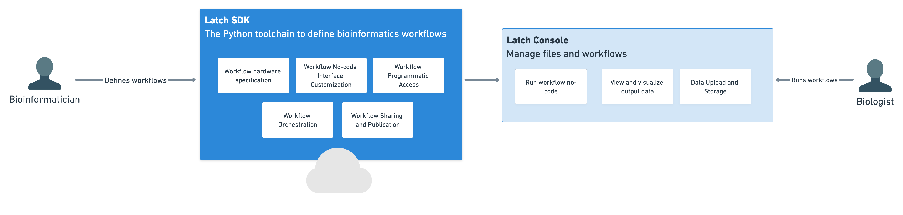

# What is the Latch SDK?

It takes months to build infrastructure with the compute, storage, and user-friendly interface necessary to run bioinformatics pipelines at scale.

The Latch SDK is an open-source toolchain to define serverless bioinformatics workflows with plain python and deploy associated no-code interfaces using single command.

Bioinformatics workflows developed with the SDK automatically receive:

* Instant no-code interfaces for accessibility and publication
* First class static typing
* Containerization and versioning of every registered change
* Reliable and scalable managed cloud infrastructure
* Singe line definition of arbitrary resource requirements (eg. CPU, GPU) for serverless execution



## Problems Latch SDK solves

**Building the infrastructure to share bioinformatics pipelines at scale is time-consuming.** Bioinformatics is dominated by terabytes of data and workflows that require multiple CPUs or GPUs, making sharing and scaling pipelines difficult.

Lacth SDK allows developers to upload workflows to the full-featured [Latch Platform](https://console.latch.bio) with ease. The platform is built with Kubernetes, ensuring containerization, portability, and scalability are available out-of-the-box. Behind the scene, Latch takes advantage of AWS spot instances, offering ultra-fast runtimes with extremely low cloud costs for teams.

**Bioinformaticians need to create intuitive user interfaces for biologists.** As a lab or R&D team grows, the number of biologists per bioinformatician increases to a point where it's no longer sustainable for the bioinformatician to manage requests and run pipelines manually from her computer. Automating pipeline runs returns valuable time to the bioinformatician to focus on writing analyses to generate scientific insights.

With Latch SDK, developers can write the description to their workflow and customize input parameters using plain Markdown. Latch automatically parses the written text and Python function headers to compile a type-safe UI.

**Specifying arbitrary cloud compute and storage resources for bioinformatics pipelines is difficult.** With Latch SDK, there are several Python task decorators that easily allow you to define the resources available at runtime. The framework starts at 2 CPUs and 4 GBs of memory and goes all the way to 31 CPUs, 120 GBs of memory and 1 GPU (24 GBs of VRAM, 9,216 CUDA cores) to easily handle all processing needs.

**Bioinformatics tools face the challenges of irreproducibility.** The lack of proper versioning and dependencies management results in a long tail of poorly documented and unusable bioinformatics software tools.

Latch SDK containerizes and versions workflow code in the background each time a workflow is registered to the Latch platform. Container images are constructed by parsing autogenerated or user-defined [Dockerfiles](https://docs.docker.com/engine/reference/builder/). Similarly, versions are user-specified as any unique plaintext string. The resulting workflows are portable and scalable, and their behavior is reproducible.

## What the Latch SDK is not

* **A self-hosted solution**: Currently, you cannot write your workflow using Latch SDK and host it in your own AWS instance or an HPC. The infrastructure serving bioinformatics pipelines is fully managed by Latch. This allows us to rapidly iterate to bring on high quality features, give cost and performance guarantees, and ensure that security is offered out-of-the-box.

## Examples

Visit [Examples](../examples/workflows_examples.md) to see real-world bioinformatics workflows being built using the Latch SDK

---

## Next Steps

To get started with Latch SDK, view the following resources:

* **[Quickstart](./getting_started/quick_start.md)** is the fastest way to get started with the Latch SDK.
* **[Concepts](./basics/what_is_a_workflow.md)** describes all important Latch SDK concepts.
* **[Examples](./examples/workflows_examples.md)** show full examples of using Latch SDK for various bioinformatics pipelines.
* **[Troubleshooting](./troubleshooting/troubleshooting)** provides a guide to debug common errors.
* **[Reference](./api/modules.rst)** contains detailed API and design documents.
* **[Subcommands](./subcommands.md)** contains details about the Latch command line toolchain to register workflows and upload data to Latch.
* Join the <a href="https://forms.gle/sCjr8tdjzx5HjVW27" target="_blank">SDK open-source community</a> on Slack!

---

```{toctree}
:hidden:
:maxdepth: 2
self
```

```{toctree}
:hidden:
:maxdepth: 2
:caption: Getting Started
getting_started/quick_start
getting_started/authoring_your_workflow
```

```{toctree}
:hidden:
:maxdepth: 2
:caption: Defining a Workflow
basics/what_is_a_workflow
basics/when_to_create_task

basics/defining_environment
basics/working_with_files
basics/parameter_types
basics/customizing_interface
basics/preview_interface
basics/customize_docs
basics/messages
basics/defining_cloud_resources
basics/caching
basics/conditional_section
basics/map_task
basics/adding_secrets
```

```{toctree}
:hidden:
:maxdepth: 2
:caption: Testing and Debugging a Workflow
basics/local_development
basics/latch_develop_example
basics/remote_execution
```

```{toctree}
:hidden:
:maxdepth: 2
:caption: Publishing a Workflow
basics/uploading_test_data
basics/remote_registration
```

```{toctree}
:hidden:
:maxdepth: 2
:caption: Registry
registry/overview.md
registry/account.md
registry/project.md
registry/table.md
registry/record.md
```

```{toctree}
:hidden:
:maxdepth: 2
:caption: Examples
examples/workflows_examples
```

```{toctree}
:hidden:
:maxdepth: 2
:caption: Tutorials
tutorials/overview
tutorials/rnaseq
tutorials/metamage
```

```{toctree}
:hidden:
:maxdepth: 2
:caption: API Reference
subcommands
api/modules
```

```{toctree}
:hidden:
:maxdepth: 2
:caption: Troubleshooting
troubleshooting/troubleshooting.md
```
