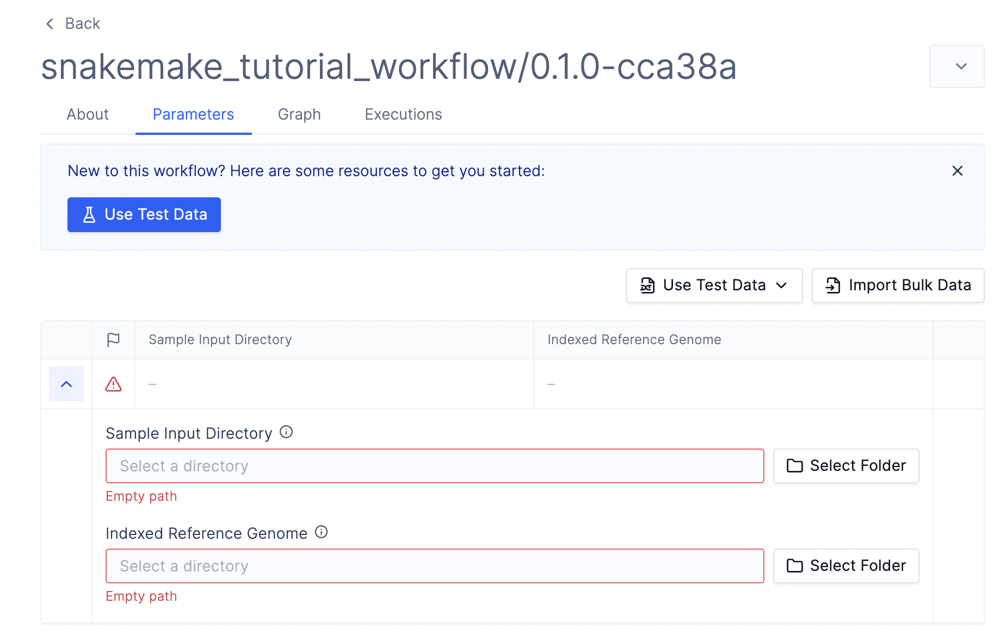

# A simple Snakemake example

In this guide, we will walk through how you can upload a simple Snakemake workflow to Latch.

The example being used here comes from the [short tutorial in Snakemake's documentation](https://snakemake.readthedocs.io/en/stable/tutorial/short.html).

## Prerequisites

* Install the [Latch SDK](https://github.com/latchbio/latch#installation)
* Install [snakemake](https://snakemake.readthedocs.io/en/stable/getting_started/installation.html)
* Install [Docker](https://www.docker.com/get-started/) and have Docker run locally

## Step 1
First, clone the Snakemake example repository:

```console
git clone https://github.com/latchbio/snakemake-short-tutorial.git &&\
cd snakemake-short-tutorial
```

The directory tree consists of a simple Python script and a Snakefile:
```
snakemake-short-tutorial
├── scripts
│   └── plot-quals.py
└── workflow
    └── Snakefile
```

## Step 2: Add a metadata file
Next, add a `latch_metadata.py` file in the `snakemake-short-tutorial` directory like so:

```python
# latch_metadata.py
from latch.types.metadata import SnakemakeMetadata, SnakemakeFileParameter
from latch.types.directory import LatchDir
from latch.types.metadata import LatchAuthor, LatchMetadata, LatchParameter
from pathlib import Path

SnakemakeMetadata(
    display_name="snakemake_tutorial_workflow",
    author=LatchAuthor(
            name="latchbio",
    ),
    parameters={
        "samples" : SnakemakeFileParameter(
                display_name="Sample Input Directory",
                description="A directory full of FastQ files",
                type=LatchDir,
                path=Path("data/samples"),
        ),
        "ref_genome" : SnakemakeFileParameter(
                display_name="Indexed Reference Genome",
                description="A directory with a reference Fasta file and the 6 index files produced from `bwa index`",
                type=LatchDir,
                path=Path("genome"),
        ),
    },
)
```

The `latch_metadata.py` is used to specify the input parameters that the Snakemake workflow needs to run.

For example, by parsing the Snakefile, we determine there are two parameters that the workflow needs: a reference genome and a list of samples to be aligned against the reference genome.

For each parameter, the `path` key specifies the location of the input data; hence, values defined here must match the paths of the inputs for each rule in the Snakefile.

## Step 3: Add dependencies

Next, create an `environment.yaml` file to specify the dependencies that the Snakefile needs to run successfully:

```python
# environment.yaml
channels:
  - bioconda
  - conda-forge
dependencies:
  - snakemake=7.25.0
  - jinja2
  - matplotlib
  - graphviz
  - bcftools =1.15
  - samtools =1.15
  - bwa =0.7.17
  - pysam =0.19
  - pygments
```

## Step 3: Upload the workflow to Latch

Finally, type the following command to register the workflow to Latch:

```console
latch register . --snakefile workflow/Snakefile
```

During registration, a workflow image is built based on dependencies specified in the `environment.yaml` file. Once the registration finishes, the `stdout` provides a link to your workflow on Latch.



## Step 4: Run the workflow
Snakemake support is currently based on JIT (Just-In-Time) registration. This means that the workflow produced by `latch register` will only register a second workflow, which will run the actual pipeline tasks.

Once the workflow finishes running, results will be deposited to [Latch Data](https://console.latch.bio/data) under the `Snakemake Outputs` folder.

## Next Steps

* Learn more in-depth about how Snakemake integration works on Latch by reading our [manual](../manual/snakemake.md).
* Visit the repository of [public examples](https://github.com/latchbio/latch-snakemake-examples) of Snakemake workflows on Latch.
