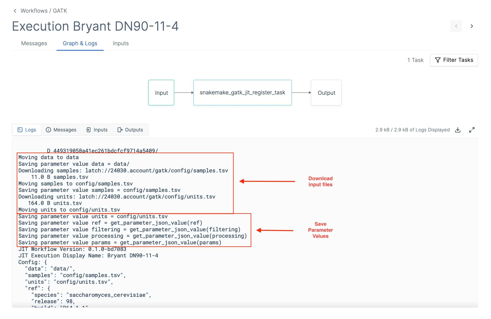
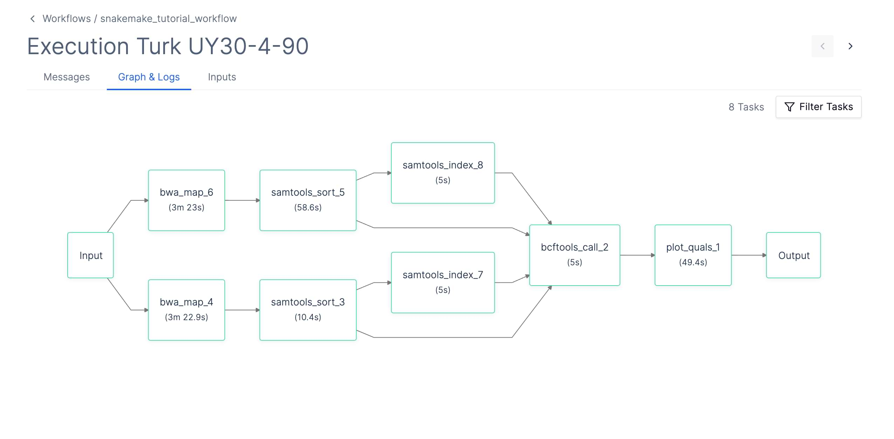

# Overview

Latch's Snakemake integration allows developers to build graphical interfaces to expose their Snakemake workflows to wet lab teams. It also provides managed cloud infrastructure for executing the workflow's jobs.

A primary goal for the Snakemake integration is to allow developers to register existing Snakemake projects with minimal added boilerplate and modifications to code.

## Snakemake Execution on Latch

There are two stages to every Snakemake execution:

1. Just-In-Time compilation: generates the workflow DAG from the Snakefile and input parameters
2. Runtime: execution of the workflow tasks generated during the JIT step.

### JIT Workflow

The first ("JIT") workflow does the following:

1. Create empty input files; this enables the JIT task to mock the file structure at runtime without using unnecessary network bandwidth from downloading the entire file
2. Import the Snakefile, calculate the dependency graph, and determine which jobs need to be run
3. Generate a Latch SDK workflow Python script for the second ("runtime") workflow and register it
4. Run the runtime workflow

### Runtime Workflow

The runtime workflow will spawn a task per each Snakemake job. This means there will be a separate task per each wildcard instantiation of each rule. This can lead to workflows with hundreds of tasks. Note that the execution graph can be filtered by task status.

When a task executes, it will:

1. Download all input files that are defined in the rule
2. Execute the Snakemake task
3. Upload outputs/logs/benchmarks to Latch Data

## Limitations

1. The workflow will execute the first rule defined in the Snakefile (matching standard Snakemake behavior). There is no way to change the default rule other than by moving the desired rule up in the file
1. Rules only download their inputs, which can be a subset of the input files. If the Snakefile tries to read input files outside of the ones explicitly defined in the rule, it will usually fail at runtime
1. Large files that move between tasks need to be uploaded by the outputting task and downloaded by each consuming task. This can take a significant amount of time. Frequently, it's possible to merge the producer and the consumer into one task to improve performance
1. Environment dependencies (Conda packages, Python packages, other software) must be well-specified. Missing dependencies will lead to JIT-time or runtime crashes
1. Config files are not supported and must be hard-coded into the workflow Docker image
1. `conda` directives will frequently fail with timeouts/SSL errors because Conda does not react well to dozens of tasks trying to install Conda environments over a short period. It is recommended that all conda environments are included in the Docker image.
1. The JIT workflow hard-codes the latch paths for rule inputs, outputs, and other files. If these files are missing when the runtime workflow task runs, it will fail
