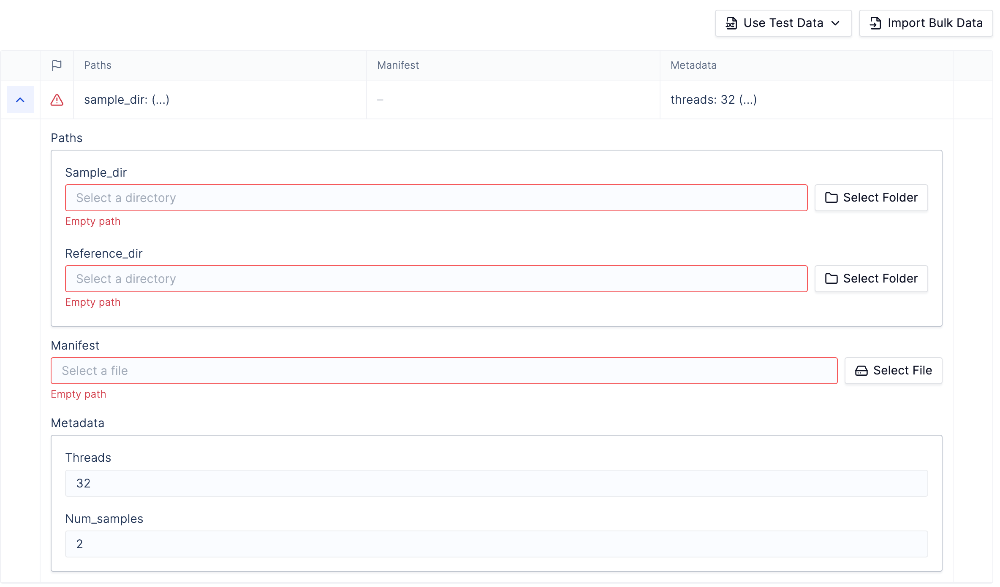

# Uploading an Existing Snakemake Workflow

The following guide will walk you through how to upload an existing Snakemake workflow to the Latch console in four simple steps. If you do not already have a Snakemake workflow, see the [Tutorial](./tutorial.md) to get started.

## Prerequisites

- Register for an account and log into the [Latch Console](https://console.latch.bio)
- Install a compatible version of Python. The Latch SDK is currently only supported for Python >=3.8 and <=3.11
- Install the [Latch SDK](https://github.com/latchbio/latch#installation) with [Snakemake](https://snakemake.readthedocs.io/en/stable/getting_started/installation.html) support. We recommend installing Latch SDK in a fresh environment for best behavior:

```console
$ python3 -m venv env
$ source env/bin/activate
$ pip install "latch[snakemake]"
```

- Verify the Latch SDK version >= 2.38.8

```console
$ latch --version
latch, version 2.38.8
```

## Step 1: Ensure your Snakefile is Cloud Compatible

Update your workflow's `Snakefile` to ensure compatibility with [cloud execution](./cloud.md) on Latch.

## Step 2: Define Metadata and Input Parameters

To construct a graphical interface from a Snakemake workflow, the input parameters need to be explicitly identified and defined so that they can be presented to scientists through a web application.

The Latch SDK expects these parameters to be defined as a Python `SnakemakeMetadata` object. Fortunately, the Latch SDK provides a command to automatically generate this object from an existing config file. Run the following command in the root directory of your project:

```console
latch generate-metadata <path_to_config.yaml>
```

This command will generate two files:

```
latch_metadata/__init__.py
latch_metadata/parameters.py
```

The first file holds the `SnakemakeMetadata` object, and the second file contains the input parameter definitions. **Be sure to inspect the resulting files to verify that the input parameters are as expected.**

Below is an explanation of the most relevant fields of the `SnakemakeMetadata` object:

#### display_name

Display name of the workflow, as it will appear on the Latch UI.

#### output_dir

Points to the folder in Latch Data where Snakemake outputs are stored after the workflow finishes executing.

#### parameters

Input parameters to the workflow, defined as `SnakemakeParameter` objects. The Latch Console will expose these parameters to scientists before they execute the workflow. The `type` and `default` fields for each parameter are inferred from the config file when the `generate-metadata` command is run.

#### file_metadata

Every input parameter of type LatchFile or LatchDir must have a corresponding `SnakemakeFileMetadata` in the `file_metadata` field. LatchFile and LatchDir are pointers to remote files that are hosted on the Latch platform. The `SnakemakeFileMetadata` object provides required metadata about each remote file, such as:

1. `path`: The local path inside the container where the workflow engine will copy Latch Data files/directories before the job executes
2. `config`: If `True`, exposes the local file path in the Snakemake config
3. `download`: If `True`, downloads the file in the JIT step instead of creating an empty file.
   **Note**: To limit network consumption, the `download` field should only be `True` for files that the Snakefile reads at compilation time (such as configuration files).

## Step 3: Define Container Environment

When registering a Snakemake workflow on Latch, we need to build a single container image containing all your runtime dependencies and the Latch packages. By default, all tasks (including the JIT step) will run inside this container.

The Latch SDK provides a command to generate a Dockerfile with all the Latch-specific dependencies required to run Snakemake workflows in the cloud. This command also attempts to infer and install the workflow's runtime dependencies based on the configuration files in your root directory. Read [here](../basics/defining_environment.md) for more details.

Run the following command in the root directory of your project:

```console
latch dockerfile . --snakemake
```

Inspect the resulting `Dockerfile` and **verify that it installs all required runtime dependencies for your workflow**.

#### Per-Task Environments

Sometimes, it is preferable to use isolated environments for each Snakemake rule using the `container` and `conda` [Snakemake directives](https://snakemake.readthedocs.io/en/stable/snakefiles/deployment.html#running-jobs-in-containers) instead of building one large image.

When using the `container` directive, the Latch workflow will:

1. Launch the workflow container.
2. Execute Latch-specific commands to setup the Snakemake job.
3. Pull the user-specified image and execute the Snakemake job in a sub-container of the workflow container.

To configure your environment on Latch, add the `env_config` field to your workflow's `SnakemakeMetadata` object in `latch_metadata/__init__.py` (this field is similar to the `--use-conda` and `--use-singularity` flags in Snakemake). For example:

```
# latch_metadata.py
from latch.types.metadata import SnakemakeMetadata, SnakemakeFileParameter, EnvironmentConfig
from latch.types.directory import LatchDir
from latch.types.metadata import LatchAuthor, LatchMetadata, LatchParameter
from pathlib import Path

SnakemakeMetadata(
    display_name="snakemake_tutorial_workflow",
    author=LatchAuthor(
            name="latchbio",
    ),
    env_config=EnvironmentConfig(
      use_conda=False,
      use_container=True,
    ),
    ...
)
```

## Step 4: Register the Workflow

To register a Snakemake workflow to Latch, type:

```console
latch login
latch register . --snakefile Snakefile
```

After registering your workflow to Latch, click on the link provided in the output of the `latch register` command. This will take you to an interface like the one below:



To execute the workflow, provide appropriate input parameters and click `Launch Workflow` in the bottom right.

## Next Steps

- See the [Advanced Configuration](./configuration.md) section to learn about more advanced workflow settings.
- See the [Troubleshooting](./troubleshooting.md) guide for debugging common workflow issues.
