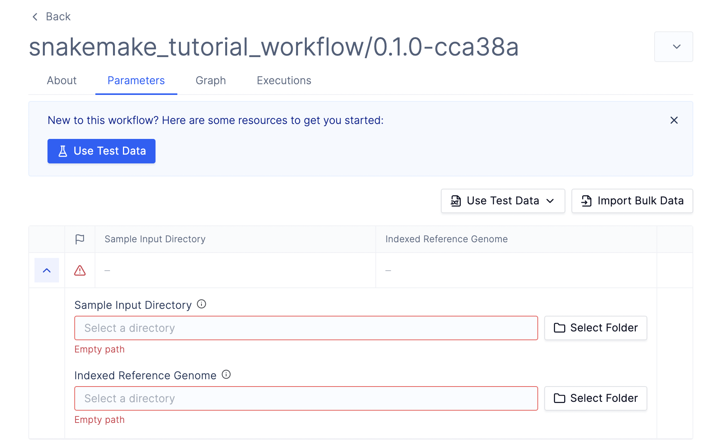

# Quickstart

In this guide, we will walk through how you can upload a simple Snakemake workflow to Latch.

The example being used here comes from the [short tutorial in Snakemake's documentation](https://snakemake.readthedocs.io/en/stable/tutorial/short.html).

## Prerequisites

- Register for an account and log into the [Latch Console](https://console.latch.bio)
- Install a compatible version of Python. The Latch SDK is currently only supported for Python >=3.8 and <=3.11
- Install the [Latch SDK](https://github.com/latchbio/latch#installation) with [snakemake](https://snakemake.readthedocs.io/en/stable/getting_started/installation.html) support. We recommend installing Latch SDK in a fresh environment for best behaviour:

```console
python3 -m venv env
source env/bin/activate
pip install "latch[snakemake]"
```

## Step 1: Clone the example Snakemake workflow

First, clone the example Snakemake workflow:

```console
git clone git@github.com:latchbio/snakemake-tutorial.git
cd snakemake-tutorial
```

The workflow generated contains what is typically seen in a Snakemake workflow, such as python scripts and a Snakefile.

```
snakemake-wf
├── Snakefile
├── environment.yaml
├── config.yaml
├── scripts
│   └── plot-quals.py
├── data
├── .dockerignore
```

## Step 2: Add Latch Metadata

The `latch_metadata.py` is used to specify the input parameters and metadata that the Snakemake workflow needs to run in the Latch Console.

You can automatically generate the `latch_metadata.py` file from an existing `config.yaml` by typing:

```console
latch generate-metadata config.yaml
```

To learn more about the `generate-metadata` command, see: [Metadata](./metadata.md)

This command will create `latch_metadata` in your workflow directory:

```console
snakemake-wf
├── Snakefile
├── environment.yaml
├── config.yaml
├── scripts
│   └── plot-quals.py
├── latch_metadata
│   └── __init__.py
│   └── parameters.py
```

Let's inspect the generated files:

```python
# latch_metadata/__init__.py
from latch.types.metadata import SnakemakeMetadata, LatchAuthor
from latch.types.directory import LatchDir

from .parameters import generated_parameters

SnakemakeMetadata(
    output_dir=LatchDir("latch:///your_output_directory"),
    display_name="Your Workflow Name",
    author=LatchAuthor(
        name="Your Name",
    ),
    # Add more parameters
    parameters=generated_parameters,
)
```

The `latch_metadata/__init__.py` file instantiates a `SnakemakeMetadata` object which contains the Latch specific metadata that will be displayed on the Latch Console when executing a workflow. Feel free to update the `output_dir`, `display_name`, or `author` fields.

The `SnakemakeMetadata` object also contains a `parameters` field which is used to specify the input parameters to the workflow.

```python
# latch_metadata/parameters.py
from dataclasses import dataclass
import typing

from latch.types.metadata import SnakemakeParameter, SnakemakeFileParameter
from latch.types.file import LatchFile
from latch.types.directory import LatchDir

# Import these into your `__init__.py` file:
#
# from .parameters import generated_parameters

generated_parameters = {
    'samples': SnakemakeFileParameter(
        display_name='Samples',
        type=LatchDir,
        config=True,
    ),
    'ref_genome': SnakemakeFileParameter(
        display_name='Ref Genome',
        type=LatchDir,
        config=True,
    ),
}
```

The file contains two file parameters of type `LatchDir`, which is a pointer to a directory hosted on Latch Data. When we register this workflow, these parameters will be exposed to the user on the Latch UI before they execute the workflow. Then, the workflow orchestrator will download these directories to the local machine before executing the task.

How does the orchestrator know which local path to download the remote files to? For each `SnakemakeFileParameter` parameter, we can use the `path` keyword to specify the local path where files will be copied before the Snakemake workflow is run. Add the local path to the file parameters as follows:

```python
# latch_metadata/parameters.py
from pathlib import Path # added
...
generated_parameters = {
    'samples': SnakemakeFileParameter(
        display_name='Samples',
        type=LatchDir,
        config=True,
        path=Path('data/samples') # added
    ),
    'ref_genome': SnakemakeFileParameter(
        display_name='Ref Genome',
        type=LatchDir,
        config=True,
        path=Path('genome') # added
    ),
}
```

## Step 3: Define Workflow Environment

In order to execute Snakemake workflows in a cloud environment, we must define a single Docker container to run each task in. This container must contain both the runtime dependencies for the Snakemake tasks as well as Latch specific dependencies (such as the Latch SDK). To learn more about managing task dependencies, read about [Environments](./environments.md).

Fortunately, the Latch SDK provides a convenient command to generate a Dockerfile with the required Latch dependencies. Run the following in your workflow directory:

```console
latch dockerfile . --snakemake
```

Let's breakdown the resulting `Dockerfile`:

```Docker
from 812206152185.dkr.ecr.us-west-2.amazonaws.com/latch-base:fe0b-main

...

# Latch SDK
# DO NOT REMOVE
run pip install "latch[snakemake]"==<version>
run mkdir /opt/latch
```

Use the Latch base image and install the Latch SDK with Snakemake support. These steps are required to execute workflows on the Latch cloud.

```Docker
# Install Mambaforge
run apt-get update --yes && \
 apt-get install --yes curl && \
 curl \
 --location \
 --fail \
 --remote-name \
 https://github.com/conda-forge/miniforge/releases/latest/download/Mambaforge-Linux-x86_64.sh && \
 `# Docs for -b and -p flags: https://docs.anaconda.com/anaconda/install/silent-mode/#linux-macos` \
 bash Mambaforge-Linux-x86_64.sh -b -p /opt/conda -u && \
 rm Mambaforge-Linux-x86_64.sh

# Set conda PATH
env PATH=/opt/conda/bin:$PATH

# Build conda environment
copy environment.yaml /opt/latch/environment.yaml
run mamba env create \
 --file /opt/latch/environment.yaml \
 --name workflow
env PATH=/opt/conda/envs/workflow/bin:$PATH
```

Since we had an `environment.yaml` file in our root directory, the `latch dockerfile` command will automatically create a conda environment from the environment definition. This gaurantees that we have all necessary runtime dependencies (`bwa`, `samtools`, etc...) installed in the container when running our tasks.

```
# Copy workflow data (use .dockerignore to skip files)
copy . /root/
```

Copy the source code into the container. Be sure to use .dockerignore to avoid copying any large data files that you do not want in your container.

```
copy .latch/snakemake_jit_entrypoint.py /root/snakemake_jit_entrypoint.py
```

Copy the auto-generated Snakemake entrypoint file into the container. This is the python file that will be executed when the workflow runs. For now, you don't need to worry about the contents of this file.

## Step 4: Upload the workflow to Latch

Finally, type the following commands to login to your account and register the workflow to Latch:

```console
latch login
latch register . --snakefile Snakefile
```

During registration, a workflow image is built and the `snakemake_jit_entrypoint.py` file is generated. Once the registration finishes, the `stdout` provides a link to your workflow on Latch.



## Step 5: Upload Data and Run the workflow

Before running the workflow, we need to upload our input data to [Latch Data](https://console.latch.bio/data). The skeleton code contains some sample data under the `data/` directory which you can use for testing.

Once you have uploaded the data and selected the appropriate input parameters, click `Launch Workflow`. You should now see the workflow task executing.


Snakemake support currently uses JIT (Just-In-Time) registration. This means that once the JIT task above completes, it will produce a second workflow, which will run the actual Snakemake jobs. To learn more about about the lifecycle of a Snakemake workflow on Latch read [here](./lifecycle.md).

Once the workflow finishes running, results will be deposited to under the `output_dir` folder, as defined in your `latch_metadata.py` file.

## Next Steps

- Learn more about the lifecycle of a Snakemake workflow on Latch by reading our [manual](../snakemake/lifecycle.md).
- Learn about how to modify Snakemake workflows to be cloud-compatible [here](../snakemake/cloud.md).
- Visit [troubleshooting](../snakemake/troubleshooting.md) to diagnose and find solutions to common issues.
- Visit the repository of [public examples](https://github.com/latchbio/latch-snakemake-examples) of Snakemake workflows on Latch.
