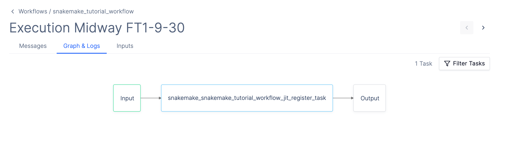

# Quickstart

In this guide, we will walk through how to upload a simple Snakemake workflow to Latch.

The example used here comes from the [short tutorial in Snakemake's documentation](https://snakemake.readthedocs.io/en/stable/tutorial/short.html).

## Prerequisites

- Register for an account and log into the [Latch Console](https://console.latch.bio)
- Install a compatible version of Python. The Latch SDK is currently only supported for Python >=3.8 and <=3.11
- Install the [Latch SDK](https://github.com/latchbio/latch#installation) with [Snakemake](https://snakemake.readthedocs.io/en/stable/getting_started/installation.html) support. We recommend installing Latch SDK in a fresh environment for best behavior:

```console
python3 -m venv env
source env/bin/activate
pip install "latch[snakemake]"
```

## Step 1: Clone the example Snakemake workflow

First, clone the example Snakemake workflow:

```console
git clone git@github.com:latchbio/snakemake-tutorial.git
cd snakemake-tutorial
```

The workflow generated contains what is typically seen in a Snakemake workflow, such as Python scripts and a Snakefile.

```
snakemake-tutorial
├── Snakefile
├── config.yaml
├── data
│   └── ...
├── environment.yaml
├── scripts
│   └── plot-quals.py
├── .dockerignore
```

## Step 2: Add Latch Metadata

All Latch workflows require a metadata file specifying the input parameters and metadata the Snakemake workflow needs to run in the Latch Console.

You can automatically generate the required metadata files from an existing `config.yaml` by typing:

```console
latch generate-metadata config.yaml
```

To learn more about the `generate-metadata` command, see [Metadata](./metadata.md)

This command will create a `latch_metadata` folder in your workflow directory:

```
snakemake-tutorial
├── Snakefile
├── config.yaml
├── data
│   └── ...
├── environment.yaml
├── latch_metadata
│   └── __init__.py
│   └── parameters.py
├── scripts
│   └── plot-quals.py
├── .dockerignore
```

Let's inspect the generated files:

```python
# latch_metadata/__init__.py
from latch.types.metadata import SnakemakeMetadata, LatchAuthor
from latch.types.directory import LatchDir

from .parameters import generated_parameters, file_metadata

SnakemakeMetadata(
    output_dir=LatchDir("latch:///your_output_directory"),
    display_name="Your Workflow Name",
    author=LatchAuthor(
        name="Your Name",
    ),
    # Add more parameters
    parameters=generated_parameters,
    file_metadata=file_metadata,
)
```

The `latch_metadata/__init__.py` file instantiates a `SnakemakeMetadata` object, which contains the Latch-specific metadata displayed on the Latch Console when executing a workflow. Feel free to update the `output_dir`, `display_name`, or `author` fields.

The `SnakemakeMetadata` object also contains `parameters` and `file_metadata` fields specifying the workflow's input parameters.

```python
# latch_metadata/parameters.py
from dataclasses import dataclass
import typing

from latch.types.metadata import SnakemakeParameter, SnakemakeFileParameter, SnakemakeFileMetadata
from latch.types.file import LatchFile
from latch.types.directory import LatchDir


# Import these into your `__init__.py` file:
#
# from .parameters import generated_parameters, file_metadata

generated_parameters = {
    'samples': SnakemakeParameter(
        display_name='Samples',
        type=LatchDir,
    ),
    'ref_genome': SnakemakeParameter(
        display_name='Ref Genome',
        type=LatchDir,
    ),
}

file_metadata = {
    'samples': SnakemakeFileMetadata(
        path='data/samples/',
        config=True,
    ),
    'ref_genome': SnakemakeFileMetadata(
        path='genome/',
        config=True,
    ),
}
```

This file contains two file parameters of type `LatchDir` (which is a pointer to a directory hosted on Latch Data). When we register this workflow, these parameters will be exposed to the user on the Latch UI. Upon execution, the workflow orchestrator will download these directories to the local machine before executing the task.

How does the orchestrator know which local path to download the remote files? For each `SnakemakeParameter` of type `LatchFile` or `LatchDir`, we use `SnakemakeFileMetadata` object to specify the local path to copy files to before the Snakemake job runs.

## Step 3: Define Workflow Environment

To execute Snakemake workflows in a cloud environment, we must define a single Docker container to run each task in. This container must contain both the runtime dependencies for the Snakemake tasks and Latch-specific dependencies (such as the Latch SDK). To learn more about managing task dependencies, read about [Environments](./environments.md).

Fortunately, the Latch SDK provides a convenient command to generate a Dockerfile with the required Latch dependencies. Run the following in your workflow directory:

```console
latch dockerfile . --snakemake
```

Let's analyze the resulting `Dockerfile`:

```Docker
from 812206152185.dkr.ecr.us-west-2.amazonaws.com/latch-base:fe0b-main

...

# Latch SDK
# DO NOT REMOVE
run pip install "latch[snakemake]"==<version>
run mkdir /opt/latch
```

Use the Latch base image and install the Latch SDK with Snakemake support. These steps are required to execute workflows on the Latch cloud.

```Docker
# Install Mambaforge
run apt-get update --yes && \
 apt-get install --yes curl && \
 curl \
 --location \
 --fail \
 --remote-name \
 https://github.com/conda-forge/miniforge/releases/latest/download/Mambaforge-Linux-x86_64.sh && \
 `# Docs for -b and -p flags: https://docs.anaconda.com/anaconda/install/silent-mode/#linux-macos` \
 bash Mambaforge-Linux-x86_64.sh -b -p /opt/conda -u && \
 rm Mambaforge-Linux-x86_64.sh

# Set conda PATH
env PATH=/opt/conda/bin:$PATH

# Build conda environment
copy environment.yaml /opt/latch/environment.yaml
run mamba env create \
 --file /opt/latch/environment.yaml \
 --name workflow
env PATH=/opt/conda/envs/workflow/bin:$PATH
```

The `latch dockerfile` command will detect the existence of an `environment.yaml` file and create a conda environment from that file. This guarantees that all necessary runtime dependencies (`bwa`, `samtools`, etc.) are installed in the container when running our tasks. If your workflow doesn't have an `environment.yaml` file, you must manually install packages in the Dockerfile.

```
# Copy workflow data (use .dockerignore to skip files)
copy . /root/
```

Copy the source code into the container. Use .dockerignore to avoid copying any large data files that you do not want in your container.

```
copy .latch/snakemake_jit_entrypoint.py /root/snakemake_jit_entrypoint.py
```

Copy the auto-generated Snakemake entry point file into the container. This Python file will be executed when the workflow runs. For now, you don't need to be familiar with the contents of this file.

## Step 4: Upload the Workflow to Latch

Finally, type the following commands to log in to your account and register the workflow to Latch:

```console
latch login
latch register . --snakefile Snakefile
```

During registration, a workflow image is built and uploaded, and the `snakemake_jit_entrypoint.py` file is generated. Once the registration finishes, `stdout` provides a link to your workflow on Latch.


## Step 5: Upload Data and Run the Workflow

Before running the workflow, we must upload our input data to [Latch Data](https://console.latch.bio/data). The skeleton code contains some sample data under the `data`/` directory, which you can use for testing.

Once you have uploaded the data and selected the appropriate input parameters, click `Launch Workflow`. You should now see the workflow task executing.



Snakemake support currently uses JIT (Just-In-Time) registration. This means that once the single-task workflow above is complete, it will produce a second workflow, which runs the actual Snakemake jobs. To learn more about the lifecycle of a Snakemake workflow on Latch, click [here](./lifecycle.md).

Once the workflow finishes running, results will be deposited under the `output_dir` folder, as defined in your `latch_metadata.py` file.

## Next Steps

- Learn more about the lifecycle of a Snakemake workflow on Latch by reading our [manual](../snakemake/lifecycle.md).
- Learn about how to modify Snakemake workflows to be cloud-compatible [here](../snakemake/cloud.md).
- Visit [troubleshooting](../snakemake/troubleshooting.md) to diagnose and find solutions to common issues.
- Visit the repository of [public examples](https://github.com/latchbio/latch-snakemake-examples) of Snakemake workflows on Latch.
