# Benchling Sync

Latch Registry integrates with Benchling API to import your entity and plate schemas as a Project to Latch. This document walks through the process of setting up Benchling Integration and using it to import your data.

## Setup Benchling Sync

The integration works by using your Benchling developer API key.

1. Follow official [Benchling tutorial](https://help.benchling.com/hc/en-us/articles/9714802977805-Access-the-Benchling-Developer-Platform#h_2962600be3) to get your personal user API key.
2. In Latch Console, go to Workspace Settings > Developer, and click on Benchling
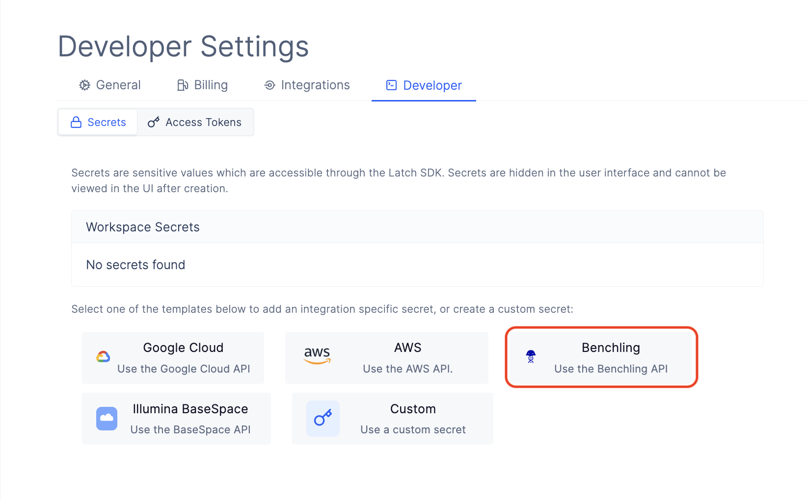
3. For `BENCHLING_TENANT_URL` put in your tennant URL. Ex. `https://latch.benchling.com/`.
4. For `BENCHLING_API_KEY` put in your Benchling API key. Ex. `sk_example_key`
5. Click on `Submit` to save your Benchling credentials which will securly store your credentials in Amazon Secrets Manager.
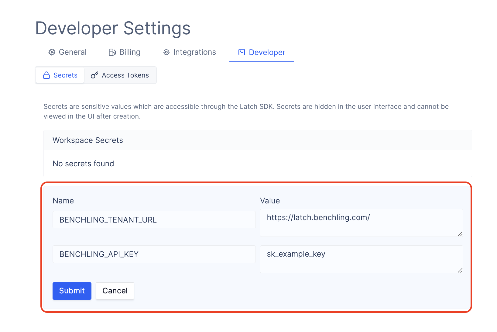
6. You will see your Benchling secrets added to the `Workspace Secrets` section.
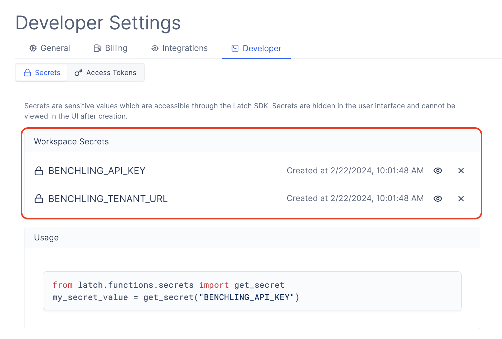

## Importing Data Using Benchling Sync
After successfully adding your Benchling credentials to Latch, you can go to `Registry` and import your data as a new project.

1. Go to `Registry`.

2. Create a new project by clicking `New Project` in the sidebar.
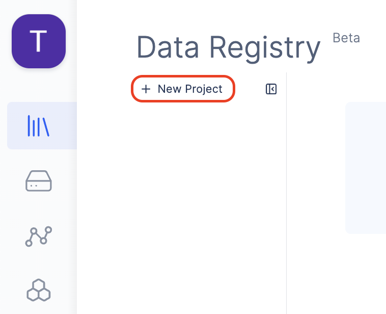
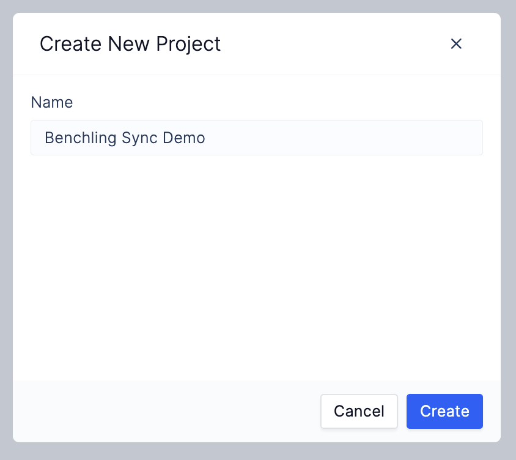

3. Click on `Benchling Data Sync` in the top right corner.
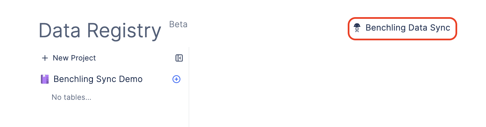

4. Select the project to sync data into.
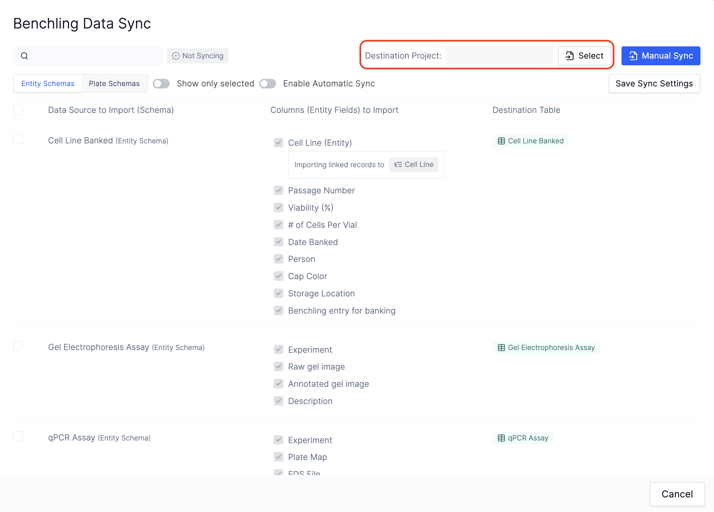
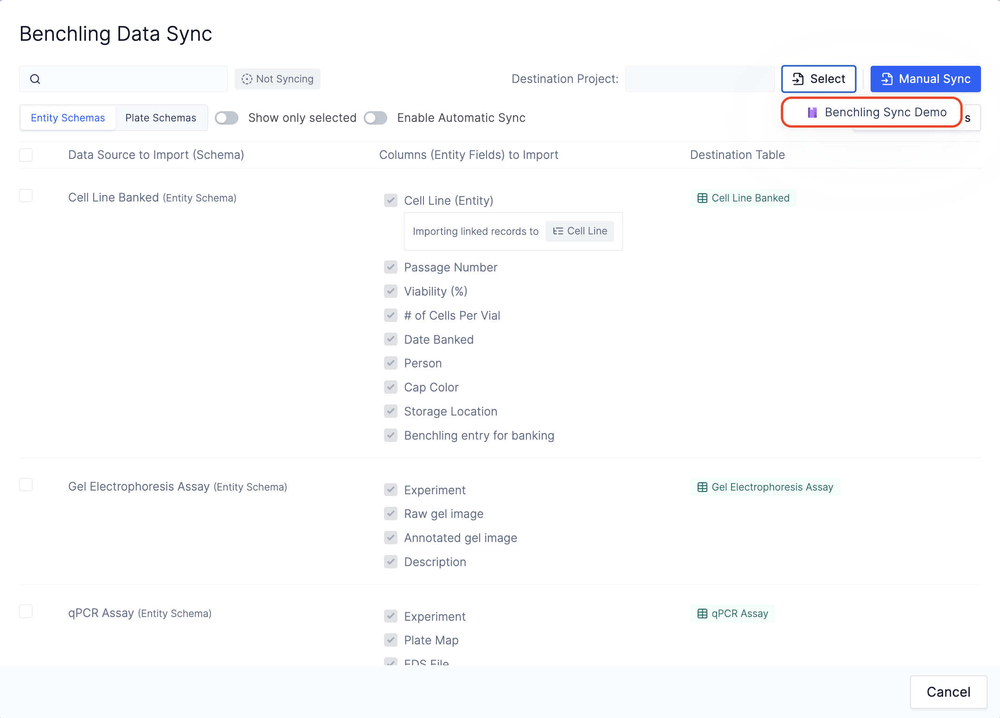

5. Use the selector to switch between Plate and Entity schemas.
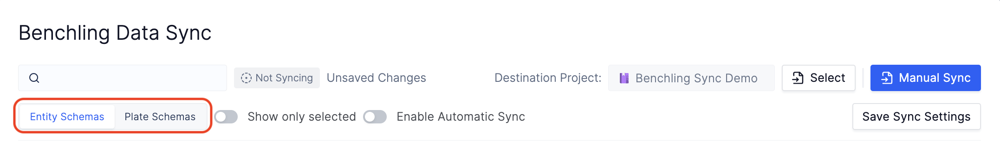

6. Check Benchling Schemas and columns that you want to sync. These schemas will be imported into the tables under the project that you have selected in step 4. If the entity schema you selected, links to another schemas, those will be selected for an import as well. It is crucial to import all related schemas to properly link Registry tables.
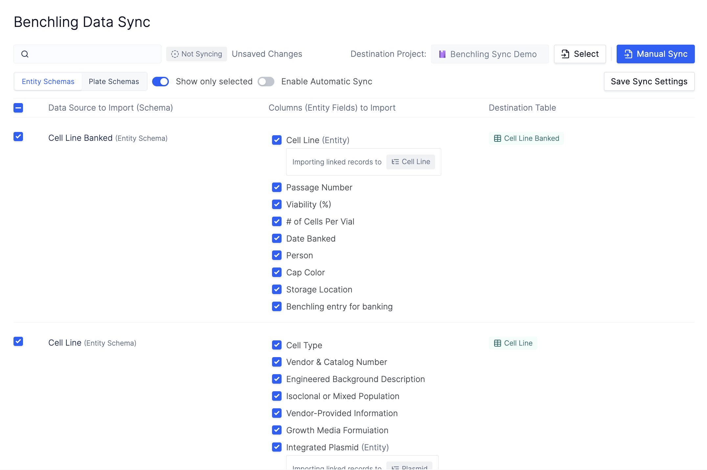

7. (Optional) Enable automatic sync. If this option is enabled, your data will be automatically synced from Benchling to Latch every 30 minutes.
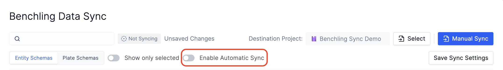

8. Click `Save Sync Settings` to save the state of your sync.

9. Click `Manual Sync` to manually import all the schemas that you have selected into Latch. Depending on the size and the amount of schemas that you are importing, this might take a couple of minutes. Please keep the tab with the importer open. If you need to use the rest of the platform, please open a new tab and go to console page there.

10. After the sync exits, all of the schemas that you have selected will be available in the specified project.
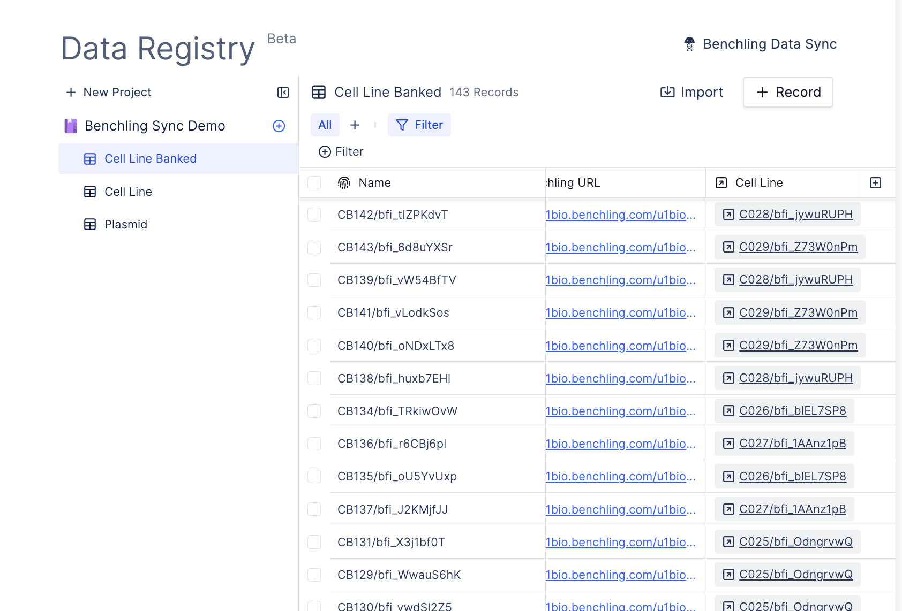

See how you can use [Registry](overview.md) to better analyze and search through your Benchling data.
