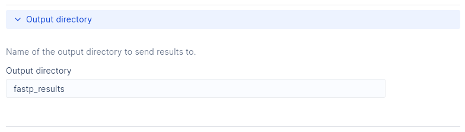

# An example workflow for custom parameter layout

In the [Customizing your interface](../basics/customizing_interface.md) section,
we saw how we can use the Flow argument in a LatchMetadata construct to define
the layout and the different sections of our interface.

So, let's build a workflow to show the different types of Flow elements you can use in your own workflows and
how they're rendered in the interface.

## Building the workflow

We'll build a workflow for a tool that has many possible parameters-
[fastp](https://github.com/OpenGene/fastp), an all-in-one FASTQ preprocessor,
which should make for an interesting and comprehensive interface.

First, let's define a simple dockerfile to install the tool in our environment:

```Dockerfile
# Dockerfile

FROM 812206152185.dkr.ecr.us-west-2.amazonaws.com/latch-base:6839-main

RUN apt-get update &&\
    apt-get install -y curl

# Install fastp
RUN curl -L http://opengene.org/fastp/fastp -o fastp &&\
    chmod a+x fastp

# STOP HERE:
# The following lines are needed to ensure your build environement works
# correctly with latch.
RUN python3 -m pip install --upgrade latch
COPY wf /root/wf
ARG tag
ENV FLYTE_INTERNAL_IMAGE $tag
WORKDIR /root
```

Now, since fastp accepts both single-end and paired-end reads as input, let's try to build this
workflow to be able to accept both types of input - this is a great example to show how the Fork
element can be used.

First, let's work on the workflow code itself:

As types for these two inputs, let's build simple dataclasses, to hold the sample names and the reads
themselves.

```py
# wf/__init__.py

import subprocess
from dataclasses import dataclass
from pathlib import Path
from typing import Optional

from dataclasses_json import dataclass_json
from latch import medium_task, workflow
from latch.resources.launch_plan import LaunchPlan
from latch.types import LatchDir, LatchFile

from .docs import fastp_docs


@dataclass_json
@dataclass
class SingleEnd:
    name: str
    read1: LatchFile


@dataclass_json
@dataclass
class PairedEnd:
    name: str
    read1: LatchFile
    read2: LatchFile
```

Then, we'll define the task that will run fastp, we'll make paired-end the default
input type - therefore making single end optional.

```py
# wf/__init__.py

@medium_task
def run_fastp(
    paired_end: PairedEnd,
    quality_threshold: int,
    single_end: Optional[SingleEnd],
    output_directory: str,
) -> LatchDir:

    # If single_end is set, the
    # sample is single_end
    if single_end is not None:
        sample = single_end
        read_type = "single"
    else:
        sample = paired_end
        read_type = "paired"

    sample_name = sample.name

    # Output directory for the files
    output_dir = Path("fastp_results").resolve()
    output_dir.mkdir(parents=True, exist_ok=True)

    # The name of the first output
    # if single, it's the only output
    out1_name = (
        f"{sample_name}.trim.fastq.gz"
        if read_type == "single"
        else f"{sample_name}_1.trim.fastq.gz"
    )

    _fastp_cmd = [
        "/root/fastp",
        "--in1",
        sample.read1.local_path,
        "--out1",
        f"fastp_results/{out1_name}",
        "--json",
        f"fastp_results/{sample_name}.fastp.json",
        "--html",
        f"fastp_results/{sample_name}.fastp.html",
        "--thread",
        "16",
        "--qualified_quality_phred",
        str(quality_threshold),
    ]

    # Add paired-end specific parameters. such
    # as the second input and outputs and the automatic
    # adapter detection.
    if read_type == "paired":
        _fastp_cmd.extend(
            [
                "--in2",
                sample.read2.local_path,
                "--out2",
                f"fastp_results/{sample_name}_2.trim.fastq.gz",
                "--detect_adapter_for_pe",
            ]
        )

    subprocess.run(_fastp_cmd, check=True)

    return LatchDir(str(output_dir), f"latch:///{output_directory}/{sample_name}")
```

As for the workflow itself, it will be simple - since it only contains a single task.
That being said, do note the presence of a variable - `sample_fork` - this is
the unique key necessary to use the Fork element, since it allows the runtime behaviour
to change based on the user's input, as we'll see in just a bit.

Don't worry about the `fastp_docs` variable just yet, that's what we'll build next.

```py
# wf/__init__.py

@workflow(fastp_docs)
def fastp(
    sample_fork: str,
    paired_end: PairedEnd,
    quality_threshold: int = 30,
    single_end: Optional[SingleEnd] = None,
    output_directory: str = "fastp_results",
) -> LatchDir:
    """Workflow for running fastp and showing Flow Elements
    """

    fastp_res = run_fastp(
        paired_end=paired_end,
        quality_threshold=quality_threshold,
        single_end=single_end,
        output_directory=output_directory,
    )

    return fastp_res
```

## Building the workflow documentation

Now, with the workflow logic done, we can start working on the documentation.
In order to keep the code more organized, let's create a separate file for it (`wf/docs.py`)

```py
# wf/docs.py

from latch.types.metadata import (
    Fork,
    ForkBranch,
    LatchAuthor,
    LatchMetadata,
    LatchParameter,
    Params,
    Section,
    Spoiler,
    Text,
)

FLOW = [
        Section(
            "Samples",
            Text(
                "Sample provided has to include an identifier for the sample (Sample name)"
                " and one or two files corresponding to the reads (single-end or paired-end, respectively)"
            ),
            Fork(
                "sample_fork",
                "Choose read type",
                paired_end=ForkBranch("Paired-end", Params("paired_end")),
                single_end=ForkBranch("Single-end", Params("single_end")),
            ),
        ),
    ]
```

In the code above we define a variable, FLOW, which will be used
as the value for the flow argument in our LatchMetadata object.
In this variable, we'll define the way our parameters are laid out and how they'll
look in the interface.

First, we define a Section for our sample parameters - be it paired end or single end,
we name this section "Samples", the first value inside the Section element.
Then, we can include some small descriptive text using the Text element.

And, finally, we add the logic for the fork itself: Notice how we use the variable
we set in our workflow (`sample_fork`) as the unique key for our fork - Although this
has no visible impact on the interface itself, it's necessary for the Fork logic to
work when running your workflow. Then, in separate branches using ForkBranch, we include
our `paired_end` and `single_end` parameters using the Params element.

After registering, this will be rendered as such:


But, since we have other parameters in our workflow, we can add new sections for them:

```py
# wf/docs.py

FLOW = [
    Section(
        "Samples",
        Text(
            "Sample provided has to include an identifier for the sample (Sample name)"
            " and one or two files corresponding to the reads (single-end or paired-end, respectively)"
        ),
        Fork(
            "sample_fork",
            "Choose read type",
            paired_end=ForkBranch("Paired-end", Params("paired_end")),
            single_end=ForkBranch("Single-end", Params("single_end")),
        ),
    ),
    Section(
        "Quality threshold",
        Text(
            "Select the quality value in which a base is qualified."
            "Quality value refers to a Phred quality score"
        ),
        Params("quality_threshold"),
    ),
    Spoiler(
        "Output directory",
        Text("Name of the output directory to send results to."),
        Params("output_directory"),
    ),
]
```

Notice how, instead of using the Section element for our `output_directory` parameter, we
use the `Spoiler` element - this element is very useful when you have sensible defaults
set for a parameter in your workflow and wish to obscure this parameter from the user.

These two new elements we added will be rendered as such:


The output directory parameter can be accessed and changed by clicking the dropdown:



Finally, we can build our LatchMetadata object, assigning it to the `fastp_docs`
variable, which will be imported and used in `wf/__init__.py`, as shown before.

```py
# wf/docs.py

fastp_docs = LatchMetadata(
    display_name="fastp - Flow Tutorial",
    author=LatchAuthor(
        name="LatchBio",
    ),
    parameters={
        "sample_fork": LatchParameter(),
        "paired_end": LatchParameter(
            display_name="Paired-end reads",
            description="FASTQ files",
            batch_table_column=True,
        ),
        "single_end": LatchParameter(
            display_name="Single-end reads",
            description="FASTQ files",
            batch_table_column=True,
        ),
        "quality_threshold": LatchParameter(
            display_name="Minimum quality", description="Phred quality score"
        ),
        "output_directory": LatchParameter(
            display_name="Output directory",
        ),
    },
    flow=FLOW,
)
```

As a last note, see above how `sample_fork` still has to be included
in your parameters definition since it's set as one of the workflow
parameters - even though it's not visibly used inside of your code.
