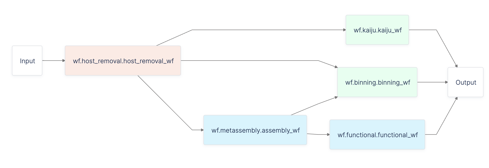
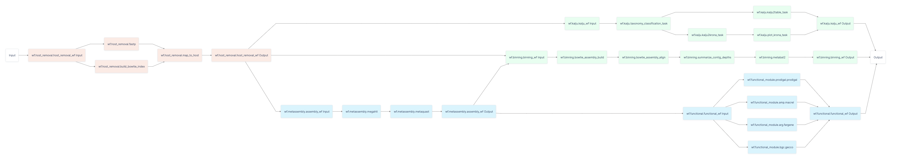

# Taxonomy Classification with Metamage Workflow

In this tutorial, we will use the Latch SDK to build **metamage**, a workflow for taxonomic classification, assembly, binning and annotation of short-read host-associated metagenomics datasets.

## Prerequisites

* Install the Latch SDK.
* Understand basic concepts of a workflow through our [Quickstart](../getting_started/quick_start.md) and [Authoring your Own Workflow](../getting_started/authoring_your_workflow.md).

## What You Will Learn

Bioinformatics workflows often deal with pipelines with tens to hundreds of tasks, where each task processes a set of input values.

It is best practice to package groups of tasks into modular workflows and reuse these workflows in a larger workflow.

Using **metamage** as an example, the tutorial will demonstrate how we can use **subworkflows** for reusing workflows.

To follow along, view the source code by our Biocomputing Ambassador João Vitor Cavalcante [here](https://github.com/jvfe/metamage_latch).

> We won't go over how to write your own workflow in this tutorial. If you are unfamiliar with Latch workflows, we recommend visiting [Authoring your Own Workflow](../getting_started/authoring_your_workflow.md) before continuing.

## Workflow Overview


The workflow is composed of:

### Read pre-processing and host read removal

* [fastp](https://github.com/OpenGene/fastp) for read trimming and other general pre-processing
* [BowTie2](https://github.com/BenLangmead/bowtie2) for mapping to the host genome and extracting unaligned reads

### Assembly

* [MEGAHIT](https://github.com/voutcn/megahit) for assembly
* [MetaQuast](https://github.com/ablab/quast) for assembly evaluation

### Functional annotation

* [Macrel](https://github.com/BigDataBiology/macrel) for predicting Antimicrobial Peptide
    (AMP)-like sequences from contigs
* [fARGene](https://github.com/fannyhb/fargene) for identifying Antimicrobial Resistance Genes
    (ARGs) from contigs
* [Gecco](https://github.com/zellerlab/GECCO) for predicting biosynthetic gene clusters
    (BCGs) from contigs
* [Prodigal](https://github.com/hyattpd/Prodigal) for protein-coding
    gene prediction from contigs.

### Binning

* BowTie2 and [Samtools](https://github.com/samtools/samtools) to
    building depth files for binning.
* [MetaBAT2](https://bitbucket.org/berkeleylab/metabat/src/master/) for
    binning

### Taxonomic classification of reads

* [Kaiju](https://github.com/bioinformatics-centre/kaiju) for
    taxonomic classification
* [KronaTools](https://github.com/marbl/Krona/wiki/KronaTools) for
    visualizing taxonomic classification results

---

## How the Workflow is Represented in the Latch SDK

Let's inspect the workflow directory:

```console
$ tree metamage_latch
metamage_latch
├── CITATION.cff
├── Dockerfile
├── LICENSE
├── README.md
├── version
└── wf
    ├── __init__.py
    ├── binning.py
    ├── docs.py
    ├── functional.py
    ├── functional_module
    │   ├── amp.py
    │   ├── arg.py
    │   ├── bgc.py
    │   └── prodigal.py
    ├── host_removal.py
    ├── kaiju.py
    ├── metassembly.py
    └── types.py

2 directories, 17 files
```

The 5 steps in the overview above can be seen in 5 Python files, each of which defines a smaller workflow in Latch:

* **host_removal.py** for read pre-processing and host read removal
* **metassembly.py** for assembly
* **functional.py** for functional annotation
* **binning.py** for binning
* **kaiju.py** for taxonomic classification of reads

These five workflows can be imported for reuse in `__init__.py` like so:

```python

# Note how we are importaing the name of the workflow function in each Python file
from .binning import binning_wf
from .functional import functional_wf
from .host_removal import host_removal_wf
from .kaiju import kaiju_wf
from .metassembly import assembly_wf

from .docs import metamage_DOCS
...

@workflow(metamage_DOCS)
def metamage(
    read1: LatchFile,
    read2: LatchFile,
    host_genome: LatchFile,
    kaiju_ref_db: LatchFile,
    kaiju_ref_nodes: LatchFile,
    kaiju_ref_names: LatchFile,
    host_name: str = "host",
    sample_name: str = "metamage_sample",
    taxon_rank: TaxonRank = TaxonRank.species,
    min_count: int = 2,
    k_min: int = 21,
    k_max: int = 141,
    k_step: int = 12,
    min_contig_len: int = 200,
    prodigal_output_format: ProdigalOutput = ProdigalOutput.gbk,
    fargene_hmm_model: fARGeneModel = fARGeneModel.class_a,
) -> List[Union[LatchFile, LatchDir]]:

    # Host read removal and trimming
    unaligned = host_removal_wf(
        read1=read1,
        read2=read2,
        host_genome=host_genome,
        host_name=host_name,
        sample_name=sample_name,
    )

    # Kaiju taxonomic classification
    kaiju2table, krona_plot = kaiju_wf(
        read_dir=unaligned,
        kaiju_ref_db=kaiju_ref_db,
        kaiju_ref_nodes=kaiju_ref_nodes,
        kaiju_ref_names=kaiju_ref_names,
        sample_name=sample_name,
        taxon_rank=taxon_rank,
    )

    # Assembly
    assembly_dir, metassembly_results = assembly_wf(
        read_dir=unaligned,
        sample_name=sample_name,
        min_count=min_count,
        k_min=k_min,
        k_max=k_max,
        k_step=k_step,
        min_contig_len=min_contig_len,
    )

    # Binning
    binning_results = binning_wf(
        read_dir=unaligned, assembly_dir=assembly_dir, sample_name=sample_name
    )

    # Functional Annotation
    prodigal_results, macrel_results, fargene_results, gecco_results = functional_wf(
        assembly_dir=assembly_dir,
        sample_name=sample_name,
        prodigal_output_format=prodigal_output_format,
        fargene_hmm_model=fargene_hmm_model,
    )

    return [
        kaiju2table,
        krona_plot,
        metassembly_results,
        binning_results,
        prodigal_results,
        macrel_results,
        fargene_results,
        gecco_results,
    ]
```

To upload the full workflow on the Latch Platform, use:

```console
latch register --remote metamage_latch
```

The workflow will show up in [console.latch.bio/workflows](https://console.latch.bio/workflows).

## Viewing the DAG for subworkflows

When you navigate to the **Graph** page, you will see a condensed version of the workflow with subworkflows:


Pressing "Enter" on your keyboard allows you to view an expanded version of the workflow with tasks in every subworkflow and navigate between the expanded and condensed mode.


---

## Key Takeaways

* For medium to complex workflows with many tasks, it is recommended that you group tasks into a workflow.
* Each workflow can be reused as a subworkflow of a new, larger workflow.
