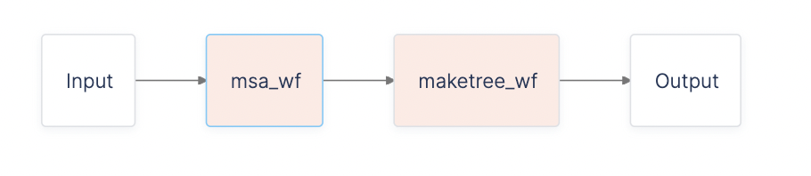

# Multiple Sequence Alignment and Tree Generation with MUSCLE

In this tutorial, we will use the Latch SDK to chain together existing workflows to create a new, end-to-end workflow. Specifically, we will be connecting a multiple sequence alignment workflow with a UPGMA tree workflow to build a phylogenetic tree from raw FASTA sequences. 

## Prerequisites: 
* Install the Latch SDK.
* Understand basic concepts of a workflow through our [Quickstart](../getting_started/quick_start.md) and [Authoring your Own Workflow](../getting_started/authoring_your_workflow.md).

## What you will learn
* How to use workflow references to reuse existing workflows on Latch Console in your own workflow

To follow along, you can view the full code example [here](https://github.com/hannahle/muscle_latch). 

## Workflow Overview
Our workflow consists of two simple steps: 
1. **Multiple sequence alignment (MSA)**: [MUSCLE v3](https://drive5.com/muscle/manual/basic_alignment.html) is used to make an alignment from raw sequences. The input to MUSCLE is a FASTA file that contains sequences. The output is an aligned FASTA.
2. **UPGMA tree generation**: MUSCLE is also used to make a UPGMA tree from a multiple alignment. The input contains aligned sequences in FASTA format. The output tree is written in Newick format.

### Defining the workflow reference
* To list out all workflows you have 