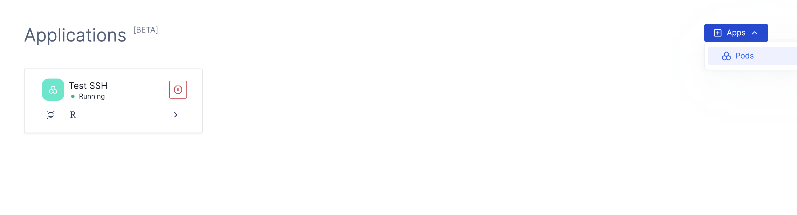
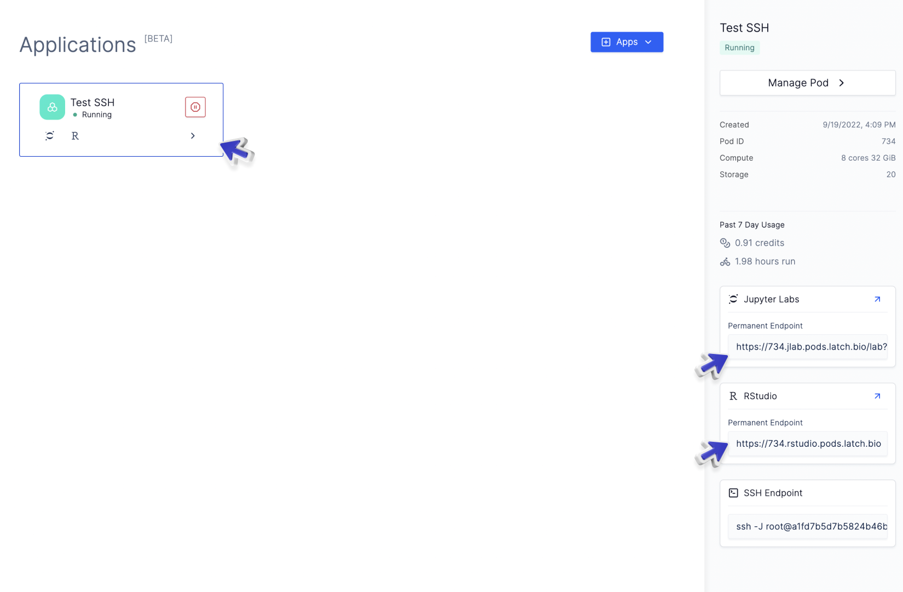
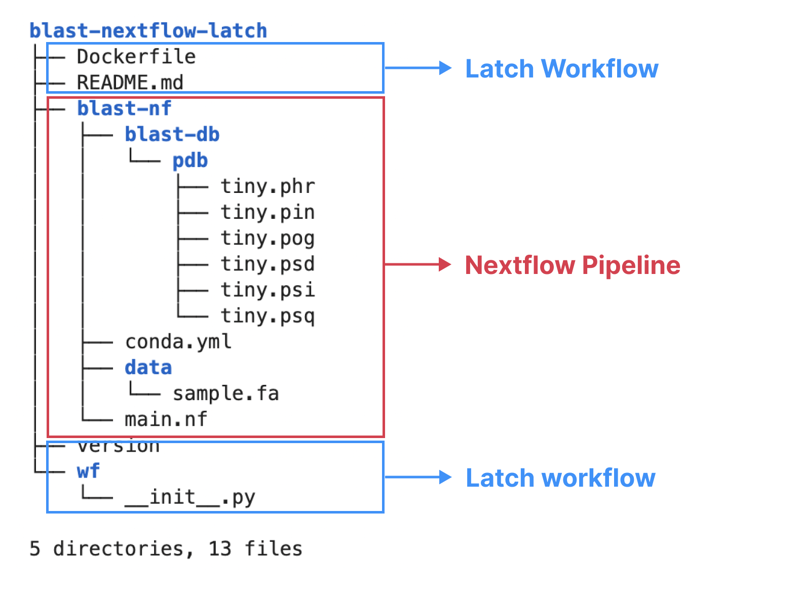
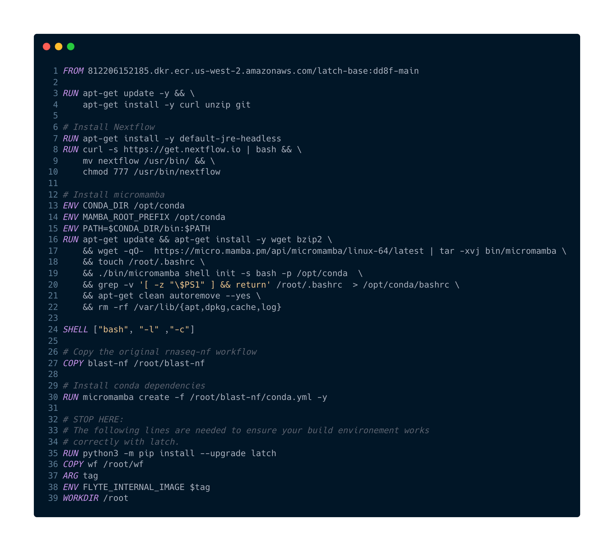
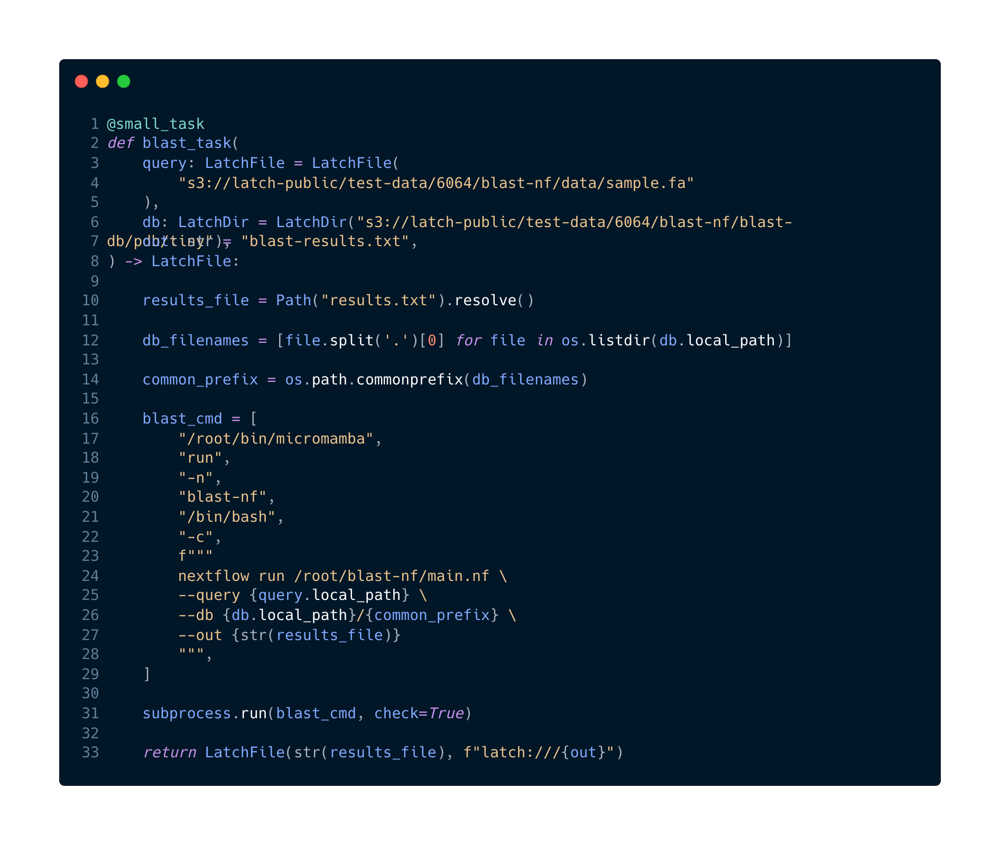
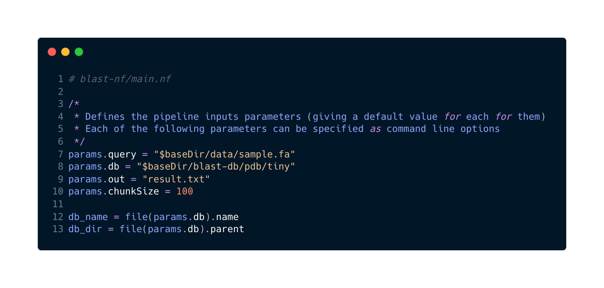

# Tutorial: Running Nextflow in Python with Latch SDK

Estimated time to complete: 45 minutes

Nextflow is a popular framework for orchestrating bioinformatics workflows. In this tutorial, we will walk through how you can package an existing Nextflow script in Latch Python SDK!

## Prerequisites

Before we start, make sure you:

* Install the [Latch SDK](../getting_started/quick_start.md).
* Understand basic concepts of a workflow through our [Quickstart](../getting_started/quick_start.md) and [Authoring your Own Workflow](../getting_started/authoring_your_workflow.md).

As an example, we will use a BLAST workflow written in Nextflow. Let's dive in!

## Set up your developer environment

As a quick refresh, the SDK schedules each task of your workflow to be run on a Linux computer.

We highly recommend that you run through the tutorial inside a Latch Pod (a Linux-based compute environment on Latch) to best simulate the behaviour of how your tasks would run on Latch.

### Step 1: Start a Latch Pod

* Navigate to the [Apps page on Latch](https://console.latch.bio/apps).
* To create a new Pod, click the Apps dropdown and select “Create a new Pod”. You will be prompted to enter a Pod name and set up your personal computing environment.



* There are four Pod sizes that you can choose from: 4 cores and 8GiB of RAM, 8 cores and 32 GiB of RAM, 16 cores and 128 GiB of RAM, and 64 cores and 256GiB of RAM. Storage for a Pod ranges from 20 to 1000 gigabytes. For our RNASeq-NF tutorial, let's choose the **16 cores and 128GiB of RAM** option.
  
* Click "Launch Pod". For the first time, Pods may take 5-15 minutes to start running.

* Once a Pod has started, JupyterLab will be available by default in your Pod. To access them, simply double click on the desired notebook, or copy paste the permanent endpoints from the sidebar to your browser.



* Once you are inside a Pod, you can clone the example code GitHub repository here:

```console
git clone https://github.com/latchbio/blast-nextflow-latch
```

At a high level, the repo contains the original BLAST Nextflow Pipeline, as well as additional files and folders required to upload the workflow to Latch:



We will first attempt to run the Nextflow pipeline locally, and walk through the additional files required to package the pipeline and upload it to Latch.

## Step 2: Install dependencies for the Nextflow Pipeline

To successfully run Nextflow BLAST pipeline inside the Pod, your Pod environment needs:

* Java 8
* Nextflow (version 20.07.x or higher)

In this tutorial, we will use `conda` to manage the pipeline dependencies. We need to additionally install:

* Micromamba (a faster alternative to Anaconda)
* BLAST

Let's walk through our Jupyter Notebook to see how these dependencies are installed!

> Note: All the commands below assume that you are in a Linux environment. Please ensure that you are inside a Latch Pod or an alternative Linux environment before proceeding.

### Update system dependencies

First, let's download and update existing dependencies on our system:

```console
apt-get update -y && apt-get install -y curl unzip git
```

### Install Java 8

Java 8 is required to run Nextflow. You can install the headless version of Java 8 like so:

```console
apt-get install -y default-jre-headless
```

### Install Nextflow

```console
curl -s https://get.nextflow.io | bash && \
    mv nextflow /usr/bin/ && \
    chmod 777 /usr/bin/nextflow 
```

### Install Micromamba

Micromamba is a drop-in replace for Conda that is faster and more light-weight. It uses the same commands and configurations as Conda.

```console
# Install micromamba
! export CONDA_DIR=/opt/conda
! export MAMBA_ROOT_PREFIX=/opt/conda
! export PATH=$CONDA_DIR/bin:$PATH

! apt-get update && apt-get install -y wget bzip2 \
    && wget -qO-  https://micro.mamba.pm/api/micromamba/linux-64/latest | tar -xvj bin/micromamba \
    && touch /root/.bashrc \
    && ./bin/micromamba shell init -s bash -p /opt/conda  \
    && grep -v '[ -z "\$PS1" ] && return' /root/.bashrc  > /opt/conda/bashrc
    && apt-get clean autoremove --yes \
    && rm -rf /var/lib/{apt,dpkg,cache,log}
```

The above set of commands install Micromamba under the `/root/bin` directory.

### Create a Conda environment for the BLAST Nextflow Pipeline

We can use YAML files to manage conda dependencies. Inspecting the `blast-nf` folder, there is a `conda.yml` file that specifies `blast`, which is the only dependency required for this pipeline.

```yml
# blast-nf/conda.yml
name: blast-nf
channels:
  - defaults
  - bioconda
  - conda-forge
dependencies:
  - blast
```

You can create an environment called `blast-nf` using Micromamba like so:

```console
/root/bin/micromamba create -f /root/blast-nextflow-latch/blast-nf/conda.yml -y
```

You can verify the dependencies installation by listing our the environment:

```console
/root/bin/micromamba env list
```

Output on Latch Pod:

```console
          __  ______ ___  ____ _____ ___  / /_  ____ _
         / / / / __ `__ \/ __ `/ __ `__ \/ __ \/ __ `/
        / /_/ / / / / / / /_/ / / / / / / /_/ / /_/ /
       / .___/_/ /_/ /_/\__,_/_/ /_/ /_/_.___/\__,_/
      /_/

  Name       Active  Path                           
──────────────────────────────────────────────────────
  base               /root/micromamba               
  blast-nf              /root/micromamba/envs/blast-nf
                     /root/miniconda                
             *       /root/miniconda/envs/jupyterlab
```

### Run the BLAST Nextflow Pipeline

Great! Now that we have successfully installed Nextflow and all required dependencies, let's run the BLAST pipeline locally:

```console
/root/bin/micromamba run -n blast-nf /bin/bash -c "nextflow run /root/blast-example/main.nf --out /root/results.txt"
```

The results would be output under `/root/results.txt`. You can see an example output file [here](https://console.latch.bio/s/594643294258238).

## Step 3: Package the Nextflow Pipeline as a Latch Workflow


Now that we have successfully run the BLAST pipeline, let's walk through the additional files necessary to package it as a **Latch Workflow**. These files are:

1. A Dockerfile to install the required dependencies
2. A Python `__init__.py` to define workflow logic
3. A `version` file to semantically name the workflow version

### Define your Dockerfile to install dependencies

As the Latch workflow will be executed on a fresh machine on the Latch platform, we have to define a Dockerfile with the necessary dependencies for BLAST to run.

To do so, we can copy paste previous commands used to set up our environment:



* **Line 1**: is the [Latch base image](https://github.com/latchbio/latch-base), which is used to configure libraries required for consistent task behaviour.
* **Line 3-4**: downloads and installs the updates for each outdated package and dependency on the machine that executes the workflow. `curl` and `unzip` are also installed.
* **Line 7**: installs the Java runtime environment, which is required to run Nextflow.
* **Line 8-10**: installs Nextflow and moves the binary to `/usr/bin`.
* **Line 13-25**: is a series of commands to install Micromamba.
* **Line 27**: copies the BLAST Nextflow pipeline code to the task execution environment. The `/root/blast-nf` is that path at which the NF code is stored in the machine that executes the task on Latch.
* **Line 30**: uses Micromamba to install the dependencies as spefieid in `/root/blast-nf/conda.yml`.
* **Line 35-39**: are already provided in the boilerplate Dockerfile and are needed to ensure your build envrionment works correctly with Latch.

That's it! You've successfully defined your Dockerfile.

To test whether the Dockerfile builds the correct environment, first register your workflow to Latch:

```console
latch register -r .
```

Then, open a remote debugging session:

```console
latch develop .
```

Enter an interative shell:

```console
>>> shell

Syncing local changes... 
Could not find /Users/hannahle/Documents/GitHub/nextflow-latch-wf/data - skipping
Finished syncing.
Pulling 812206152185.dkr.ecr.us-west-2.amazonaws.com/6064_nextflow-latch-wf:0.0.0-7da9b6... 
Image successfully pulled.
```

This will pull your workflow image built by the Dockerfile, which is handy to verify and reiterate on your build commands.

For example, we can verify that Nextflow is installed correctly by typing:

```console
root@ip-10-0-11-243:~# nextflow
Usage: nextflow [options] COMMAND [arg...]

Options:
  -C
     Use the specified configuration file(s) overriding any defaults
  -D
     Set JVM properties
  -bg
     Execute nextflow in background
  -c, -config
  ...
```

### Define the Latch workflow

The core logic of a Latch workflow is in the `wf/__init__.py`.

To wrap the Nextflow workflow inside a Latch workflow, first import the necessary dependencies

```python
import subprocess
from pathlib import Path
from typing import List
from latch import medium_task, workflow
from latch.resources.launch_plan import LaunchPlan
from latch.types import LatchAuthor, LatchFile, LatchMetadata, LatchParameter, LatchDir
```

Next, let's define our task:



* **Line 1**: specifies the compute that the RNASeq-NF pipeline needs. Here, we are using a `@small_task`, which will provision a machine with 2 cpus, 4 gigs of memory of memory to run the task. For a comprehensive list of all task resources available, visit [how to define cloud resources](./../basics/defining_cloud_resources.md).
* **Line 3-8:** are the task parameters. We choose `query` and `db` because they are also required parameters in the BLAST Nextflow pipeline, as shown in Nextflow's `main.nf` file.



* **Line 10**: creates a filepath called `results.txt` that can be used to output the BLAST results to.
* **Line 12**: `db.local_path` downloads the BLAST database to the task execution environment. We use Python list comprehension to retrieve all filenames under this directory.
* **Line 14**: retrieves the common filename prefix across alls inside the BLAST database. This is necessary because the BLAST pipeline requires a common filename prefix to be appended to the BLAST database directory.
* **Line 16-29**: specifies the command to be run by Python `subprocess` module.
* **Line 17-22**: tells Micromamba to use the `blast-nf` conda environment previously installed in our Dockerfile.
* **Line 24-27**: is the command to run the BLAST Nextflow pipeline with custom parameters.
* **Line 31**: uses `subprocess` to pops open a process to execute the Nextflow command.
* **Line 33**: takes the output `/root/results.txt` file and uploads it to [Latch Data](https://console.latch.bio/data) under a user-defined filename.

Now you have successfully defined a Latch task with custom compute resources to execute the BLAST Nextflow pipeline on Latch!

### Calling a Latch task inside a Latch workflow

Since this is a single task workflow, you can simply call the task inside the workflow and return its results like so:

```python
@workflow(metadata)
def blast_wf(
    query: LatchFile, db: LatchDir, out: str
) -> LatchFile:
    ...
    return blast_task(query=query, db=db, out=out)
```

### Defining Workflow GUI

To expose workflow parameters to a user-friendly workflow GUI, you can use the `LatchMetadata` object. An important point to note is that all workflow arguments need to be added to the `parameters` key of LatchMetadata for them to display on the GUI. For an exhaustive list of how workflow argument and their Python types map to the front-end interface, visit [Customizing Your Interface](../basics/customizing_interface.md)

```python
"""The metadata included here will be injected into your interface."""
metadata = LatchMetadata(
    display_name="Example: Wrapping a Nextflow BLAST Pipeline in Latch SDK",
    documentation="your-docs.dev",
    author=LatchAuthor(
        name="John von Neumann",
        email="hungarianpapi4@gmail.com",
        github="github.com/fluid-dynamix",
    ),
    repository="https://github.com/your-repo",
    license="MIT",
    parameters={
        "query": LatchParameter(
            display_name="FASTA File",
            description="Select FASTA file.",
            batch_table_column=True,  # Show this parameter in batched mode.
        ),
        "db": LatchParameter(
            display_name="BLAST Database",
            description="Select the database to run BLAST against.",
            batch_table_column=True,  # Show this parameter in batched mode.
        ),
        "out": LatchParameter(
            display_name="Output Text File",
            description="Specify the location of the output text file.",
            batch_table_column=True,  # Show this parameter in batched mode.
        )
    },
    tags=[],
)
```

### Adding Test Data

Finally, we can add some test data to run the workflow.

In the BLAST Nextflow workflow, there is a folder for test data under `blast-nf/data` and an additional folder for BLAST database under `blast-nf/blast-db/pdb`. Let's upload these folders to a public S3 link, so that they can be used by others when running the workflow on Latch:

```console
latch test-data upload blast-nextflow-latch/blast-nf/data
latch test-data upload blast-nextflow-latch/blast-nf/blast-db/pdb
```

Once the command runs successfully, you will see the links at which the folder is uploaded. You can then use the `LaunchPlan` construct to add the remote files as test data like so:

```python
"""
Add test data with a LaunchPlan. Provide default values in a dictionary with
the parameter names as the keys. These default values will be available under
the 'Test Data' dropdown at console.latch.bio.
"""
LaunchPlan(
    rnaseq_wf,
    "Test Data",
    {
        "reads": [
            LatchFile("s3://test-data/6064/rnaseq-nf/data/ggal/ggal_gut_1.fq"), # <- Here we are using a different user's public S3 link - Substitute with your own if desired. Both will work.
            LatchFile("s3://test-data/6064/rnaseq-nf/data/ggal/ggal_gut_2.fq"),
        ],
        "transcriptome": LatchFile(
            "s3://test-data/6064/rnaseq-nf/data/ggal/ggal_1_48850000_49020000.Ggal71.500bpflank.fa"
        ),
        "outdir": LatchDir("latch:///welcome"),
    },
)
```

### Registering the workflow to Latch Console

To publish the workflow to the Latch platform, you can navigate to the root workflow directory and upload it with the `latch register` command:

```console
latch register -r blast-nextflow-latch
```

This will give us:

* a no-code interface
* managed cloud infrastructure for workflow execution
* a dedicated API endpoint for programmatic execution
* hosted documentation
* parallelized CSV-to-batch execution

Once registration finishes, you can navigate to [Latch](https://console.latch.bio/workflows) to run your workflow.

---

## Commonly Asked Questions

Below we aim to provide answers to the most commonly asked questions about porting a Nextflow pipeline to Latch:

1. **Should I wrap an entire Nextflow pipeline in a single task or refactor each Nextflow process to an individual task?**

    For prototyping purposes, we recommend that you wrap an entire Nextflow pipeline in a single task first. This allows you to quickly experience the development experience with a Pythonic SDK and publish a first workflow that's ready-to-use for scientists.

    One disadvantage of this, however, is all processes are run on a single machine with fixed compute resource. If parallelization of individual processes across multiple machines is desired, it is beneficial to refactor each process into its individual task. With the [SDK's remote debugging toolkit](../basics/local_development.md), refactoring also enables for faster debugging and development.

2. **Can I take advantage of existing Netxflow's community workflows while using the Latch SDK?**

    Yes, absolutely! For example, say you want to run [NF-Core's demultiplex pipeline](https://nf-co.re/demultiplex), you can substitute the `nextflow run` command in our tutorial below with the following inside your Python subprocess:

    ```console
    nextflow run nf-core/demultiplex --input samplesheet.csv --outdir <OUTDIR> -profile <docker/singularity/podman/shifter/charliecloud/conda/institute>
    ```

3. **How does the SDK handle retries?**

    Visit the documentation on how the SDK handles retries [here](https://docs.latch.bio/basics/retries.html). Currently, the SDK does not yet support autoscaling compute resources for failed tasks due to out-of-memory errors. This is a feature we're actively investigating and will release in future versions.
