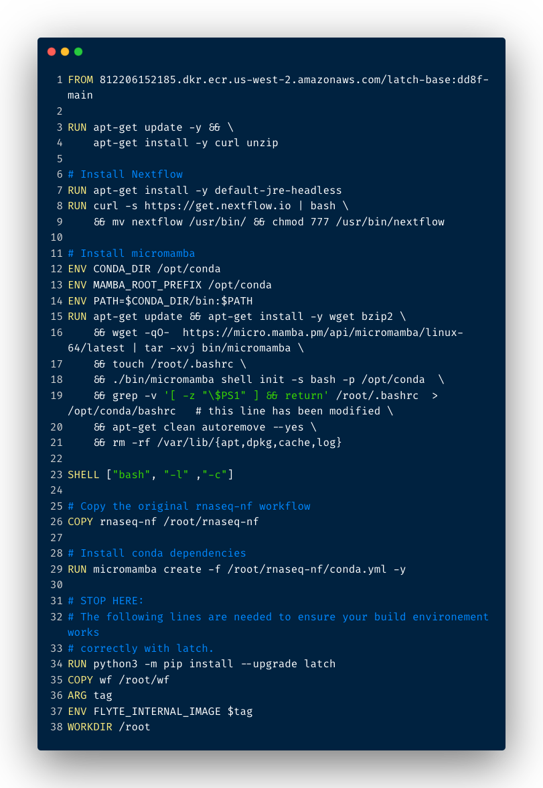
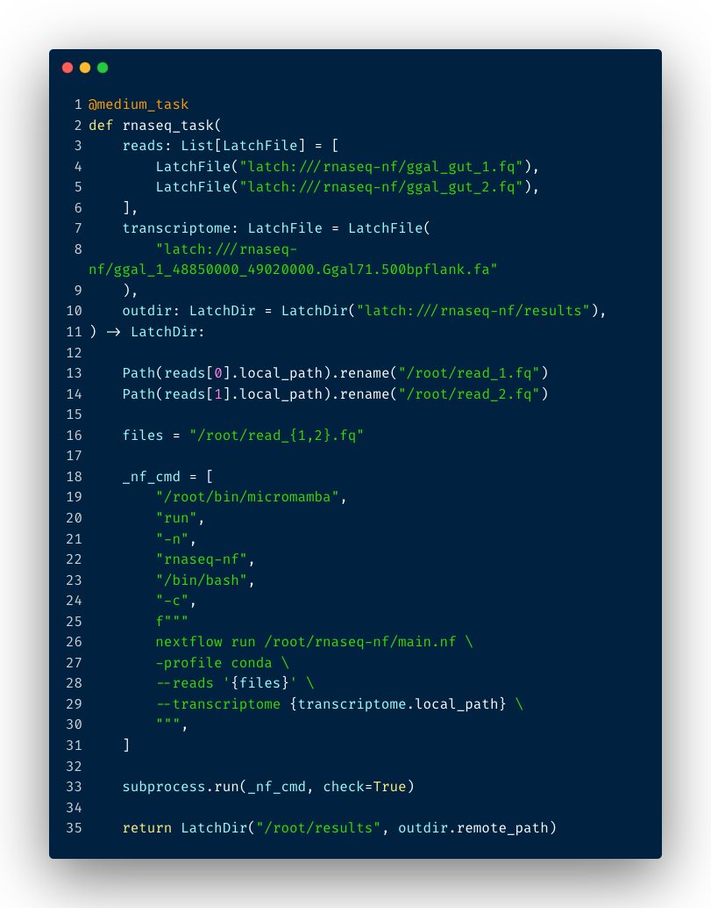

# Tutorial: Running Nextflow in Python with Latch SDK

Estimated time to complete: 30 minutes

Nextflow is a popular framework for orchestrating bioinformatics workflows. In this tutorial, we will walk through how you can package an existing Nextflow script in Latch Python SDK!

## Prerequisites

Before we start, make sure you:

* Install the [Latch SDK](../getting_started/quick_start.md).
* Understand basic concepts of a workflow through our [Quickstart](../getting_started/quick_start.md) and [Authoring your Own Workflow](../getting_started/authoring_your_workflow.md).

As an example, we will use Nextflow's RNA-seq pipeline example. Let's dive in!

## Overview of the RNA-seq Nextflow Pipeline

The [RNASeq-NF pipeline](https://www.nextflow.io/example4.html) maps a collection of read-pairs to a given reference genome and outputs the respective transcript model. The Nextflow team has kindly provided the GitHub repository to their full pipeline code [here](https://github.com/nextflow-io/rnaseq-nf).

At a high level, RNASeq-NF uses the following components and tools:

* Salmon 1.0.0
* FastQC 0.11.5
* Multiqc 1.5

To run the Nextflow pipeline locally:

```console
# Clone the repository
git clone https://github.com/nextflow-io/rnaseq-nf.git
cd rnaseq-nf

# Run the Nextflow script
nextflow run main.nf
```

Once the execution finishes successfully, you will see a MultiQC report generated under `rnaseq-nf/results/multiqc_report.html`.

## How to Wrap the Nextflow Pipeline in Latch SDK

To port the above workflow to the Latch SDK, we have to complete three steps:

1. Initialize a Latch workflow and clone the RNASeq-NF code inside the Latch workflow directory.
2. Define your Dockerfile to install dependencies
3. Define a workflow that executes the `nextflow run` command to run the Nextflow pipeline.

### Step 1: Initialize the Latch workflow directory

If you prefer to follow along, instead of creating the workflow from scratch, clone the final GitHub repository here:

```console
git clone https://github.com/latchbio/nextflow-latch-wf.git 
```

For those who prefer starting from scratch, first initialize a fresh Latch boiplerplate repository:

```console
latch init nextflow-latch-wf
```

Enter the workflow directory;

```console
cd nextflow-latch-wf
```

Clone the original RNASeq-NF code:

```console
https://github.com/nextflow-io/rnaseq-nf.git
```

Great! Now we have a boilerplate code to start modifying, as well as the Nextflow code that we will later use.

### Step 2: Define your Dockerfile to install dependencies

As the Latch workflow will be executed on a fresh machine on the Latch platform, we have to define a Dockerfile with the necessary dependencies for RNASeq-NF to run:



* **Line 1**: is the [Latch base image](https://github.com/latchbio/latch-base), which is used to configure libraries required for consistent task behaviour.
* **Line 3-4**: downloads and installs the updates for each outdated package and dependency on the machine that executes the workflow. `curl` and `unzip` are also installed.
* **Line 7**: installs the Java runtime environment, which is required to run Nextflow.
* **Line 8-9**: installs Nextflow and moves the binary to `/usr/bin`.
* **Line 11-23**: is a series of commands to install Micromamba. We use Micromamba because the RNASeq-NF pipeline specifies all its dependencies in the `rnaseq-nf/conda.yml` file, which can later be used to set up the environment.
* **Line 26**: copies the RNASeq-NF pipeline code to the task execution environment. The `/root/rnaseq-nf` is that path at which the NF code is stored in the machine that executes the task on Latch.
* **Line 29**: uses Micromamba to install the dependencies as spefieid in `/root/rnaseq-nf/conda.yml`. These dependencies include `salmon=1.6.0`, `fastqc=0.11.9`, and `multiqc=1.11`.
* **Line 31-38**: are already provided in the boilerplate Dockerfile and are needed to ensure your build envrionment works correctly with Latch.

That's it! You've successfully defined your Dockerfile.

To test whether the Dockerfile builds the correct environment, first register your workflow to Latch:

```console
latch register -r .
```

Then, open a remote debugging session:

```console
latch develop .
```

Enter an interative shell:

```console
>>> shell

Syncing local changes... 
Could not find /Users/hannahle/Documents/GitHub/nextflow-latch-wf/data - skipping
Finished syncing.
Pulling 812206152185.dkr.ecr.us-west-2.amazonaws.com/6064_nextflow-latch-wf:0.0.0-7da9b6... 
Image successfully pulled.
```

This will pull your workflow image built by the Dockerfile, which is handy to verify and reiterate on your build commands.

For example, we can verify that Nextflow is installed correctly by typing:

```console
root@ip-10-0-11-243:~# nextflow
Usage: nextflow [options] COMMAND [arg...]

Options:
  -C
     Use the specified configuration file(s) overriding any defaults
  -D
     Set JVM properties
  -bg
     Execute nextflow in background
  -c, -config
  ...
```

### Step 3: Define the Latch workflow

The core logic of a Latch workflow is in the `wf/__init__.py`.

To wrap the Nextflow workflow inside a Latch workflow, first import the necessary dependencies

```python
import subprocess
from pathlib import Path
from typing import List
from latch import medium_task, workflow
from latch.resources.launch_plan import LaunchPlan
from latch.types import LatchAuthor, LatchFile, LatchMetadata, LatchParameter, LatchDir
```

Next, let's define our task:



* **Line 1**: specifies the compute that the RNASeq-NF pipeline needs. Here, we are using a `@medium_task`, which will provision a machine with 32 cpus, 128 gigs of memory of memory to run the task. For a comprehensive list of all task resources available, visit [how to define cloud resources](./../basics/defining_cloud_resources.md).
* **Line 3-10:** are the task parameters. We choose `reads`, `transcriptome`, and `outdir` because they are also required parameters in the RNASeq-NF pipeline, as shown in Nextflow's `main.nf` file [here](https://github.com/nextflow-io/rnaseq-nf/blob/master/main.nf).
* **Line 13-14**: defines the paths of the forward and reverse reads.
  * If you are familiar with Python, `pathlib` is a handy module that makes sure that your file paths work the same in different operating systems. Also, it provides functionalities and operations to help you save time while handling and manipulating paths.
  * Here, we are passing in the remote filepath (e.g. `latch:///rnaseq-nf/ggal_gut_1.fq`) to the `Path` object to resolve its filepath in the task machine.
  * Then, we rename the local absolute filepath to `/root/read_1.fq`. Similarly, we rename the local absolute filepath of the second read to `/root/read_2.fq`. Since the RNASeq-NF pipeline ingests a string with a common prefix pattern `*_{1,2}.fq` instead of a list, renaming both files guarantees that they both have the same initial pattern.
* **Line 16**: specifies the string value for the `reads` command line argument of the RNASeq-NF pipeline.
* **Line 18-29**: specifies the command to be run by Python `subprocess` module.
* **Line 19-20**: tells Micromamba to use the `rnaseq-nf` conda environment previously installed in our Dockerfile.
* **Line 26-29**: is the command to run the Nextflow RNASeq-NF command with custom parameters.
* **Line 33**: uses `subprocess` to pops open a process to execute the Nextflow command.
* **Line 35**: takes the output `/root/results` folder and uploads it to [Latch Data](https://console.latch.bio/data) under a user-defined folder.

Now you have successfully defined a Latch task with the correct compute resource to execute the RNASeq-NF pipeline!

### Calling a Latch task inside a Latch workflow

Since this is a single task workflow, you can simply call the task inside the workflow and return its results like so:

```python
@workflow(metadata)
def rnaseq_wf(
    reads: List[LatchFile], transcriptome: LatchFile, outdir: LatchDir
) -> LatchDir:
    """Description...

    markdown header
    ----

    Write some documentation about your workflow in
    markdown here:

    > Regular markdown constructs work as expected.

    # Heading

    * content1
    * content2
    """
    return rnaseq_task(reads=reads, transcriptome=transcriptome, outdir=outdir)

```

### Defining Workflow GUI

To expose workflow parameters to a user-friendly workflow GUI, you can use the `LatchMetadata` object. An important point to note is that all workflow arguments need to be added to the `parameters` key of LatchMetadata for them to display on the GUI. For an exhaustive list of how workflow argument and their Python types map to the front-end interface, visit [Customizing Your Interface](../basics/customizing_interface.md)

```python
"""The metadata included here will be injected into your interface."""
metadata = LatchMetadata(
    display_name="Porting RNAseq-NF pipeline to Latch SDK",
    documentation="your-docs.dev",
    author=LatchAuthor(
        name="Hannah Le",
        email="hannah@latch.bio",
        github="https://github.com/latchbio/nextflow-latch-wf",
    ),
    repository="https://github.com/latchbio/nextflow-latch-wf",
    license="MIT",
    parameters={
        "reads": LatchParameter(
            display_name="Forward and Reverse reads",
            description="Paired-end read 1 and 2 files to be aligned.",
        ),
        "transcriptome": LatchParameter(
            display_name="Transcriptome", description="Select transcriptome (.fa)"
        ),
        "outdir": LatchParameter(
            display_name="Output Directory", description="Select output directory."
        ),
    },
    tags=[],
)
```

### Adding Test Data

Finally, we can add some test data to run the workflow.

In the RNASeq-NF workflow, there is a folder for test data under `rnaseq-nf/data/ggal`. Let's upload these folders to a public S3 link, so that they can be used by others when running the workflow on Latch:

```console
latch test-data upload rnaseq-nf/data/ggal
```

Once the command runs successfully, you will see the links at which the folder is uploaded. You can then use the `LaunchPlan` construct to add the remote files as test data like so:

```python
"""
Add test data with a LaunchPlan. Provide default values in a dictionary with
the parameter names as the keys. These default values will be available under
the 'Test Data' dropdown at console.latch.bio.
"""
LaunchPlan(
    rnaseq_wf,
    "Test Data",
    {
        "reads": [
            LatchFile("s3://test-data/6064/rnaseq-nf/data/ggal/ggal_gut_1.fq"),
            LatchFile("s3://test-data/6064/rnaseq-nf/data/ggal/ggal_gut_2.fq"),
        ],
        "transcriptome": LatchFile(
            "s3://test-data/6064/rnaseq-nf/data/ggal/ggal_1_48850000_49020000.Ggal71.500bpflank.fa"
        ),
        "outdir": LatchDir("latch:///welcome"),
    },
)
```

### Registering the workflow to Latch Console

To publish the workflow to the Latch platform, you can navigate to the root workflow directory and upload it with the `latch register` command:

```console
latch register -r .
```

This will give us:

* a no-code interface
* managed cloud infrastructure for workflow execution
* a dedicated API endpoint for programmatic execution
* hosted documentation
* parallelized CSV-to-batch execution

Once registration finishes, you can navigate to [Latch](https://console.latch.bio/workflows) to run your workflow.

---

## Commonly Asked Questions


1. **Should I wrap an entire Nextflow pipeline in a single task or refactor each Nextflow process to an individual task?**

    For prototyping purposes, we recommend that you wrap an entire Nextflow pipeline in a single task first. This allows you to quickly experience the development experience with a Pythonic SDK and publish a first workflow that's ready-to-use for scientists.

    One disadvantage of this, however, is all processes are run on a single machine with fixed compute resource. If parallelization of individual processes across multiple machines is desired, it is beneficial to refactor each process into its individual task. With the [SDK's remote debugging toolkit](../basics/local_development.md), refactoring also enables for faster debugging and development.

2. **Can I take advantage of existing Netxflow's community workflows while using the Latch SDK?**

    Yes, absolutely! For example, say you want to run [NF-Core's demultiplex pipeline](https://nf-co.re/demultiplex), you can substitute the `nextflow run` command in our tutorial below with the following inside your Python subprocess:

    ```console
    nextflow run nf-core/demultiplex --input samplesheet.csv --outdir <OUTDIR> -profile <docker/singularity/podman/shifter/charliecloud/conda/institute>
    ```

3. **How does the SDK handle retries?**

    Visit the documentation on how the SDK handles retries [here](https://docs.latch.bio/basics/retries.html). Currently, the SDK does not yet support autoscaling compute resources for failed tasks due to out-of-memory errors. This is a feature we're actively investigating and will release in future versions.
