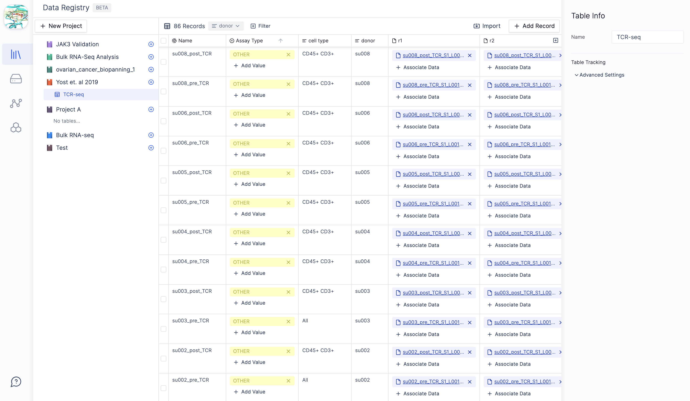
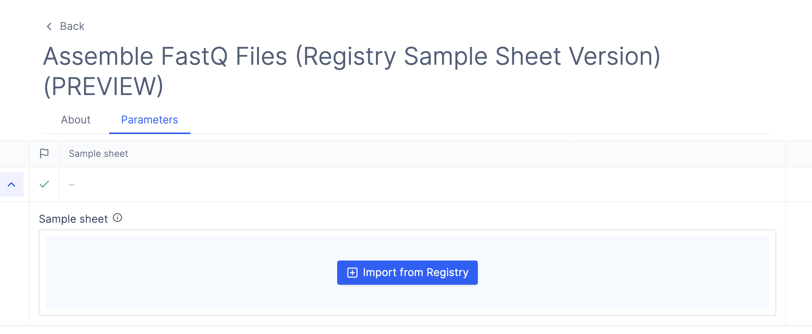
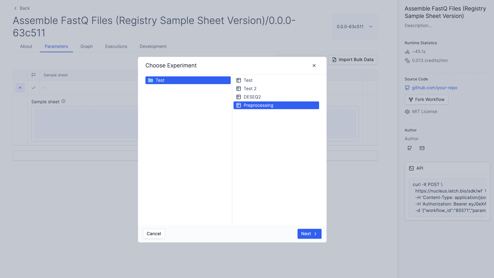
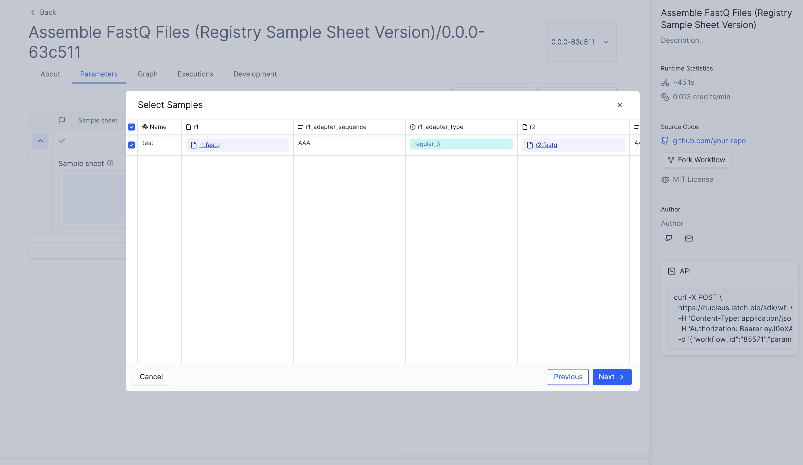
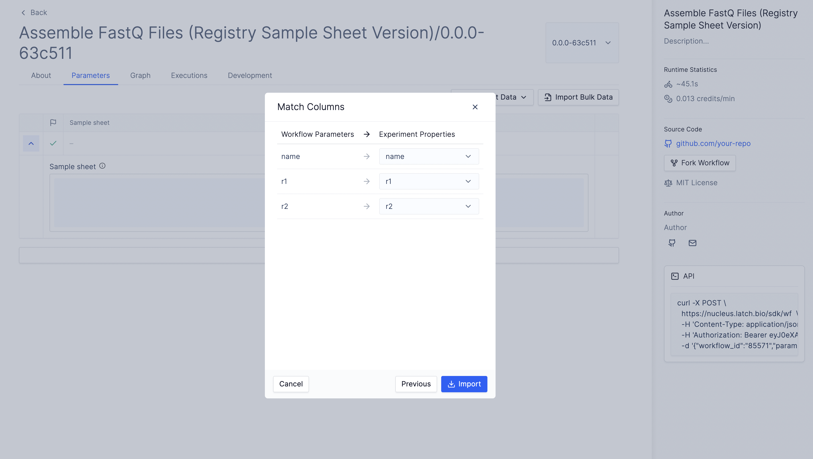

# Tutorial: Workflow Sample Sheet Input Using Registry

[Latch Registry](https://latch.wiki/what-is-registry) is a flexible sample management system that links files on Latch Data with metadata.



Workflows can use the Registry as a source of tabular data. A common use case is to import sample sheets which contain links to sequence files and associated labels and metadata.

For example, our Bulk RNA-Seq workflow uses a sample sheet to specify a list of read pairs for processing. These can be imported directly from Registry where they can be stored alongside information about the sequenced sample like sequencing date, batch, etc.

In this tutorial, we write a workflow which reads COVID sequencing data from Registry and assembles it using [Bowtie 2](https://bowtie-bio.sourceforge.net/bowtie2/index.shtml).

## Prerequisites

* Install the [Latch SDK](../getting_started/quick_start.md)
* To follow along, clone [the GitHub repository here](https://github.com/latchbio/assembly-registry-wf).

## Defining a Sample Sheet with the SDK
A sample sheet component is defined as a list of `dataclass`es in the SDK. 

First, let's define a task called `assembly_task` that accepts a single `dataclass` as an input parameter.

```python
from dataclasses import dataclass

@dataclass
class Sample:
    name: str
    r1: LatchFile
    r2: LatchFile

@small_task
def assembly_task(sample: Sample) -> LatchFile:

    # A reference to our output.
    sam_file = Path("covid_assembly.sam").resolve()

    bowtie2_cmd = [
        "bowtie2/bowtie2",
        "--local",
        "--very-sensitive-local",
        "-x",
        "wuhan",
        "-1",
        sample.r1.local_path,
        "-2",
        sample.r2.local_path,
        "-S",
        str(sam_file),
    ]

    ...

    output_location = f"latch:///Assembly Outputs/{sample.name.replace('/', '_')}/covid_assembly.sam"

    return LatchFile(str(sam_file), output_location)
```

Next, we define the combined workflow using [`map_task`](../basics/map_task.md) to run assembly on each input in parallel.

```python
@workflow(metadata)
def assemble_and_sort(samples: List[Sample]) -> List[LatchFile]:
    return map_task(assembly_task)(sample=samples)
```

Now that we have set up the workflow logic, we can customize the workflow interface to display a sample sheet. To do so, we can set the `samplesheet` flag of `LatchParameter` equal to `True`.

```python
"""The metadata included here will be injected into your interface."""
metadata = LatchMetadata(
    display_name="Assemble FastQ Files (Registry Sample Sheet Version)",
    documentation="your-docs.dev",
    author=LatchAuthor(
        name="Author",
        email="author@gmail.com",
        github="github.com/author",
    ),
    repository="https://github.com/your-repo",
    license="MIT",
    parameters={
        "samples": LatchParameter(
            display_name="Sample sheet",
            samplesheet=True, # <======= flag to display sample sheet component
            description="A list of samples and their sequencing reads",
        )
    },
    tags=[],
)
```

To preview what the workflow interface looks like, you can type:
```bash
latch preview <path_to_workflow_directory>
```

The command will open up a new page in the browser that displays a preview of the sample sheet component.



When you click "Import from Registry", a new import modal will pop up. 



Here, you can select the table of interest and samples to be used in the workflow.



## Note on Registry Types

The types of the fields of the Python `dataclass` used in the sample sheet input determine which Registry columns will be available for import. The names of the fields only server to inform the default assignment of columns to fields.
For example, the Registry table in the screenshot above has three columns: "Name", "r1", and "r2", which have the types "Text", "File", and "File", respectively. The `Sample` `dataclass` has matching fields: `name: str`, `r1: LatchFile`, and `r2: LatchFile`. If the Registry used the "Text" type for column "r1", it would not be available for matching with the `r1` field.



To learn more about how to create columns with specific types in Registry, visit our [Registry Wiki here](https://latch.wiki/create-a-table).
