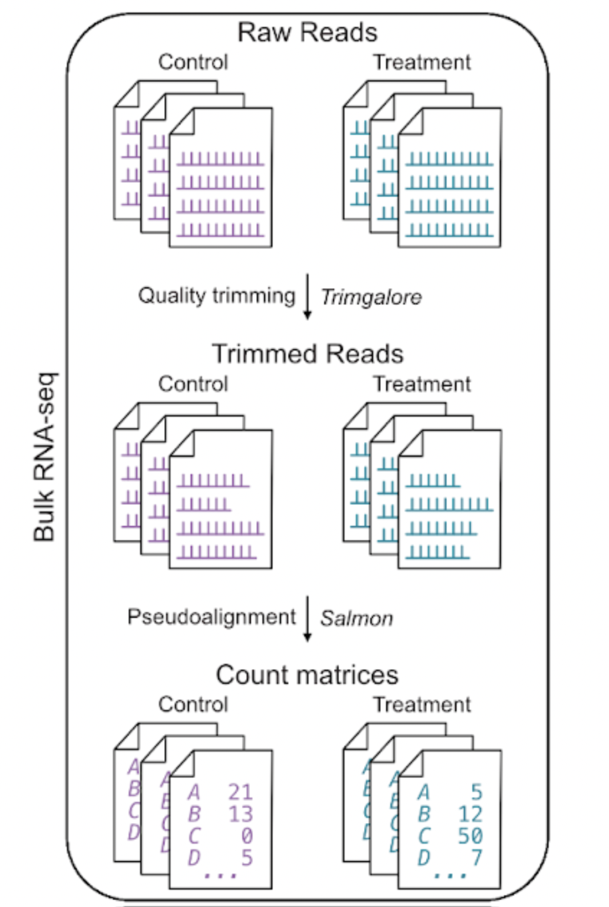
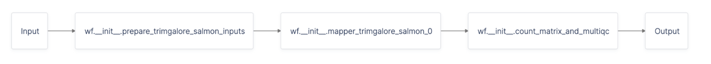

# A Bulk RNA-seq Pipeline for Count Matrix Generation

RNA-seq has become a ubiquitous tool for gaining insight into the transcriptomes of diverse organisms. Bulk RNA-seq examines the mRNA present in a population of cells.

In this tutorial, we will use the Latch SDK to deploy a Bulk RNA-sequencing pipeline that takes as input FastQ files and automatically trims reads and generates count matrices.

## Prerequisites

* Install the Latch SDK.
* Understand basic concepts of a workflow through our [Quickstart](../getting_started/quick_start.md) and [Authoring your Own Workflow](../getting_started/authoring_your_workflow.md).

## What You Will Learn

Bioinformatics workflows often deal with performing operations and passing around large files. Using RNA-seq as an example, this tutorial will focus on highlighting the following key concepts:

* How to run a task in parallel over a list of files using `map_task`
* Hown to handle files with metadata
* How to use `file_glob` to conviently put a list of output files into a directory
* How to write a task to coalesce outputs from a map task

To follow along, view source code [here](https://github.com/latch-verified/bulk-rnaseq/releases/tag/v0.0.317).

---

## Overview of the Workflow

At a high level, the bulk RNA-seq workflow produces gene and transcript counts from bulk RNA-seq sample reads.



There are two main steps in the workflow: trimming and alignment.

**Trimming**: Short-read sequencing technologies introduce adapters, small sequences attached to the 5' and 3' end of cDNA fragments, in cDNA libraries. Adapter sequences must be removed prior to mapping. Also, not every base pair is sequenced at a suitable quality. Reads can be trimmed based on base call quality thereby removing low quality data. We are using [*TrimGalore*](https://github.com/FelixKrueger/TrimGalore) as our trimming tool.

**Alignment**: Alignment is the process of assigning a sequencing read to a location on a reference genome or transcriptome. It is the most computationally expensive step of the workflow, requiring a comparison against the entire reference sequence for each of millions of reads. We utilize [*salmon*](https://github.com/COMBINE-lab/salmon) to implement selective alignment, which produces highly accurate estimates of transcript abundances.

We additionally use [*tximport*](https://bioconductor.org/packages/release/bioc/html/tximport.html) to perform the conversion of transcripts to read counts.

## How a Workflow is Represented in Latch

A workflow is an analysis that takes in some input, processes it in one or more steps and produces some output. Formally, a workflow can be described as a directed acyclic graph (DAG), where each node in the graph is called a task. This computational graph is a flexible model to describe most any bioinformatics analysis.

In our example, we can define the above workflow like so:

```python
@workflow
def rnaseq(
    samples: List[Sample],
    alignment_quantification_tools: AlignmentTools,
    ta_ref_genome_fork: str,
    sa_ref_genome_fork: str,
    output_location_fork: str,
    run_name: str,
    latch_genome: LatchGenome,
    bams: List[List[LatchFile]],
    custom_gtf: Optional[LatchFile] = None,
    custom_ref_genome: Optional[LatchFile] = None,
    custom_ref_trans: Optional[LatchFile] = None,
    star_index: Optional[LatchFile] = None,
    salmon_index: Optional[LatchFile] = None,
    save_indices: bool = False,
    custom_output_dir: Optional[LatchDir] = None,
) -> List[LatchFile]:
    inputs = prepare_trimgalore_salmon_inputs(
        samples=samples,
        run_name=run_name,
        clip_r1=None,
        clip_r2=None,
        three_prime_clip_r1=None,
        three_prime_clip_r2=None,
        custom_output_dir=custom_output_dir,
        latch_genome=latch_genome,
        bams=bams,
        custom_gtf=custom_gtf,
        custom_ref_genome=custom_ref_genome,
        custom_ref_trans=custom_ref_trans,
        custom_salmon_index=salmon_index,
        save_indices=save_indices,
    )
    outputs = map_task(trimgalore_salmon)(input=inputs)
    return count_matrix_and_multiqc(
        run_name=run_name,
        ts_outputs=outputs,
        output_directory=custom_output_dir,
        latch_genome=latch_genome,
        custom_gtf=custom_gtf,
    )

```

The workflow code above contains 3 tasks:

* `prepare_trimgalore_salmon_inputs`: to pre-process and prepare valid inputs for the second trimgalore_salmon task
* `trimgalore_salmon`: to trim sample’s reads and quantify transcripts for each sample
* `count_matrix_and_multiqc`: to create an aggregated count table for transcripts of all samples and create a MultiQC report for percentage of reads aligned.



Let’s walk through each task and why they are important!

## Step 1: Using a helper task to prepare inputs

```python
@small_task
def prepare_trimgalore_salmon_inputs(
   samples: List[Sample],
   run_name: str,
   latch_genome: LatchGenome,
   bams: List[List[LatchFile]],
   save_indices: bool,
   clip_r1: Optional[int] = None,
   clip_r2: Optional[int] = None,
   three_prime_clip_r1: Optional[int] = None,
   three_prime_clip_r2: Optional[int] = None,
   custom_output_dir: Optional[LatchDir] = None,
   custom_gtf: Optional[LatchFile] = None,
   custom_ref_genome: Optional[LatchFile] = None,
   custom_ref_trans: Optional[LatchFile] = None,
   custom_salmon_index: Optional[LatchFile] = None,
) -> List[TrimgaloreSalmonInput]:
   custom_names = []
   custom_files = []
   if custom_ref_genome is not None:
       custom_names.append("genome")
       custom_files.append(custom_ref_genome)
   if custom_ref_trans is not None:
       custom_names.append("trans")
       custom_files.append(custom_ref_trans)
   if custom_salmon_index is not None:
       custom_names.append("index")
       custom_files.append(custom_salmon_index)
   if custom_gtf is not None:
       custom_names.append("gtf")
       custom_files.append(custom_gtf)

   return [
       TrimgaloreSalmonInput(
           sample_name=sample.name,
           replicates=sample.replicates,
           run_name=run_name,
           clip_r1=clip_r1,
           clip_r2=clip_r2,
           three_prime_clip_r1=three_prime_clip_r1,
           three_prime_clip_r2=three_prime_clip_r2,
           base_remote_output_dir=_remote_output_dir(custom_output_dir),
           latch_genome=latch_genome.name,
           bams=bams,
           custom_names=custom_names,
           custom_files=custom_files,
           save_indices=save_indices,
       )
       for sample in samples
   ]
```

In bioinformatics workflows, management of files and metadata is key. For instance, when trimming adapters from sequencing reads, we might be interested in the content of the FastQ file, whether it’s a single or paired-end read, and the reference genome to be aligned against.

To do so, we can use a Python data class. In our example, the `prepare_trimgalore_salmon_inputs` takes in parameters that are often used in addition to `samples` and return a Python data class called `TrimgaloreSalmonInput`, which has the following properties:

```python
@dataclass_json
@dataclass
class TrimgaloreSalmonInput:
    sample_name: str
    replicates: List[Replicate]
    run_name: str
    base_remote_output_dir: str
    latch_genome: str
    bams: List[List[LatchFile]]
    custom_names: List[str]
    custom_files: List[LatchFile]
    clip_r1: Optional[int] = None
    clip_r2: Optional[int] = None
    three_prime_clip_r1: Optional[int] = None
    three_prime_clip_r2: Optional[int] = None
    save_indices: bool = False
```

`TrimgaloreSalmonInput` will become the input to our second task - `trimgalore_salmon`.

## Step 2: Running TrimGalore and Salmon on FastQs samples

The `trimgalore_salmon` task has many moving parts, which we won’t examine in detail. We recommend that you review the code at the end once you’ve had a full grasp of the big picture.

Here, we are emphasizing two key concepts:

* How to run the `trimgalore_salmon` task on a list of inputs
* How to use file globs to handle groups of files

### Running the `trimgalore_salmon` task on a list of inputs

To run a specific task on a list of inputs in parallel, we use map task like so:

```python
from latch import map_task
...
    outputs = map_task(trimgalore_salmon)(input=inputs)
...
```

Where `inputs` is a list of `TrimgaloreSalmonInput` that the helper task `prepare_trimgalore_salmon_inputs` returns.

Note that a task can only be mapped if it accepts one input and produces one output. Here, recall how the `trimgalore_salmon` task only accepts one input.

```python
def trimgalore_salmon(input: TrimgaloreSalmonInput) -> TrimgaloreSalmonOutput:
```

**Concepts Check**:

<details>
<summary>What if I want to map a task and pass more than one input parameter to that task? </summary>
You would have to write a helper task, similar to our `prepare_trimgalore_salmon_input` task above which accepts multiple inputs and returns a Python data class.
</details>

<details>
<summary>What’s the difference between a helper task and a helper function? When should I use a task and not a function?</summary>
You can specify that a function is a task by using the Python decorator `@task` before the function definition. For example, `prepare_trimgalore_salmon_input` is a helper task, whereas `do_trimgalore` is a pure helper function.

It’s important to note that only tasks can be called within a workflow. For example, calling `do_trimgalore` within the `rnaseq` workflow would throw an error.
</details>

<details>
<summary>What’s the output type of map_task(trimgalore_salmon)(input=inputs)?</summary>
It would be a `List` of the output type that `trimgalore_salmon` returns, i.e. `List[TrimgaloreSalmonOutput]`
</details>

---

## Using Globs to Move Groups of Files

Often times logic is needed to move groups of files together based on a shared pattern. To do this in the SDK, you can leverage the `file_glob` function to construct lists of `LatchFile`s defined by a pattern.

There are many instances in our bulk RNA-seq example where `file_glob` is used:

* To group different trimming report outputted from Trimgalore:

```python
    reports = file_glob("*trimming_report.txt", reports_directory)
```

* To group trimmed FastQs:

```python
    if isinstance(reads, SingleEndReads):
        (r1,) = file_glob(f"{local_output}/*trimmed.fq*", reads_directory)
        trimmed_replicate = SingleEndReads(r1=r1)
    else:
        # File glob sorts files alphanumerically
        r1, r2 = file_glob(f"{local_output}/*val*.fq*", reads_directory)
        trimmed_replicate = PairedEndReads(r1=r1, r2=r2)
```

## Step 2: Generate count matrix and a MultiQC report

It is helpful to aggregate transcript quantification files for multiple samples from Salmon into a single counts table for downstream analysis like differential expression.

To do this, we define a task called `count_matrix_and_multiqc` to join the various quantification files from the map task and produce a single count matrix, as well as perform MultiQC to compute the percent of reads aligned.

### Joining quantification files into a single count matrix

```python
@small_task
def count_matrix_and_multiqc(
    run_name: str,
    ts_outputs: List[TrimgaloreSalmonOutput],
    output_directory: Optional[LatchDir],
    latch_genome: LatchGenome,
    custom_gtf: Optional[LatchFile] = None,
) -> List[LatchFile]:
    output_files = []

    Path("/root/inputs").mkdir(parents=True)
    paths = [
        Path(x.salmon_output.local_path).rename(f"/root/inputs/{x.sample_name}")
        for x in ts_outputs
    ]

    def remote(suffix: str):
        return _remote_output_dir(output_directory) + run_name + "/" + suffix

    # Create combined count matrix
    if all(x.passed_tximport for x in ts_outputs):
        message(
            "info",
            {
                "title": "Generating count matrix from all samples",
                "body": "\n".join(f"- {x.sample_name}" for x in ts_outputs),
            },
        )

        combined_counts = defaultdict(dict)
        for output, path in zip(ts_outputs, paths):
            genome_abundance_file = next(path.glob("*genome_abundance.sf"))
            with genome_abundance_file.open("r") as f:
                for row in csv.DictReader(f, dialect=csv.excel_tab):
                    gene_name = row["Name"]
                    combined_counts[gene_name][output.sample_name] = row["NumReads"]

        raw_count_table_path = Path("./counts.tsv").resolve()
        with raw_count_table_path.open("w") as file:
            sample_names = (x.sample_name for x in ts_outputs)
            writer = csv.DictWriter(
                file,
                [_COUNT_TABLE_GENE_ID_COLUMN, *sample_names],
                delimiter="\t",
            )
            writer.writeheader()
            for gene_id, data in combined_counts.items():
                data[_COUNT_TABLE_GENE_ID_COLUMN] = gene_id
                writer.writerow(data)

        count_matrix_file = LatchFile(
            str(raw_count_table_path),
            remote("Quantification (salmon)/counts.tsv"),
        )
        output_files.append(count_matrix_file)
    else:
        message(
            "warning",
            {
                "title": "Unable to create combined count matrix",
                "body": "Some samples failed in the earlier step",
            },
        )
```

### Generating a MultiQC Report

To generate a MultiQC report, we use `subprocess` to run the `multiqc` command and output the HTML report to Latch.

```python
try:
        subprocess.run(["multiqc", *paths], check=True)
        multiqc_report_file = LatchFile(
            "/root/multiqc_report.html",
            remote("multiqc_report.html"),
        )
        output_files.append(multiqc_report_file)
    except subprocess.CalledProcessError as e:
        print(f"Error occurred while generating MultiQC report -> {e}")
        message(
            "error",
            {
                "title": "Unable to generate MultiQC report",
                "body": "See logs for more information",
            },
        )

    return output_files
```

The MultiQC report shows percentage of reads aligned per sample and fragment length distribution using *Salmon*.

See an example MultiQC report output from the Bulk RNA-seq workflow [here](https://console.latch.bio/data/2428754).

---

## Key Takeaways

In this tutorial, you learned how to:

* use map tasks to run Trimgalore and Salmon over a list of inputs.
* make use of Python data classes to handle multiple `LatchFile`s and associated metadata in tasks.
* use `file_glob` to group files according to a predefined pattern.
* write a task to coalesce outputs from a map task.
